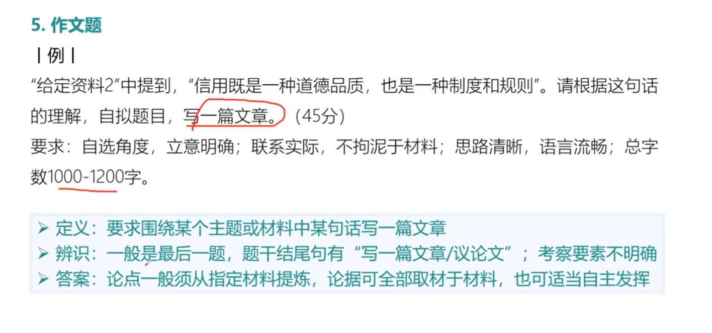
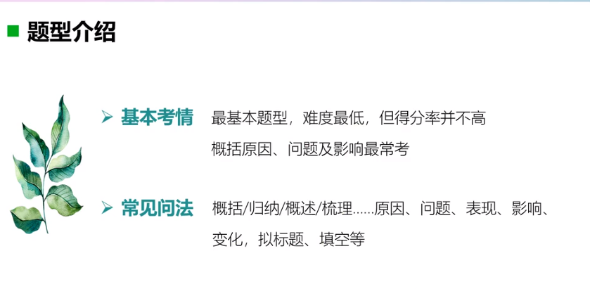
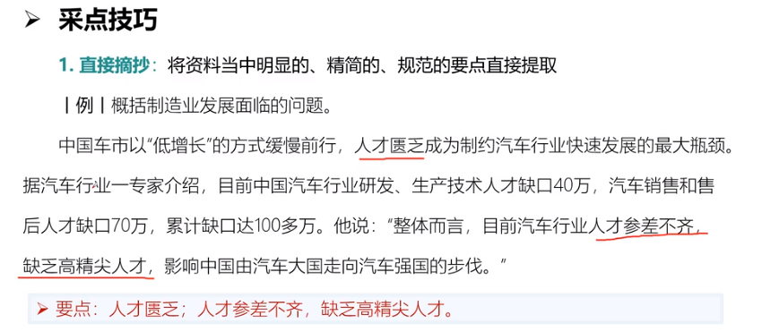
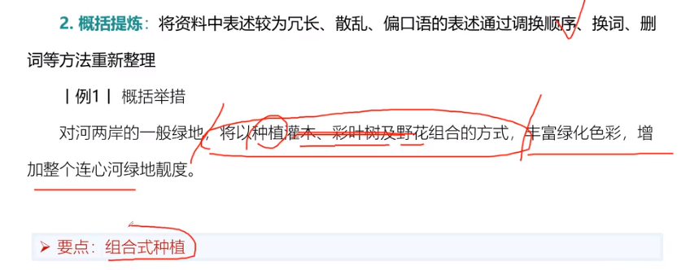
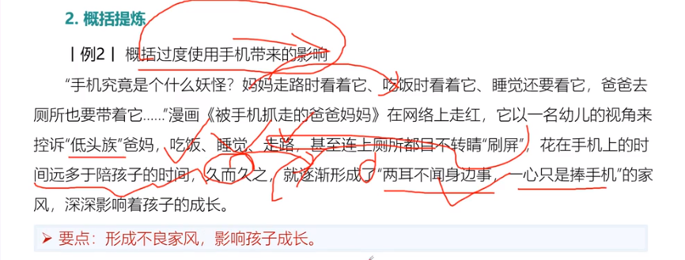
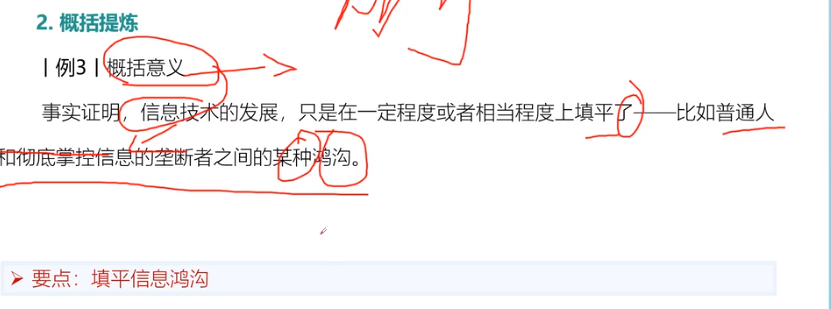
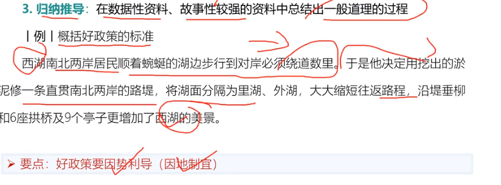
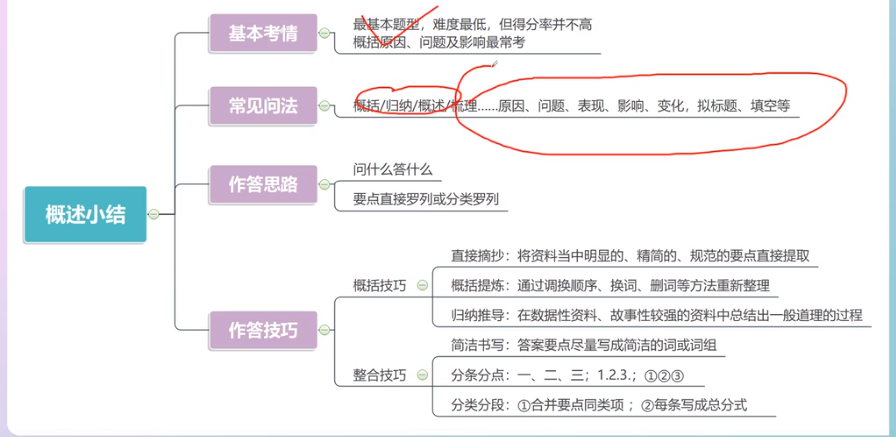

# Table of Contents

* [五种题型](#五种题型)
  * [概括](#概括)
  * [分析 -不常考](#分析--不常考)
  * [对策](#对策)
  * [公文](#公文)
  * [作文](#作文)
  * [考清总结](#考清总结)
* [四大要素](#四大要素)
* [答题步骤](#答题步骤)
  * [审题](#审题)
  * [作答范围](#作答范围)
  * [作答要求](#作答要求)
* [概括题](#概括题)
  * [采点技巧](#采点技巧)
  * [整合技巧](#整合技巧)

# 五种题型

## 概括

## 分析 -不常考

## 对策

## 公文

## 作文

## 考清总结

# 四大要素

# 答题步骤

## 审题

明确答题思路、阅读重点

## 作答范围

## 作答要求

# 概括题

做答思路： 问什么答什么

## 采点技巧

调换顺序、换词、删除等重新整理

## 整合技巧

