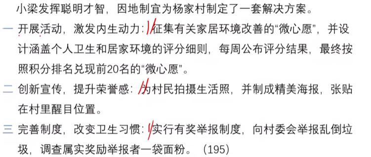

# Table of Contents

* [归纳概括](#归纳概括)


# 归纳概括

1. 问啥答啥，有啥写啥
2. 理解语义，技巧辅助
3. 读出层次、找对大哥
4. 书写规范、形意结合


1. 根据材料1 小梁改善杨家村人居环境的主要做法

   ```
   
   　　材料一
   　　杨家村是深度贫困村，经过几年的努力，村里绝大多数贫困户已经圆了脱贫梦。为了稳定增收，杨家村决心借助山清水秀的景致发展乡村旅游。2019年年初，在政府和帮扶单位专项资金支持下，杨家村的美丽乡村项目顺利开工。水泥道路通村入户，古建民居修葺一新，竹木栅栏、青石台阶、小桥流水的景观设计，让这个昔日的深度贫困村华丽转身，好似世外桃源。
   　　村里漂亮了，可是人居环境却是个“老大难”。远远望去村容村貌焕然一新，可是走进老百姓家里一看，庭院乱堆放、杂物遍地是。以前村干部也多次上门做工作，但是群众认为这是自家的事，村干部管不着。关键时刻，省建筑工程集团公司的驻村第一书记小梁发挥聪明才智，为村里“量身设计”了一套解决方案。
   　　8月的一天，一场“积分兑换心愿，勤劳改变习惯”的文明习惯养成活动在杨家村拉开帷幕。小梁和村干部一起向村民征集有关家居环境改善的“微心愿”，并精心设计了十项涵盖个人卫生和居家环境的评分细则，每周公布评分结果，最终按照积分排名兑现前20名的“微心愿”。“我们想通过‘微心愿’来激发村民的内生动力，帮助大家养成好习惯，形成新风尚。”小梁说。
   　　村民们纷纷讲出了自己改善家居的愿望。“要是有台大彩电，忙完一天的农活，就可以陪孙子看动画片了！”村民张大娘说。“要是有台大冰箱，我家就能天天吃到新鲜饭菜了!”村民张伯伯说。他们的这些心愿，配上摄影师为他们拍摄的生活照，被制成精美的海报，张贴在村里醒目的位置。其中一张海报是65岁的唐大妈笑呵呵地在做针线活。“在整洁、干净的屋里做针线活儿，我心里那叫一个美啊！”海报上印着两行大字，这是唐大妈的感言。看着邻里乡亲竟然也能像明星一样登上如此精美的海报，村民们的荣誉感更强烈了。为了督促村民改变卫生习惯，实行有奖举报制度，发现谁家乱倒垃圾可以向村委会举报，调查属实的给举报者奖励一袋面粉。在大家共同努力下，改善家居环境一时间蔚然成风。小梁说，几个月来，从锅碗瓢盆、个人起居，到房前屋后、禽畜养殖，杨家村变化很大。
   　　村民夏姐的丈夫常年在外打工，她自己留在村里种地看孩子。一个人忙里忙外，难免顾不上收拾屋子。“自从参加活动以来，养成了好习惯，房前屋后都干净了，自己住着也舒服。”她说。
   　　从爱美之心人皆有之，到护美之行人人为之，杨家村这个新建成的美丽乡村，处处透着美的气息。小梁也如约为表现优异的家庭兑现了“微心愿”，夏姐领到了心仪的热水器，脸上露出了开心的笑容。
   ```

   **问题：**请根据给定资料，概括小梁改善杨家村人居环境的主要做法。（20分）要求：全面准确，简明扼要，条理清晰，不超过200字。

   1. 范围是什么？
   2. 内容是什么？ **小梁**改善**杨家村**人居环境的**主要做法**  
   3. 要求是什么？不超过200字


我们先看看参考答案，在自己分析分析

```
杨家村民对人居环境改善缺乏积极性，小梁的做法有：1、结合实际，制定系统化的解决方案。2、激励为主，向村民征集家居环境改善微心愿，评分兑换心愿，激发村民内生动力，帮助养成好习惯。3、针对性强，精心设计涵盖个人卫生和居家环境的评分细则，有效引导人居环境改善。4、重视宣传，请摄影师拍摄生活照制成海报，增强村民荣誉感和参与积极性。5、信守承诺，如约兑现“微心愿”，将爱美之心变成护美之行，建成美丽乡村。
```




