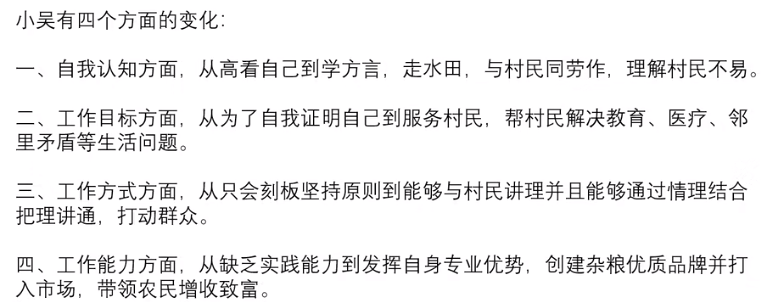

# Table of Contents

* [归纳概括](#归纳概括)
* [综合分析](#综合分析)
  * [基本思路](#基本思路)
* [对策启示](#对策启示)
* [大作文](#大作文)


# 归纳概括

1. 问啥答啥，有啥写啥
2. 理解语义，技巧辅助
3. 读出层次、找对大哥
4. 书写规范、形意结合


1. 根据材料1 小梁改善杨家村人居环境的主要做法

   ```
   
   　　材料一
   　　杨家村是深度贫困村，经过几年的努力，村里绝大多数贫困户已经圆了脱贫梦。为了稳定增收，杨家村决心借助山清水秀的景致发展乡村旅游。2019年年初，在政府和帮扶单位专项资金支持下，杨家村的美丽乡村项目顺利开工。水泥道路通村入户，古建民居修葺一新，竹木栅栏、青石台阶、小桥流水的景观设计，让这个昔日的深度贫困村华丽转身，好似世外桃源。
   　　村里漂亮了，可是人居环境却是个“老大难”。远远望去村容村貌焕然一新，可是走进老百姓家里一看，庭院乱堆放、杂物遍地是。以前村干部也多次上门做工作，但是群众认为这是自家的事，村干部管不着。关键时刻，省建筑工程集团公司的驻村第一书记小梁发挥聪明才智，为村里“量身设计”了一套解决方案。
   　　8月的一天，一场“积分兑换心愿，勤劳改变习惯”的文明习惯养成活动在杨家村拉开帷幕。小梁和村干部一起向村民征集有关家居环境改善的“微心愿”，并精心设计了十项涵盖个人卫生和居家环境的评分细则，每周公布评分结果，最终按照积分排名兑现前20名的“微心愿”。“我们想通过‘微心愿’来激发村民的内生动力，帮助大家养成好习惯，形成新风尚。”小梁说。
   　　村民们纷纷讲出了自己改善家居的愿望。“要是有台大彩电，忙完一天的农活，就可以陪孙子看动画片了！”村民张大娘说。“要是有台大冰箱，我家就能天天吃到新鲜饭菜了!”村民张伯伯说。他们的这些心愿，配上摄影师为他们拍摄的生活照，被制成精美的海报，张贴在村里醒目的位置。其中一张海报是65岁的唐大妈笑呵呵地在做针线活。“在整洁、干净的屋里做针线活儿，我心里那叫一个美啊！”海报上印着两行大字，这是唐大妈的感言。看着邻里乡亲竟然也能像明星一样登上如此精美的海报，村民们的荣誉感更强烈了。为了督促村民改变卫生习惯，实行有奖举报制度，发现谁家乱倒垃圾可以向村委会举报，调查属实的给举报者奖励一袋面粉。在大家共同努力下，改善家居环境一时间蔚然成风。小梁说，几个月来，从锅碗瓢盆、个人起居，到房前屋后、禽畜养殖，杨家村变化很大。
   　　村民夏姐的丈夫常年在外打工，她自己留在村里种地看孩子。一个人忙里忙外，难免顾不上收拾屋子。“自从参加活动以来，养成了好习惯，房前屋后都干净了，自己住着也舒服。”她说。
   　　从爱美之心人皆有之，到护美之行人人为之，杨家村这个新建成的美丽乡村，处处透着美的气息。小梁也如约为表现优异的家庭兑现了“微心愿”，夏姐领到了心仪的热水器，脸上露出了开心的笑容。
   ```

   **问题：**请根据给定资料，概括小梁改善杨家村人居环境的主要做法。（20分）要求：全面准确，简明扼要，条理清晰，不超过200字。

   1. 范围是什么？
   2. 内容是什么？ **小梁**改善**杨家村**人居环境的**主要做法**  
   3. 要求是什么？不超过200字

> 读材料的时候，要想这些关键词配不配出现


我们先看看参考答案，在自己分析分析材料中有那些关键信息，在将这些关键信息，总结概括出来

1. 我们看第一段，只是提到了杨家村，**小梁**并没有出现，第一段与我们没有关系
2. 小梁发挥聪明才智，为村里“量身设计”了一套解决方案。
3. 并精心设计了十项涵盖个人卫生和居家环境的评分细则，每周公布评分结果，最终按照积分排名兑现前20名的“微心愿”  “我们想通过‘微心愿’来激发村民的内生动力，帮助大家养成好习惯，形成新风尚。
4. 看着邻里乡亲竟然也能像明星一样登上如此精美的海报，村民们的荣誉感更强烈了。 为了督促村民改变卫生习惯，实行有奖举报制度，.....调查属实的给举报者奖励一袋面粉


2. 2020国考地市级第一题

   一、根据给定资料1，请你谈谈老马是怎样“当好基层这根绣花针”的。

   要求：准确、全面，有条理。不超过200字。

   1. **审题：**

   资料一；老马；怎样做好基层绣花针；有条理；200字。

   **2.分析：**

   此题为概括题；概括做法。（像这种基层干部的事例型材料，一般要求概括能力要强一些）

   **3.阅读材料**

   ```
   段1：上午9点不到，“老马工作室”的门口已经排起了长队。“我们小区消防栓不出水、电梯天天出故障，您可得给评评理。”“啥情况？你们先说，我记一下。”老马笑着掏出随身带着的笔和本，开始了一天的工作。
   
   段2：老马是街道首席调解员，也是全国人大代表，做了30年的调解工作。“老老少少都叫我‘老马’。去年两会上，也亲切地喊我‘老马’，让我又惊又喜！他握着我的手说，老马讲得好，接地气，很结合实际。”老马乐道，“他还说，基层工作就是上面千条线、下面一根针，必须夯实基层。我们需要千千万万像老马同志这样的基层干部。”
   
   段3：去年，老马接待群众600多人次，有家长里短，有邻里矛盾，也有基层治理中的一些问题。接待群众是门“技术活”，不仅要真诚待人，还得对政策烂熟于心。“当好基层这根‘绣花针’，状态要投入，本领得过硬，我一天都不敢怠慢。”虽已年过花甲，老马仍每天坚持学习3个小时。30年来，老马成功调解矛盾纠纷2000多起，写了160多本、520多万字的工作笔记。
   
   段4：一天下午，老马接待了一对夫妻，女的一说话就哭起来：“老马，我和他是没法过了。”原来，两人从农村进城打拼多年，生活富裕了，但矛盾也多了。老马一边安抚一边分析：“为什么穷的时候没有什么矛盾，富了反而矛盾多？说明精神贫穷，有短板。”一个小时的交流后，两人带着笑容离开，与来时相互指责的样子截然不同。“时代不一样了，老百姓生活越来越好，大的矛盾冲突越来越少。基层调解，更多的是要做好思想政治工作，做好情绪疏导和心灵抚慰工作。”老马总结道，“我不一定能帮助所有人解决问题，但我要尽最大努力帮大家都解开心结。所有的矛盾，只要用心去调就有解。调解常常不是说服了群众，而是感动了群众。”
   
   段5：老马这根与时俱进的“针”连得巧、织得密、缝得牢。多年来，老马给自己立下了接待群众的24字规矩：起立迎接，请坐倒水，倾听记录，交流引导，解决问题，出门相送。“工作室要成为一个温馨的驿站，群众只要来了，就要努力让大家愁脸进来笑脸出去。”有事没事找老马聊聊的人越来越多，老马总是笑脸相迎。有时，一些群众会问老马：“你是什么职务、什么级别？”“职务和级别都不重要，重要的是——我是你需要的人。”这就是老马的回答。
   
   段6：“我就是想来跟着学、跟着做。”22岁的小温大学毕业后到社区工作，听完老马的一次宣讲后，坚持来“老马工作室”实习。来老马这学习的可不仅仅只有小温，街道的社区综治干部每年都要来“老马工作室”学习一个月以上。老马培养了不少善做调解工作的“小马”。73岁的老党员老齐也经常来工作室找老马，他对老马说：“我年纪比你大，但我也是‘小马’，按照你的方法，我成功劝阻了小区里很多不文明行为呢！”在众多“老马”和“小马”的共同努力下，当地的各种矛盾纠纷逐年减少。
   
   段7：“基层干部就是一根绣花针，要把为群众服务视为终生事业。”老马说，“只要群众遇到困难，问谁是老马的时候，我都会毫不犹豫地站出来告诉他：我，就是老马！”
   ```

   4. 具体分析每段关键信息
      1. 无
      2. 无
      3. 状态要投入，本领得过硬，我一天都不敢怠慢 老马仍每天坚持学习3个小时。30年来，老马成功调解矛盾纠纷2000多起，写了160多本、520多万字的工作笔记。
      4. 基层调解，更多的是要做好思想政治工作，做好情绪疏导和心灵抚慰工作 只要用心去调就有解。调解常常不是说服了群众，而是感动了群众。”
      5. 工作室要成为一个温馨的驿站  起立迎接，请坐倒水，倾听记录，交流引导，解决问题，出门相送
      6. 老马培养了不少善做调解工作的“小马  当地的各种矛盾纠纷逐年减少。
      7. 基层干部就是一根绣花针，要把为群众服务视为终生事业  这才是大哥 重点！！！！
   5. 参考答案


​	

3. 材料5

   ```
    浙江是大运河世界文化遗产的重点区域。大运河浙江段的河道长度、遗产点段数量、遗产区面积等都在“中国大运河”世界文化遗产中占有较大的比重，共有11个河段280多千米河道，13处遗产点和18个遗产要素列入世界遗产名录。同时，大运河沿线的杭州运河元宵灯会、宁波妈祖信仰、湖州含山轧蚕花、嘉兴三塔踏白船、绍兴背纤号子，以及湖笔制作、黄酒酿造等传统技艺也得到了持续性传承，非物质文化遗产源远流长。
       大运河浙江段流经杭州、嘉兴、湖州、绍兴、宁波5市的20多个区县，沿线与运河的建设、交通、商业、生产活动密切相关且历史风貌和传统格局保存完好的运河城镇有22个，运河村落有3处。这些城镇、村落不仅保存了与运河密切相关的城乡历史文化聚落，如城墙、城门、历史街区、建筑群落等，而且保护传承了珍贵的运河文化，其中多个已纳入历史文化名城名镇名村保护范围，以保证其真实性、完整性的延续。
       浙江省早在2008年就启动了大运河浙江段的遗产资源调查和保护规划编制工作，为运河文化带建设打下了基础。为了加强大运河世界文化遗产保护，出台了全国首部运河保护条例《杭州市大运河世界文化遗产保护条例》，为运河文化带建设提供制度保障。成立中国大运河文化带建设浙江城市协作体，探索建立沿线城市共建共享大运河文化的体制机制。自2016年起，每年在杭州举办中国大运河国际论坛，推动中国大运河文化遗产可持续发展。
       在运河环境风貌的保护和整治方面，浙江严格管控大运河沿线各市、县的城镇建设项目，积极开展运河沿线城镇、乡村航道两侧的环境综合整治工作，努力展现运河两岸原有的历史环境风貌。结合“五水共治”工程的推进，运河沿线地方政府认真落实保护管理责任采取了截污纳管、工业污染整治、农村农业污染防治、河道综合整治等措施，运河水质全面改善，生态建设成效显著。
       2017年，杭州市第十二次党代会提出，要打响东方文化特色品牌，坚持保护第一、应保尽保，实施城市记忆工程，同时要发挥运河、西湖“双世遗”综合带动效应，沿河沿湖高端商务带要以金融服务、高端商务、商贸旅游、文化创意、现代物流等产业为特色，建成高端服业集聚发展带。
   ```

   

   1. 根据资料五，概括**大运河浙江段文化带建设的现状**。（10分）
          要求：
          （1）全面、准确，有条理；
          （2）字数不超过100字。(具有代表性 因为只有100个字)
   2. 分析文段
      1.    列入世界遗产名录 大运河沿线。。。传统技艺也得到了持续性传承，非物质文化遗产源远流长。
      2. 不仅保存了与运河密切相关的城乡历史文化聚落   保护传承了珍贵的运河文化
      3. 为运河文化带建设打下了基础  为运河文化带建设提供制度保障  共建共享大运河文化的体制机制 大运河文化遗产可持续发展。
      4. 河环境风貌的保护和整治   原有的历史环境风貌  采取了。。。。 ，运河水质全面改善，生态建设成效显著。
      5.  要打响东方文化特色品牌...，建成高端服业集聚发展带。
   3. 知道了上面关键信息，怎么合理归纳呢？我们先看看上面的大哥是谁？


4. 请根据资料 2， 归纳小童获得“全市十佳科技特派员” 荣誉的原因。（20 分）
   要求：（1） 归纳全面， 语言简明；（2） 不超过 200 字。

   ```
   	M市D区是省内实施科技特派员工程的试点地区。在村民们心中，科技特派员就是要给田间地头开药方，把先进的科技种到地里头，长出金苗苗。
   　　不久前，D区记者小菲就本区科技特派员的情况，对区科技局局长李明进行了一次采访。在采访中，李局长感叹道：“我们还有很多的工作可以做。”
   　　“我们的科技特派员大部分是行业领域的专家、大学生，有的讲授得偏重于纯理论，对农民来说，太过于抽象，不接地气，不实用。这在实际操作中是得不到农民欢迎的。再者说，术业有专攻，本是种蔬菜的农民，要是派一个专攻苗木培养的工作人员给他，又能有多少用呢？”李局长认为，“农民需要和专业领域对口的，有真才实学的，能听懂田坎语言的科技特派员对接，而非流于形式的‘拉郎配’。”
   　　D区目前共有440多个行政村，但科技特派员总共才82名。这令李局长忧心。“在这支队伍里，60来岁的根本不算老，最大的已经70多岁了。想想这些老人们还能在田坎上、果林里跑几年？而一个大学生想要成为一名科技特派员，起码要跟着老特派员学习两年。但是，有多少大学生愿意跟着天天进村下地？我们这些年过花甲的特派员又有多少精力来带这些‘徒弟’呢？”
   　　D区的村民老蒋也对小菲说道，“去年我养土鸡，上面给我安排了科技特派员。结果每次来就是帮我喂喂鸡苗，陪着唠唠嗑。后来我怀疑有些鸡苗害了瘟病，找他帮忙看看，他却说没事，叫我放心。结果后来几百只鸡全部染上了鸡瘟，让我损失惨重。”对此，老蒋表示很无奈。
   　　小菲对全区82名科技特派员进行了问卷调查。调查发现：有近三分之二的科技特派员认为自己的知识结构趋于老化，需要更新丰富。而同时，80%的科技特派员表示因为工作的关系，自己根本没有时间去自行组织学习，但如果有相应的知识讲座、观摩交流会的话，他们会积极参加，有优质的网络学习资源也不愿错过。并且这些特派员有不少同专业同领域的朋友、同学其实也有成为服务农村的科技特派员的意愿，但最后都因为工作忙、不在本地、不在政府指派培养范围内等原因而作罢。
   　　据悉，D区计划近期开展服务行动。围绕本地农业主导产业，建立一批“互联网+科技特派员”创新创业示范基地，对接国家、省里的“科技特派员管理服务平台”。
   　　材料2
   　　在2017年T市的“全市十佳科技特派员”评选活动中，小童以压倒性的票数获得第一名。一个年仅25岁的年轻人，为何能从平均年龄在50岁以上的本市特派员中脱颖而出呢？
   　　领导说，他所服务的S村地处偏僻，有一段路车根本开不进去，下雨天时他坐摩托车进村，常弄得一身泥，特别狼狈。可是他每个月去S村的次数和时间都远远超过了考核要求。同事们说，他要是有什么没弄懂的问题，肯定会睡不好觉，会缠着老特派员们搞清楚的。大学书本告诉了他“是什么”“为什么”，但他觉得还不够。从来到我们这儿，他就开始研究我们这儿的土壤、天气、乡情民俗，他一个北方人竟然在短短几个月时间里学会了我们这儿的方言。
   　　老乡们说，他态度好，说话和气。大家都喜欢和他说话。他说的话大家听得懂，句子不长，用的也是田坎语言，好懂实用。而且他手把手地传技术，把课堂设在田间地头，教给大家的东西都能被记得住。“他讲东西很接地气，富有土味儿。而且，他还会收集村民的需求，定期地在网上开展‘订单化’培训。这样的特派员难找。”村支书也对小童赞不绝口。
   　　而小童自己却说，自己能赢得大家的喜欢，在于自己会玩些“小花样”。“老乡们要的是技术，晦涩的理论讲得再高深，起到的作用也是有限的；老乡们学技术，最终还是要落脚到做上面去。科教本身有些乏味，必须要加点料才会有滋有味。我在做技术特派工作时，就坚持添加‘三味’：一是原味，坚持用原汁原味的田坎语言讲授，尽量讲短话，讲土话；二是鲜味，给乡亲们的一定是最新的农技知识，过时的、可能已经不适用的，坚决不讲；三是甜味，对乡亲们积极鼓励，尽量用积极的语言，谁都希望话好听啊，多给他们看看成功的案例，正面激励。如果你用的是本地语言，说的是农家事，讲的是致，讲的是致富经，他们不欢迎你都难啊。”
   ```

   1. 分析：
      1. 无
      2. 无
      3. 特派员没有做好的地方？不太确定
      4. d去问题
      5. d区问题
      6. 总体看完没有出现关键人物 小童！！！
   2. 材料二
      1. 无
      2. 领导说   吃苦耐劳   同事说 学历能力强
      3. 老乡说 为人和善
      4. 自己说  善于研究


5. **根据给定资料2，阐述城市水系所具有的的功能。（15分）**

   要求：准确、简练、条理清晰；不超过150字。

   ```
   段1：城市“现代化”的负面影响之一，就是使得城市不透水地表面积不断增加，严重地削弱了地表蓄洪、植物拦截和土壤下渗的功能。对洪水截流作用的消失，造成的后果就是地下水补给日益不足，地表径流量逐年提高。而且由于城市所产生的空气污染物为降水提供了大量的凝结核，所以一般而言，城市化地区的降水量要比农村高5%～15%，雷暴雨天气要多10%～15%。因此，城市水系应更多地承担起蓄积雨洪、分流下渗、调节行洪等功能。但是由于水系遭破坏，这些功能都极大地衰退了，而它们绝不是目前城市中广泛采用的管道排水或防洪工程所能取代的。
   
   段2：城市，大都是因水而兴起，因水而繁荣、发展。绝大多数历史悠久的城市，都是先有河后有城，许多城市的历史都是沉淀在河道、湖泊、海滨和湿地上的。如北京城区所有的河流，几乎都可以找到与其相关的历史文化古迹或典故；杭州城里的浣纱河，传说是西施浣纱的地方。许多城市因水而建，也因水而具有“灵气”。一些原本没有水面的城市，为了创造生态景观而人工修造出一系列的水面，如澳大利亚首都堪培拉的葛里芬湖。葛里芬是一位美国的规划师，他设计的堪培拉规划方案在多个竞标方案中胜出。按他的规划修建的堪培拉是非常秀美的，尤其是中间的湖泊，虽为人工开挖，却利用了山谷地形，蜿蜒曲折，调节了城市内部的气候，造就了堪培拉秀丽的景观。所以，堪培拉市民就把这位设计师的名字作为这个城市湖泊的名字。
   
   段3：自古以来，内河船运由于其低成本、高可靠性、安全性和可观赏性，始终受到人们的重视。近几年，英国许多地方还纷纷疏通古代运河以供城市间输送游客和农产品所需。另外，城市水系又是各城市之间的天然隔离带。在古代，所谓的护城河就具有保护城市、阻隔敌人的功效。而在现代，这些天然的河流是城市最壮观的公共空间。在人口日益稠密的现代城市中，城市水系与绿带公园结合在一起，构成了城市最漂亮、最令人流连忘返、最具有生态和文化功能的城市亮点。
   
   段4：城市水系可以成为廉价、有效的净化城市污水的天然场所。如果按照生态的方式而不仅仅是按照水利的要求、当地的要求来修建城市水系，使水面与岸边的生态系统相连接，就可以将水系改造为“城市之肾”，大大增强对污水的自然降解能力。城市的许多水生植物、微生物吸收磷化合物等污染物的能力强，而投资成本又很低，如果换算成每吨污水的处理费用，通常仅为传统二级污水处理厂的20%～50%，运行成本则只有10%～20%。由此我们可以得出，什么是环境友好型和资源节约型的城市发展模式。将这种人工湿地式的城市水系与污水处理厂的尾水回用再处理系统相连接，就可以使四类水在净化处理后达到饮用水源取水标准，实现城市水源的循环利用。这是从根本上解决城市缺水的百年大计。
   
   段5：生态学家卡琳•克里斯坦森在《绿色生活——2l世纪生活手册》一书中指出，“乡土感情可由本地多种多样特有的生物来增强”，忠告“不可破坏现存的生态系统和荒野”，建议要“在花园和邻近地区提供野生动物活动场所”，“建造一个池塘”并种植本地特有的野花、灌木和树，构建一个因草林多、昆虫长、鸟类聚、小兽生而形成的完整的小水系生物群落。这种生物群落在城市里面尤为宝贵。有专家曾提出西湖整治成功与否的一个简单的生态标准：“当野天鹅、野鸭子在西湖里生出蛋而且孵出小天鹅、小野鸭的时候，我可以据此判断西湖的整治是成功的。”我们许多城市的水系远没有达到这个标准，而且许多城市的水系改造更是偏离了这个标准。城市水系作为均质人工城市中的异质斑块，一旦与城市绿地系统相互连接，使野生动物可以通过廊道在斑块间进行迁徙，就可以提高城市生态系统整体抗风险的能力。按这样的思路发展的城市，不仅是人工的，而且是生态的、环境友好型的，更是资源节约型的。
   
   段6：城市水系是城市最美好的公共空间，是人工建筑中反映自然景观、田园风貌的主要场所。我们在扬州可以看到，中国古代造园艺术中对水景观的处理讲究师法自然，虽为人工，宛如天成。城市水系有多种美学功能。城市的特色离不开城市的水系，城市的水系就像城市的指纹。城市的意境美对人的心态有调节的作用。城市水系有动态美，因为城市的水是流动的，具有柔性、运动性，有利于消化污染以及水生物的生成和养育。城市水系有人文美，因为它是文化的载体，历代的名人雅士常在水边留下他们的痕迹。城市水系当然还有和谐美，因为它是一个整体复合的系统。从一个城市水系可以看出一个城市管理者的抱负，就像我国古代剧作家李渔所说的那样：“山水者，情怀也；情怀者，心中之山水也。”这就是说，要在城市里面造就人工环境和保护自然景观，采用什么样的水环境治理思路是由决策者的美学修养和情操来决定的。什么样的情怀，就会造就什么样的城市山水景观。如果胸中只有“一根”单纯的调水排洪的“竹子”，那么城市的水景观肯定十分单调枯燥，对历史文化遗存的水生态的“建设性”破坏就难以避免了；如果将美学功能凝聚在治理方案之中，那么造就出的城市就是美丽的。丽江古城最诱人的就是三条弯曲流动的溪水，这就是拨动心弦的城市水系之美。
   
   段7：如果城市发生火灾，城市水系的储存用水就可以用于灭火救灾。城市水系又是很好的备用水源，如果出现自来水供应安全事故，就可以用地表水作为水源。城市水系是城市生活生产用水的备用系统、防灾系统和城市安全的保障系统。
   ```

   ​	分析

           1. 城市水系应更多地承担起蓄积雨洪、分流下渗、调节行洪等功能
           2. 许多城市的历史都是沉淀在河道、湖泊、海滨和湿地上的  为了创造生态景观  调节了城市内部的气候
           3. 内河船运由于其低成本、高可靠性、安全性和可观赏性  城市水系又是各城市之间的天然隔离带 构成了城市最漂亮、最令人流连忘返、最具有生态和文化功能的城市亮点。
           4. 城市水系可以成为廉价、有效的净化城市污水的天然场所  将这种人工湿地式的城市水系与污水处理厂的尾水回用再处理系统相连接，就可以使四类水在净化处理后达到饮用水源取水标准，实现城市水源的循环利用。这是从根本上解决城市缺水的百年大计。
           5. 城市水系作为均质人工城市中的异质斑块，一旦与城市绿地系统相互连接，使野生动物可以通过廊道在斑块间进行迁徙，就可以提高城市生态系统整体抗风险的能力。
           6. 城市水系是城市最美好的公共空间，是人工建筑中反映自然景观、田园风貌的主要场所 
           7. 如果城市发生火灾，城市水系的储存用水就可以用于灭火救灾。城市水系又是很好的备用水源，如果出现自来水供应安全事故，就可以用地表水作为水源。城市水系是城市生活生产用水的备用系统、防灾系统和城市安全的保障系统。

   个人总结

   ​	

   ```
   1. \蓄积雨洪、分流下渗、调节行洪
   2.沉淀历史、创造生态景观、 调节了城市内部的气候
   3.供城市间输送游客和农产品所需、天然隔离带、最壮观的公共空间
   4.净化水、循环利用水、解决缺水
   5.提高城市生态系统整体抗风险的能力
   6.是人工建筑中反映自然景观、田园风貌的主要场所
   7.储存水、备用水、灭火救灾
   ```

   

6. **一、根据“给定资料1”，请概括小张家乡出现的新变化。（15分）**

   **要求：（1）准确全面，条理清晰；（2）不超过200字。**

   **给定资料1**

   ```
   　前些年，小张辞去了城里的工作，回家乡的镇上当了一名快递员。下面是他讲的“三农”新故事：
   
   　　前些年，快递公司刚进这个镇时，全镇每天收发的包裹只有几十个。到村里送快递，碰到下雨天，三轮车陷入泥里，经常要下来推车，送完快递回来，鞋子上总会沾上半斤烂泥巴。那时挺后悔把城里的工作辞了，感觉很失落。
   
   　　这几年，大家的生活水平上去了，网购的人越来越多，我的业务也好了起来。特别是前年，镇上的快递公司联合农林服务中心、电商协会给大伙上起了包装技术培训课，现在咱这里的瓜果蔬菜都用上了真空包装、低温保鲜技术，快递公司也更乐意接这种订单。有了销路，家里种的就不愁卖了。
   
   　　比如说吧，咱这里的枇杷很有名。以前，乡亲们摘回枇杷后，要乘两个多小时的公交车到几十公里外的城里火车站广场叫卖。那时，品质优良的枇杷也卖不上好价钱，有时连本钱都挣不回来。如今，镇里的枇杷大部分是通过电商平台销售的。每到枇杷采摘季，镇里的文化广场就会成为快递员的临时收揽点，乡亲们排着队邮寄，场面好不热闹。
   
   　　现在咱镇里的电商差不多有500多户了。去年镇里投资建了个农产品电子商务产业园，把大家拧在一块闯市场，今年镇上的生意就更好了。加上上个月新开的那家快递公司，我们镇里已经有了4家快递公司。
   
   　　如今大家腰包里有了钱，心气足了。我同事杨大哥这几年靠送快递，摘了帽，主动要求退出了低保。大伙对生活也讲究了起来，希望村子能漂亮些、路能好走些，闲时有地儿跳跳舞、下下棋。这不，政府投了很多钱搞建设，镇里几个大的村子，都通上了柏油路，路边插上了太阳能路灯，现在我们送快递方便多了。镇边上，搞旅游的那个村子，街两旁不仅修了排水沟、统一摆上了垃圾箱，还把老百姓的房子都整了整，青瓦白墙的，远远看，像画里似的。
   
   　　最近从城里回来的人，越来越多。要么像咱一样，做做快递，或者在镇里的企业打打工；要么回家接班，种点养点啥，通过快递卖出去，不比打工挣得少，还图个自在。原来乡下的钱往城里跑，现在城里的钱开始喜欢往村子里跑。城里人来我们这投资的越来越多，要么开工厂、搞农产品加工，要么办民宿、搞乡村旅游。
   
   　　和刚回来那会儿比，我现在心里踏实多了。上个月和爱人商量，打算承包村西头一块撂荒的地，再把周边几家的田一起租过来，像村里老李他们一样，也办个家庭农场。我想只要好好干，生活会越来越好的！
   ```

   1. 

      参考答案

      

7. > 【2021年国考地市第一题】
   > “给定资料 1”中，风林村在实施“村寨银行”项目后，发生了巨大变化。请你谈谈风林村有了哪些变化。（10 分）
   > 要求：全面、准确、有条理。不超过 250 字。

   ```
    **材料1**
    Y县的风林村有13个村民小组，曾是一个有名的贫困村。全村总体地貌为高山峡谷，森林覆盖率高，动物资源丰富。
   
   过去，靠山吃山、砍树卖钱，是当地人视为天经地义的生活逻辑。由于地处山区， 这里旱地多、坡地多，气候寒凉，适宜种植的经济作物种类较少，农民收入较低。“以前大家没钱了就上山去砍树卖，钱用完了又去砍，你砍、我砍、大家砍，对森林的破坏很大。” 风林村村民赵春桥说。这样的生产生活方式，让风林村的生态环境遭遇了前所未有的挑战。“小时候河水大到能推动水磨，后来山泉水少了，村里吃水都困难！”风林村党支部书记周云光说，山上的树越砍越少，河里的鱼渐渐消失，不仅当地的生物多样性遭到破坏，村民的生存发展也渐成问题。“可是，吃饭需要钱，盖房子需要钱，娃娃读书需要钱，不砍树，大 家的生计怎么办呢？”赵春桥说。
   
   怎么把村民力量发动起来，既让大家吃饱穿暖，又能保护好生态？为了解决生态保护和村民生存的矛盾，2016年，当地党委和政府在风林村引入“村寨银行”项目作为新的探索:村民以小组为单位，每家自愿拿出1000元入股，和其他社会扶持资金合起来，每年发放给小组内1/3的村民用于生产生活，借贷的村民1年后连本带息还款，下一批村民继续借贷，以此方式滚动实施。村民可以自由支配这笔钱，发展种养殖业、供孩子上学、盖房、 看病等，但要签订环保协议，承诺不再砍树，不再从事破坏生态环境的生产活动，违背协议者将罚没入股资金。
   
   一开始，村民并不认可和接受。当村民听说要建“村寨银行”，以为又是扶贫项目来了，都反响热烈，但后来听说项目还需要自己出资，便开始犹豫起来。“以前我们都是各过各的，谁也不管谁，现在要集资建银行，我们哪里懂哦!”“大家的钱怎么管？往哪个方向奔？要争取哪些利益？这些事情我们可几十年都没想过。靠我们自己，能行吗？”在夜晚，村民围着火塘挤在一起，七嘴八舌地讨论着。
   
   村民不断提出疑问、发表意见，并最终讨论出一个 人人都能接受的管理制度，比如： 谁砍树了，除入股本金被扣除外，全村人都不参加他家的红白喜事；谁家不还贷款，他家的林权证、政府发放的农资补贴等，就要被扣留……
   
   村民自己立规矩，效果出乎意料地好。村里因地制宜制定村规民约，村民之间也更和睦。大家一起商量垃圾怎么回收、怎么处理，“一事一议”落到了实处。几年下来，风林村环境好了，村民的心也拢在了一起，周云光干了近20年村干部，他说现在风林村“制度 最管用、自治最省心”。
   全村13个村民小组，都划定了自然保护地，并在村民讨论的基础上，制定了管理 条例，明确了自然保护地的范围、保护措施、奖惩措施，全体村民都有权利监督落实条例的 执行状况。
   
   借贷来的资金，村民们有的用于养猪、养羊等养殖业，有的用于中药材种植，也有的用于看病就医、子女就学等方面。“村寨银行”既满足了村民在生产生活中的各种资金需求，又激发了村民保护生态的内生动力，让保护自然环境成为了一种自觉。
   
   新房组李国坤家，家门口已搭起了五六个蜂箱，地里种上了野生菌。“全组都参加了这个项目，10户获得了首批贷款，有的种上了药材，有的买了猪羊。”李国坤介绍，全村 已经没人上山砍树了。“现在，护林员不用满山跑，轻轻松松坐在家里或者干干衣活儿，就能把山看管得好好的。因为，全村人的眼睛都在盯着呢!”李国坤笑着说。
   
   不能砍树，那就种树。几年下来，风林村转变了发展方式，种植了核桃、梅子等果树，开辟了中药材生产基地，共达3400多亩。村民在山上养蜂，田里种豆，通过专业合作社把农产品销往全国，大家的腰包也越来越鼓。
   
   随着生态越来越好，山上的金丝猴、小熊猫等珍稀动物又多了起来。越来越多的游客慕名来到风林村，村民们建客栈、开餐馆、跑运输、做向导，过好日子的劲头越来越足。
   
   “物无妄然，必由其理。风林村因地制宜，遵循自然规律，从坐吃山空到山绿人富， 走上了一条绿色发之路。”有环境治理专家评论道，‘村寨银行’与生态环保联动，通过对人们观念和行为方式的改变，进而影响自然的改变，最终实现人与自然关系的平衡和发展。”
   ```

    分析： 变化一定是好的

   1. 无
   2. 这样的生产生活方式，让风林村的生态环境遭遇了前所未有的挑战。？后文会不会说到生活方式的改变？大 家的生计怎么办呢 ？
   3. 引入“村寨银行”项目作为新的探索


8. 题干如下（材料在文段末）：

   “给定材料1”和“给定材料2”反映了改革开放以来我国农村土地承包政策的发展过程，请你概述这一发展过程。（10分）

   要求：

   （1）全面、准确，有条理；

   （2）不超过200字。

   ```
   材料1
   
   位于R市郊西隅的沙坝村，总面积约10平方千米，山清水秀，历史悠久。
   
   1980年前后，家庭联产承包责任制开始在中国广大农村推行。中共中央《关于加快农业发展若干问题的决定》《关于进一步加强和完善农业生产责任制的几个问题》等有关“包产到户”“包干到户”的文件一层层传达下来，但沙坝村却没有变革的迹象，人们还在观望。时任大队书记的杨某回说：“那时候土地、山林还有各种财产都是国家（集体）的，国家的东西，哪个敢随便动！”
   
   到了1981年底，沙坝村把耕地按好、中、差进行了搭配，然后按人口平均发包给村民，完成“分田到户”，第一轮家庭联产承包责任制在沙坝村初步落实。从此，在土地所有权不变的情况下，村民对于承包地有了经营权、使用权。当时的规定是：所有承包地土地，不许出租、买卖；不许在承包地上建房、烧砖瓦等。虽然承包时大队已经确定承包期是3至5年，但是，村民中仍有人怀疑分田到户不长久，会不会“今天分下去，明天又收回来”。直到1984年的中央一号文件提出“土地承包期一般应在十五年以上”，村民们的忧虑才初步解除。而后中央提出的“为了稳定土地承包关系，鼓励农民增加投入，提高土地的生产率，在原定的耕地承包期到期之后，再延长三十年不变”，算是给农民吃了“定心丸”。为了给农民稳定的土地承包经营预期，党的十九大报告明确提出“保持土地承包关系稳定并长久不变，第二轮土地承包到期后再延长三十年”。
   
   材料2
   
   L村位于某省中北部沿海平原区，粮食作物以小麦、玉米为主，冬小麦与夏玉米一年两季轮作，经济作物以苹果为主。L村的土地分为两类，一是“围庄地”，在村庄周边，有较好的水利条件；二是“洼子地”，离村庄远，水利条件较差。与全国大多数村庄一样，L村也在20世纪90年代中后期根据当时的政策完成了“二轮土地承包”。L村把全村土地分成两份，一份为各户承包的人口地；另一份为机动地。机动地主要用于给新增加的人口增地。
   
   与其他村庄二轮承包普遍执行的“增人不增地，减人不减地”的土地政策不同的是，L村在机动地上实行“增人增地但减人不减地”的办法。自二轮土地承包以来，L村的人口增减变化将近百人。L村给新增加的人口分配土地先从位置、水利条件较好的围庄地开始，围庄地分完之后，新增加的人口就只能分到洼子地了。到了2014年，预留的机动地全部分配完了，“增人增地但减人不减地”的办法也就难以为继了。
   
   村民李某在二轮承包时家里只有他们夫妇和未成年的儿子，多年后儿子娶妻生子，都没赶上村里分地，一家6个人种着3个人的地，收入窘迫。特别是每当看到邻居张某家2个人种着9个人的地时，颇有怨言：“明显不公平，就应收回重分。”但张某对他的话却不完全认同：“我家地多人少是事实，可二轮续包的时候就是这样，30年不变也是国家规定的。”
   
   与李某、张某想要地、想种地不同，L村还有不想要、不想种地的人。76岁的万老汉，家里有6亩地，儿子和孙子都在外地打工、上学。每年的秋收季节都是万老汉最发愁的时候，繁重的劳动都得雇人帮忙。他想把地流转出去，但因为地比较零散，收益也不高，流转也很困难。村里和万老汉情况差不多的还有二十多人。近几年一直在外地打工的王某说：“种地费时费力不说，农忙时回家打理，请假还要被扣工资，不合算。这两年一直是托付亲戚来种地，没什么收益，明年也不想这么干了。”此外，村里还有10户完全脱离农业的家庭，因各种原因，他们承包的土地大多撂荒了。
   
   现任村支书告诉记者说，村里二轮承包后一直没进行土地调整，这是因为国家对土地调整有政策，明确提出“小调整、大稳定的前提是稳定”。“小调整”的间隔期最短不得少于5年，而且“小调整”只限于人地矛盾突出的个别农户。2006年因为村民的承包地占用量与家庭人口不均衡，村里曾有过一次调整的打算，村委会研究决定：凡是人口减少以及已经迁往城镇落户的农户，其承包的土地份额一律收回，另行发包给新增人口的农户。村民石某因妻子去世而被收回了2亩地。石某不服，将村委会告上法庭，要求返还被收走的土地。
   
   法院经审理认为，2003年实施的《农村土地承包法》确立了“承包土地以户为单位，减人不减地”的原则。根据该法律，家庭承包经营权的主体是农户整体，而不是家庭成员个体。只要承包方的家庭还有人在，土地就是不能收回。只有在承包经营的家庭消亡，或承包方全家迁入设区的市并转为非农户口的情况下，发包方才可以收回承包地。如果承包方自愿放弃承包地，则应提前半年提出申请。最后法院判决村委会返还石某土地。石某这一告，那次土地调整就没往下进行。后来，国家对土地调整的限制越来越严格，多次强调“承包期内，发包方不得调整承包地”“现有土地承包关系要保持稳定并长久不变”。
   
   2016年春，李某和一些农户以土地承包量有失公平为由找到了当地政府，要求调整。这一诉求得到了政府的支持。面对这种局面，村支书无奈地说：“这样一来，我们的压力很大，看来村里的土地调整也不是一个简单的事。”
   ```

   


9. 

要求：

　　(1)准确、精炼;

　　(2)标题和三个小标题须分条写，小标题要标注序号;

(3)每条不超过20字。

给定资料2.

(标题)______________________________

　　9月28日上午，在×× 博览中心，第七届大学生I-CAN物联网创新创业大赛中国总决赛颁奖仪式举行。本次比赛共有来自全国63所学校的267支队伍参加了角逐，野战“活点”沙盘、意世界、笔记本防护装置、蜜蜂之家等作品获得了特等奖，另外，全息3D成像、仿生鲶鱼、防丢宝、煤气智能报警系统、安全小车系统、太阳光雨水发电等颇为接“地气”的作品获得一二三等奖。据主办方介绍，今年参加大赛的作品涉及面更广，专业领域包括了家居、医疗等多方面，并且评委在评分中更加注重作品的市场潜力和应用价值。

　　(小标题一)______________________________

　　上午9点，颁奖仪式预约举行，依次办法了60个三等奖、40个二等奖、15个一等奖与5个特等奖。一个个充满活力的年轻获奖队员鱼贯上台领奖，对于他们来说，更多的是一种团队参赛的快乐和创意成真的成就感。某工程大学的一位参赛选手告诉记者：这次参赛他们从创意设计到做成成品总共花费了8个月的时间，前前后后少不了同学们通宵达旦的钻研，“在团队合作中，大家都听队长的，对自己分工的活认真仔细，遇到难题一起研究。现在获得了三等奖，非常有成就感。”

　　而在会场上，也有不少企业代表对这些创新技术非常感兴趣。一位企业家表示，年轻人有梦想，感想敢干，看好他们作品的市场前景，鼓励他们创业，如果有机会会与大学生团队开展合作。

　　(小标题二)______________________________

　　“太阳光雨水发电器，非常适合多雨的南方。”“交通事故警报APP，发生事故后，软件会自动发信息给你的家人。”看到这些品种繁多的获奖作品，真让人有种只有你想不到，没有你做不到的感觉。记者在采访中发现，今年的获奖作品中出现了不少新颖有特色、生活味道十足的作品，不仅又防丢钥匙的智能锁，还有各种趣味盎然的新发明。北京某大学的发明团队发明了一款“M-Fish只能鱼缸”，这款鱼缸可以与手机联通，使用者可以通过手机发送信号，控制鱼缸的充氧量，精确把握鱼食喂养。

　　某大学分校的参赛团队研发的“舒心电风扇”，是利用物联网技术制造的感应风扇，如果人体皮肤靠近，风扇就会自动关停，这样可以预防小孩子不小心将手伸进电风扇之中受伤，或者具体太近造成感冒。太原某大学团队设计的煤气智能报警系统，通过计算火焰，煤气流量等，能够及时发现煤气有没有泄露，从而报警。

　　(小标题三)______________________________

　　获奖作品中，那些与人身安全相联系的几款作品尤为引人注目。获得一等奖、由湖北某师范学院团队研发的安全校车系统，就是从新闻中心校车闷死儿童的时间有感而发、创造出一款防止在校车中遗落儿童的软件。据获奖团队介绍，他们4个伙伴用四五个月的时间，从多套方案中挑选了2套，这款作品应用了物联网技术，根据探头、座椅压力等信号综合计算，判断车内是否有人遗落，并且批量生产的成本适合市场推广。

　　具有市场潜力并且经过市场验证的作品更是脱颖而出，获得特等奖的一款“蜜蜂之家”作品是某科技大学团队研发的。他们曾经将自己的作品带到田间地头，“我们去湖北的蜂农农场呆了3个月，就是想实地检测一下这款产品到底有没有用。”团队队长小程说，他们通过实地检验，发现作品真的可以解决蜂农养蜂中的温度控制问题。该作品的实用性得到了评委的一致好评，成功摘金。


大学生创新创业大赛颁奖，评分注重市场导向

一、团队参赛有成就，企业青睐愿合作

二、作品新颖有特色，贴近生活又智能

三、安全作品受关注，作品实用获好评


10.   题目一、 请结合“给定资料1”和“给定资料2”，对比分析概括两地民居保护工作的不同之处。(25 分)

    要求：概括全面，分析深入，条理清晰。字数不超过350字。

https://zhuanlan.zhihu.com/p/434761141


# 综合分析

**综合分析题主要有两种**：

+ 一种对一个观点进行判断，比如例1，我们称之为评论型综合分析题；
+ 一种是给定一个词语或者一个句子让我们去解释或者理解，比如例2，我们称之为阐释型综合分析题。

```
1、新技术的使用能否突破社会结构的屏障，是很多人关心的问题。根据给定资料2，谈谈你的看法。（20分）要求：（1）观点明确，有理有据；（2）论述全面，语言简明；（3）不超过250字。

2、请根据“给定资料2”谈谈你对“文化鲶鱼”的理解。要求:观点正确、内容全面、语言简练。不超过300字。
```


## 基本思路

考试大纲中对“综合分析能力”是这样表述的，即“要求对给定资料的全部或部分的内容、观点或问题进行分析和归纳，多角度地思考资料内容，作出合理的推断或评价。”

所以简而言之，就变成了人人貌似都知道的“**是什么、为什么、怎么办”这3个层次、9个字**。

1、**“是什么”层次，是答题的方向标**。一开始答偏了，后面就会跟着偏。关于这么答好这个层次，等会我通过具体例题更大家交流。

2、**“为什么”层次，这是我们作答的重点。**那么何为重点？就是我们在答题的篇幅上要占大头。所以，以后做综合分析题，你要先检查一下哪个层次占的字数最多，如果不是“为什么”这个层次，那么不好意思，得分点很多地方会采空。

3、**“怎么办”层次，什么时候是措施？什么时候是结论？**很多人容易搞错，一般大家都一股脑的写措施，这显然也是没能理解答题思路的精华。那么究竟怎么进行区分，这里给大家一个简单的判别原则。如果我们分析的内容是一个具体需要解决的问题，那么我们会以措施的形式去总结，这时候往往材料中也会提到一些措施；反之，我们得出结论即可。


1.“给定资料2”中说：“我们不仅仅是为乡村群众唱几场戏，更重要的是要‘种戏’”。请你根据“给定资料2”，谈谈对“种戏”的理解。(15分)

要求：分析全面，条理清晰。不超过300字。
 ```
   2.“曹团长今天下午又要来教戏了。”消息一大早就在新民县刘村传开了，刘桂英放下碗筷，稍做收拾，来到村头大舞台，争分夺秒练习，等待老师前来指点。
   
   40多岁的刘桂英，从小跟着家人听戏，一不留神，从“粉丝”变成了“戏痴”。在过去，刘桂英跑遍十里八村去看戏。如今，不出村就能在家门口欣赏名家唱段了。最让她开心的是，这些名角不仅到村里唱戏，还教村民唱戏。
   
   “过去演几场就走了，群众‘不解渴’。如今剧团开展‘结对子、育骨干’，在乡村打造一批不走的农民剧团。”新民县花鼓戏团团长曹文君说。
   
   刘桂英不出村就能得到名师指点，得益于新民县实施的文化惠民工程。虽然仅新民县花鼓戏团每年就到乡下演出100多场，但要让戏曲在乡村扎下根，最好的办法是让群众“自娱自乐”。因此，除了政府出钱，群众看戏之外，新民县还鼓励戏曲艺术表演团体与乡村戏曲团队开展“结对子、育骨干”活动，通过“搭台子、指路子、给梯子”等方式，鼓励民间文艺团体发展，对乡村文艺人才进行传帮带，帮助他们提高创作水平和表演能力。
   
   农民演、农民看。人称“戏窝”的刘村已经这么唱了4年，现在唱上了瘾。刘村农民花鼓戏团的演员也逐年增加，从3人到5人，最后发展到30人。
   
   “戏曲是在民间产生的，又在民俗活动的氛围中逐步发展起来。要在乡村推广普及戏曲艺术，就要借助民间的生活礼仪，培育戏曲在乡村生存发展的文化土壤。”曹文君说，新民县花鼓戏团充分把握春节、元宵节、端午节、中秋节、重阳节等重要民俗节庆，结合民间风俗和节庆文化开展戏曲演出，老百姓非常喜欢。
   
   怎样确保唱的戏是乡村群众欢迎的?一份《乡村演出节目单》，一份《乡村演出调查问卷》，是新民县探索让“戏”对味和受欢迎的举措。“每隔一段时间，我们会和院团沟通，制定《乡村演出节目单》下发到村里。村民从中选出最喜欢的5个，我们汇总需求后反馈给院团，他们以此安排接下来的演出。”新民县文化和旅游局副局长张学敏拿着一份调查“菜单”说，“去年县里做了3次调查，下发3000多份调查问卷。调查结果是乡村的青年观众更喜欢现代戏，而中老年观众更喜欢传统戏曲，尤其是贴近乡村生活的戏。”
   
   “目前乡村的戏曲观众仍以老年人为主，要吸引年轻人的关注，有必要对戏曲剧目进行现代化创新。”于是，针对不同年龄段观众的不同需求。新民县花鼓戏团在乡村演出的不仅有经典的花鼓戏，还有现代戏。“我们以现代戏吸引年轻观众来现场，再演几出有趣的花鼓小戏，很快，一些人就被花鼓戏‘圈粉’了。”曹文君说，“戏曲院团也应根据乡村演出市场的规律安排自己的演出计划。既然观众需求不一样，我们就不能一成不变，所以大家花心思加入了许多现代元素。我们以进乡村为契机，采集了许多贴近乡村生活的民间故事，创排了《五朵村花》《鹅匠》等现代戏曲作品，不仅老年人喜欢，年轻人也看得津津有味。只有把戏唱在群众心坎上，才能吸引乡村观众，让戏曲在乡村真正留得下。”
   
   每次演出前，花鼓戏团的演员都会给观众介绍一下剧目的内容、作者、创作背景等，一点一滴地为他们普及戏曲知识。对此，曹文君解释道：“除了要为乡村观众唱好戏，我们还要培养乡村观众，让他们了解戏曲、认识戏曲、喜欢戏曲。”
   
   盛夏的一天，花鼓戏排练厅的温度接近40摄氏度，15岁的婷婷和20多个同龄的孩子，还在这里集中训练。他们是花鼓戏团与新民县职业高级中学联合创办的戏曲表演班的第一期学生。经过近一年的学习，婷婷的一招一式已经颇有味道。听说要经常下农村演出，很辛苦，她不假思索地说：“我们本来都是农村里的孩子，所以去农村演出就是回家，并不会觉得辛苦。”“从乡村挖掘有潜力的孩子加以培养，以后再反哺乡村，乡村的戏曲才能得以持续。”曹文君说道。
   
   “我们不仅仅是为乡村群众唱几场戏，更重要的是要‘种戏’。”张学敏说，“戏曲生长在民间、活跃在民间、变革在民间。戏曲的生存与发展有其自身的规律，只有回归民间，回归群众，才能在乡村留得住、传得开、唱得响。”
 ```

   


2. **根据“给定资料3”，请分析小吴发生了哪些变化，使得村民对她的称呼从“那个大学生”变成了“小吴”。（10分）**

   **要求：（1）准确全面，恰当提炼，条例清晰；（2）不超过200字。**

   **给定资料3：**

   　　

   ```
   小吴是北方某地宁堡村大学生村官。下面是她讲的“成长”故事：
   
   　　2016年，我被组织选派到宁堡村担任村主任助理。那时我觉得自己是大学生，肯定比农民强。村干部和村民们对我都很客气，但就是不分配活儿给我。那时我最大的活儿就是“看家”，大家出去办事，让我守在村部。我也不愿闲着，为了证明自己，一开会我就抢着发言，但不管我说得多么激情澎湃，大家一点反应也没有。第一次下田干活，我就把鞋陷进了泥里，旁边有人说：“这大学生下地还得跟个提鞋的。”
   
   　　刚到村里，我看很多事不顺眼，总觉得自己在理，大家做事应该按照我的想法来。村里核发水田地***补***偿***款，要量土地，村支书认为我是外村人，能一碗水端平，就让我负责这事。有几个人找我说情，想要皮尺松一点，好多得点补偿。我一点不让，把尺绳拽得紧紧的。结果一位村民当场质问我：“你个外来人，想干啥？”
   
   　　第一年年终评议会上，有4个人给我投了不合格票。我的委屈突然爆发，回到屋里就哭了，觉得自己表现挺优秀，关键是我也一直想要给村里干事，怎么还受这气？当时，村支书跟我讲了一番话，对我触动很大：“你坚持原则是对的，关键在怎么做。有理还不够，在村里得想办法跟老百姓把理说通。要把理说通，首先你得和大家干在一起。”他建议我，每天到老乡家干农活，一次两个小时。
   
   　　从那以后，我开始努力学说土方言，走水田地、学农活。每天“服役”两个小时，每次换一家。手掌上的血泡起了破，破了又起，汗水渍透了衣服。我慢慢感受到了农民的不易，也理解了“脚下沾有多少泥土，心中就沉淀多少激情”的含义。一段时间下来，和大家熟络了，村民们从自家娃娃读啥学校、看病到哪个医院、添置家电买啥牌子，到调解邻里矛盾都愿意找我帮忙。村里一户人家因为不满征***地***补***偿***，不断上***访。那段时间，我不时到他们家串门、唠家常，见他们家生活困难，就帮着申办救济，这户人家深受感动，后来再也没有去闹了。我还发挥自己的专业优势，成功创建本村优质杂粮品牌并打入南方市场，为大家闯出了一条增收致富的新路。去年，我被市里评为优秀大学生村官。
   
   　　现在，村里人对我的称呼，也渐渐从“那个大学生”变成了“小吴”。“小吴来了啊！”、“小吴吃了吗？”，上了年纪的，则直接叫我“小吴闺女”。我之前不太把这些话放在心上，体会到这些关心来之不易后，每次听到心里都暖暖的。
   ```

   

3.  **依据“给定资料2”，阐述划线句子“城市的水系就像城市的指纹”的意思。（10分）**
   　　**要求：（1）准确、全面，有逻辑性；（2）不超过200字。**

   ```
    城市“现代化”的负面影响之一，就是使得城市不透水地表面积不断增加，严重地削弱了地表蓄洪、植物拦截和土壤下渗的功能。对洪水的截流作用的消失，造成的后果就是地下水补给日益不足，地表径流量逐年提高。而且由于城市所产生的空气污染物为降水提供了大量的凝结核，所以一般而论，城市化地区的降雨量要比农村高5%～15%，雷暴雨天气多10%～15%。因此，城市水系应更多地承担起蓄积雨洪、分流下渗、调节行洪等功能。但是由于水系的破坏，这些功能都极大地衰退了，而这些功能决不是目前城市中广泛采用的管道排水或防洪工程所能取代的。
         城市，大都是因为水而兴起，因水而繁荣、发展。绝大多数历史悠久的城市，都是先有河，后有城，许多城市的历史是沉淀在河道、湖泊、海滨和湿地上的。如北京城区所有的河流，几乎都可以找到与其相关的历史文化古迹或典故；杭州城里的浣纱河，传说是西施浣纱的地方。许多城市因水而建，也因水而具有“灵气”。一些原本没有水面的城市，为了创造生态景观而人工修造出一系列的水面。如澳大利亚首都堪培拉的葛里芬湖。葛里芬是一位美国的规划师，他设计的堪培拉规划方案在多个投标方案中胜出，按他的规划修建的堪培拉是非常秀美的，尤其是中间的人工湖，虽为人工开挖，但却利用了山谷地形，蜿蜒曲折，调节了城市内部的气候，造就了堪培拉秀丽的景观。所以，堪培拉市民就把这位设计师的名字作为这个城市湖泊的名字。
         自古以来，内河船运由于其低成本、高可靠性、安全性和可观赏性，始终得到人们的重视。英国许多地方近几年还纷纷疏通古代运河以供城市间输送游客和农产品所需。城市水系又是各城市之间的天然隔离带。在古代，所谓的护城河就具有保护城市、阻隔敌人的功效。而在现代，这些天然的河流是城市最壮观的公共空间，在人口日益稠密的现代城市中，城市水系与绿带公园结合在一起，构成了城市最漂亮、最令人留连忘返、最具有生态和文化功能的城市亮点。
         城市水系可以成为廉价、有效的净化城市污水的天然场所。如果按照生态的方式而不仅仅是按水利的要求、当地的要求来修建城市水系，使水面与岸边的生态系统相连接，就可以将水系改造为“城市之肾”，大大增强对污水的自然降解能力。城市的许多水生植物、微生物吸收磷化合物等污染物的能力强，而投资成本又很低，如果换算成每吨污水处理费用，通常仅为传统二级污水处理厂的五分之一到二分之一，运行成本只有十分之一到五分之一。由此我们可以得出，什么是环境友好型和资源节约型的城市发展模式，通过这些数据我们就可以找到答案。将这种人工湿地式的城市水系与污水处理厂的尾水回用再处理系统相连接，就可以将四类水净化处理后达到饮用水源取水标准，实现城市水源的循环利用。这是从根本上解决城市缺水的百年大计。
         生态学家卡琳•克里斯坦森在《绿色生活——2l世纪生活手册》一书中指出，“乡土感情可由本地多种多样特有的生物来增强”，忠告“不可破坏现存的生态系统和荒野”，建议要“在花园和邻近地区提供野生动物活动场所”，“建造一个池塘”并种植本地特有的野花、灌木和树，构建一个因草林多、昆虫长、鸟类聚、小兽生而形成的完整的小水系生物群落。这种生物群落在城市里面尤为宝贵。有专家曾提出西湖整治成功与否的一个简单的生态标准：“当野天鹅、野鸭子在西湖里生出蛋而且孵出小天鹅、小野鸭的时候，我可以据此判断西湖的整治是成功的。”我们许多城市的水系远没有达到这个标准，而且有许多城市水系改造更是偏离了这个标准。城市水系作为均质人工城市中的异质斑块，一旦与城市绿地系统相互连接，使野生动物可以通过廊道在斑块间进行迁徙，就可以提高城市生态系统整体抗风险的能力。按这样的思路发展的城市，不仅是人工的，而且是生态的、环境友好的，是资源节约型的。
         城市水系是城市最美好的公共空间，是人工建筑之中反映自然景观、田园风貌的主要场所。我们在扬州可以看到，中国古代造园艺术中对水景观的处理，讲究师法自然，虽为人工，宛如天成。城市水系有多种美学功能。城市的特色离不开城市的水系，城市的水系就像城市的指纹。城市的意境美对人的心态有调节的作用。城市水系有动态美，因为城市的水是流动的，它具柔性、运动性，有利于消化污染以及水生物的生成和养育。城市水系有人文美，因为它是文化的载体，历代的名人雅士常在水边留下了他们的痕迹。城市水系当然还有和谐美，因为它是一个整体复合的系统。从一个城市水系可以看到一个城市管理者的抱负，就像我国古代剧作家李渔所说的那样：山水者，情怀也；情怀者，心中之山水也。就是说，要在城市里面造就人工环境和保护自然景观，采用什么样的水环境治理思路是由决策者的美学修养和情操来决定的。什么样的情怀，就会造就什么样的城市山水景观。如果胸中只有“一根”单纯的调水排洪的“竹子”，那么城市的水景观肯定是十分单调枯燥，对历史文化遗存的水生态的“建设性”破坏就难以避免了；如果将美学功能凝聚在治理方案之中，造就出的城市就是美丽的。丽江古城最诱人的就是三条弯曲流动的溪水，这就是拨动心弦的城市水系之美。
         如果城市发生火灾，城市水系的储存用水就可以用于灭火救灾。城市水系又是很好的备用水源。如果出现自来水供应安全事故，就可以用地表水作为水源。城市水系是城市生活生产用水的备用系统、防灾系统和城市安全的保障系统。
   ```

   分析：题目要求我们 解析【城市的水系就像城市的指纹】先看这段话出现在哪里？

   城市的特色离不开城市的水系，城市的水系就像城市的指纹。

   我们是不是要分析为什么城市的特色离不开水系？

   上面概括已经讲了这个题了。但是只是讲城市的美系 而不是功能

   ```
    城市水系是城市最美好的公共空间，是人工建筑之中反映自然景观、田园风貌的主要场所。我们在扬州可以看到，中国古代造园艺术中对水景观的处理，讲究师法自然，虽为人工，宛如天成。城市水系有多种美学功能。城市的特色离不开城市的水系，城市的水系就像城市的指纹。城市的意境美对人的心态有调节的作用。城市水系有动态美，因为城市的水是流动的，它具柔性、运动性，有利于消化污染以及水生物的生成和养育。城市水系有人文美，因为它是文化的载体，历代的名人雅士常在水边留下了他们的痕迹。城市水系当然还有和谐美，因为它是一个整体复合的系统。从一个城市水系可以看到一个城市管理者的抱负，就像我国古代剧作家李渔所说的那样：山水者，情怀也；情怀者，心中之山水也。就是说，要在城市里面造就人工环境和保护自然景观，采用什么样的水环境治理思路是由决策者的美学修养和情操来决定的。什么样的情怀，就会造就什么样的城市山水景观。如果胸中只有“一根”单纯的调水排洪的“竹子”，那么城市的水景观肯定是十分单调枯燥，对历史文化遗存的水生态的“建设性”破坏就难以避免了；如果将美学功能凝聚在治理方案之中，造就出的城市就是美丽的。丽江古城最诱人的就是三条弯曲流动的溪水，这就是拨动心弦的城市水系之美。
   ```

   

# 对策启示


# 大作文

