# Table of Contents

* [数字推理](#数字推理)
  * [整个数列的递增不明显](#整个数列的递增不明显)
    * [优先考虑做差](#优先考虑做差)
    * [再次考虑多级做差](#再次考虑多级做差)
  * [整个数列的递增很明显](#整个数列的递增很明显)
  * [幂次数](#幂次数)
  * [分数](#分数)
  * [分组](#分组)
  * [机械拆分](#机械拆分)
  * [画图数列](#画图数列)
* [基础知识](#基础知识)
  * [最小公倍数](#最小公倍数)
  * [奇数偶数](#奇数偶数)
  * [质数](#质数)
  * [整除](#整除)
* [溶质不变浓度问题](#溶质不变浓度问题)
  * [给溶质 套公式](#给溶质-套公式)
  * [未给溶质 设一个](#未给溶质-设一个)
* [十字相乘](#十字相乘)
  * [适用题型](#适用题型)
    * [溶液混合问题](#溶液混合问题)
    * [（二）分组平均数混合](#二分组平均数混合)
    * [（三）利润率混合](#三利润率混合)
    * [（四）比例混合](#四比例混合)
    * [（五）增长率混合](#五增长率混合)
* [周期循环](#周期循环)
  * [**求某年某月某日是周几问题**](#求某年某月某日是周几问题)
  * [**每隔3天就是每4天**](#每隔3天就是每4天)
  * [周期问题求最值](#周期问题求最值)
  * [一个月有几个工作日](#一个月有几个工作日)
* [牛吃草问题/消长问题](#牛吃草问题消长问题)
* [容斥问题](#容斥问题)
  * [基本概念](#基本概念)
  * [核心公式](#核心公式)
* [最值](#最值)
  * [最值-最不利极限提概述](#最值-最不利极限提概述)
  * [**最值-和定最值问题**-重点](#最值-和定最值问题-重点)
  * [最值-函数最值](#最值-函数最值)
  * [最值-三端最值](#最值-三端最值)
* [排列组合 -必考](#排列组合--必考)
  * [基本定义](#基本定义)
  * [解题思路](#解题思路)
  * [相邻-捆绑法](#相邻-捆绑法)
  * [不相邻-插空法](#不相邻-插空法)
  * [定序问题](#定序问题)
  * [全错位排序](#全错位排序)
  * [环形排序](#环形排序)
  * [平均分堆问题](#平均分堆问题)
  * [相同元素分配问题](#相同元素分配问题)
* [概率](#概率)
  * [几何概型-了解](#几何概型-了解)
  * [列题](#列题)
* [](#)
  * [比赛问题](#比赛问题)
  * [其他题型](#其他题型)
* [工程问题](#工程问题)
  * [已知时间](#已知时间)
  * [效率问题](#效率问题)
  * [合作问题](#合作问题)
* [几何图形](#几何图形)
* [利润问题](#利润问题)
  * [分批销售](#分批销售)
  * [基础题](#基础题)
* [鸡兔同笼问题](#鸡兔同笼问题)
* [数字推理](#数字推理-1)
* [参考资料](#参考资料)


# 数字推理

数字推理不是广东的特色考点，但广东的数字推理是比较有“特色”的，他的特色就是简单，特别是2019年的数字推理。但我们不能因为某一两年考得简单而简单地学，为了让大家更加系统地学习数字推理，今天兼得先生为大家全面梳理了数字推理的几大题型以及解题方法，相信我，把这几个类型的数字推理学透，广东省考的数字推理你会拿满分的，好了，直接上干货吧，我不擅长往文章里兑水，当然，也不会这样做。

广东解题方法以及常考题型都比较固定。**做这类目最重要是要关注题目的“信号”。当出现这类“信号”时，需要马上对号入座**，选择对应的方法。广东考的数列每年题量基本固定在5题。而知识点也是在5个左右


## 整个数列的递增不明显

### 优先考虑做差 

为什么？因为递增很明显，普通的加减完全满足不了这个规律

1 ，3 ，5 ，7 ，（ ）

注意：作差出来的数字都是有规律的数列，

如1,2,3,4或2,4,6,8

大家按这个方法来做一下这两道题：

例 2 ：0 ，1 ，6 ，15 ，28 ，（ ）

例 3 ：1 ，2 ，6 ，15 ，31 ，（ ）

### 再次考虑多级做差

俗话说，这个世界上没有一顿宵夜解决不了的事，如果有，那就两顿。作差数列也是同样的道理，**你作差一次找不到规律，那你就再作差一次**，看能否得到明显的规律。多级作差就是指需要作差两次或两次以上才有明显规律的数列。

例：1 ，2 ，5 ，12 ，25 ，（ ）

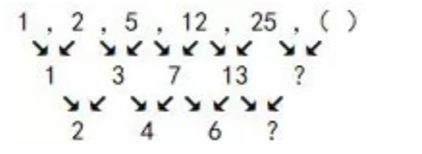

## 整个数列的递增很明显

刚才已经说过，如果单调陡增很明显的话，就是考另外两个考点，一是前后倍数关系，二是幂次方类。其中前后倍数关系类的数列，是递推数列中比较常考的一类。

**所谓递推，是指前后项存在着一定的关系，然后按这个关系递推出结果，也就是后面的数是根据前面的数按照一定的关系得来的，最基本的递推关系就是和、差、积、商**

**（一）先拿几个例子和大家简单介绍一下，什么是递推数列：**

**1.和，如：**

1、2、3、5、8、13、（21）

1+2=3，2+3=5，3+5=8，

第一项+第二项=第三项

**2.差，如：**

21、13、8、5、3、2、（1），

21-13=8，13-8=5，（ ）=3-2=1；

**3.积，如：**

1、2、2、4、8、（32）

1x2=2，2x2=4，（ ）=4x8=32；

**4.商，如：**

32、8、4、2、2、（1）

32÷8=4，8÷4=2，（ ）=2÷2=1。

+  递推数列解题思维

递推数列，关键是找关系，前后项可以通过什么相互关系得来呢？**这类题目一般是从第二项或者第三个项开始找关系的：**

例6：1 ，2 ，3，10 ，39 ，（ ）

**也就是：3是怎么来的、他和前面两项可以通过什么关系转化而来；10是怎么来的、39是怎么来的。当然，这道题有几种解法。**

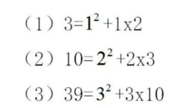

## 幂次数

包括（平方数、立方数、4 次方）。这类题本身是幂次数，广东经常考这么简单的，**最多就是在幂次数的基础上加减一个数**，这就演变成修正幂次数列。这类型的题目其实很简单，但是平时要多练习，培养自己对数字的“**敏锐**”性。


一般出现在有几个数字，突然冒出一个分数，这时需要考虑负幂次方变换。


## 分数

分数数列考察的方向也有几个，**分别是“化同”、“分子分母分开找规律”“反约分”、“前后关系”等**


**1.“化同”**，也就把整个数列的分子或者分母化成同一个数，然后找规律。方法观察数列，能否把分母或者分子通分化为一致，能一致就进行分母或分子同分，然后观察规律。大**分母都一样，接下来找分子的规律就可以了，6+8=14,8+14=22。**

**2.“反约分”，这类题目首先要观察分数的趋势，看是否递增。**

（1）**递增：**先分开看（分子分母是否单独成规律），再一起看（分子、分母一起观察，相互之间是否有规律）。

（2）**不递增，即上下起伏**：我们就要把数列变成递增的，这时约分、反约分两种方法结合使

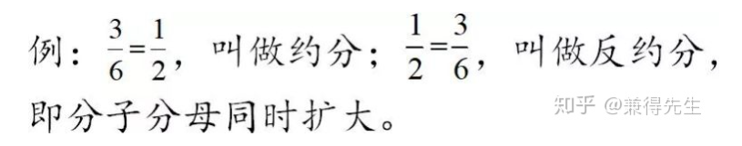

反正以上两种方法我总结为，**可以把分母通分成一样的最好，不能的话就把就需要我们“造”一个数列出来，一般是分母和分子分别弄成一个明显关系的数列**。

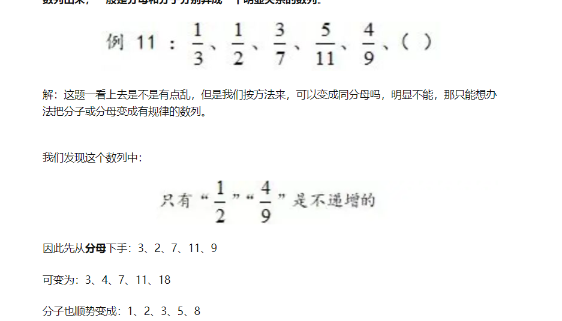

**3.“前后关系”**，顾名思义，这类数列前后项之间是有一定的关系的，一般是乘或者除，作差作和之类的比较少。

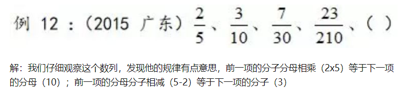

## 分组

分组型的数列比较明显，那就是这个题干一般都有**8个或8个以上**的数，又或者有明显**小数点**的，你看到这样的题，要立刻想到分组，先分组再找规律。分组通常有几个类型，分别是**奇偶数位分组、数字内部分组或数字合并分组等。**

**1.奇偶数位分组：**

1，4，4，6，9，8，16，（ ）

分成两组：

（1）奇数位组：1、4、9、16

（2）偶数位组：4、6、8、10


**2.数字内部分组：**

1.1 ，2.3 ，4.5 ，9.7 ，（ ）

分成两组：

（1）整数组：1、2、4、9

（2）小数点组：1、3、5、7


**3.数字合并分组：**

5、11、12、10、13、15、19、（ ）

[5+11] ，[12+10]，[13+15]，[19+？]

16 ， 22 ， 28 ， 34


**4.前后对应分组：**

1、3、2、5、10、13、12、（ ？）

[1+ ？] ，[3+12]，[2+13]，[5+10]


拿最后一个例题来分析，通过分组我们可以发现，前后项相加都是等于15，因此？处应该填“14”，但是你一定要知道，前后项分组有时对应结果是常数，有时对应是递增或递减数列。

备注：


## 机械拆分

这类型的题目，如果你是按照之前的思路是无法算出来的，广东很喜欢考这些题目的。这些题目有个特征，就是**数与数之间毫无特征**，有时**突然增大或突然增小**，或者**都是很大的数**。反正就是正常逻辑解释不了的。这时就只有运用数字内部规律来找了。

数字内部规律一般是**内部相加减或相乘**之类的，行内一般叫机械拆分，反正哪个容易理解你选哪个。

例13 ：325 ，118 ，721 ，604

解：这是广东的一道原题，我们来看看怎么做。从325到118再到721，**忽然增大忽然减小**，用多级数列或者递推数列之类的解法来做，想到下一年省考开始，你还是解不出的，这类型的题目要把数字按照个位十位百位单独分开来看，然后再内部相加减或相乘之类的来找规律。

（1）325=3+2+5=10；

（2）118=1+1+8=10；

（3）721=7+2+1=10；

（4）604=6+0+4=10.

这时我们就非常清晰了，各个数位之和等于一个常数。**但我们要注意，有时各个数位相加减得到的结果有可能是普通的等差数列，也有可能是一个质数数列，反正就是相加减后得出一个有规律的数列**。

现在大伙用这个方法来做一下这两道题：

例14 ：3721、6636、339、5525

例15 ：102、113、106、801、（ ）


##  画图数列

图形题表现形式也有几类，如“九宫格”“四宫圆”等，一般解法都是相邻数之间找关系，不外乎加减乘除，或者平方之类的。做这些题首要的是找到对应“？”所在位置的关系。如例16中的7、2是通过什么关系得来的？

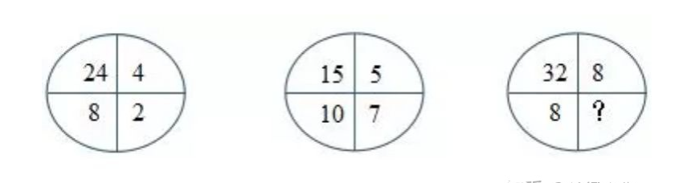

解：“？”对应的位置分别是A图中的7和B图中的2，我们现在来想，7、2是通过什么关系得来的，刚才说了，一般解法都是相邻数之间找关系，不外乎加减乘除，或者平方之类的。所以我们得留意“7”周围几个数之间有什么相互关系。

**（1）找倍数关系**：15÷5=3；

**（2）找平方关系**：这道题没有；

**（3）找加减关系**：15-5=10；10-7=3

这时我们发现：15÷5=3，10-7也是等于3，是不是找到一点所谓的关系了。接着我们拿B项来验证一下：24÷4=6,8-2=6，验证通过，因此“？”对应的数是4（32÷8=4,8-4=4）.


# 基础知识

## 最小公倍数

4、5、6最小公倍数  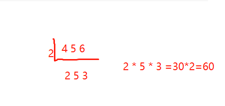


## 奇数偶数

+ 一个数可以被2整数，就是偶数，否则就是奇数
+ 运算规律：
  + 奇数偶数性质相同加减为偶数，不同加减为奇。
  + 有偶相乘为偶数，否则为奇数


例如：3x+2y=10 10是偶数，2y是偶数，那么3x肯定是偶数


## 质数

质数是指在大于1的[自然数](https://baike.baidu.com/item/自然数/385394?fromModule=lemma_inlink)中，除了1和它本身以外不再有其他[因数](https://baike.baidu.com/item/因数/9539111?fromModule=lemma_inlink)的自然数。

>  最小的质数是2。“2、3、5、7、11、13、17、19” 


只要看到质数的题目。基本和2有关

1. 下列可以分解为三个不同质数的三位数是

   A.100 =2*50

   B.102=2*3*17  所以选B

   C.104=2*52

   D.125 =5*5*5

2.  一个质数的3倍与另一个质数的2倍之和等于20，那么这两个质数的和是 

    3x+2y=20 ->3x肯定是偶数 又因为x为质数，那x只能为2了

3.  某旅游公司有能载4名乘客的轿车和能载7名乘客的面包车若干辆，某日该公司将所有车辆分成车辆数相等的两个车队运送两支旅行团。已知两支旅行团共有79人，且每支车队都满载，问该公司轿车数量比面包车多多少辆（） 

   4x+7y=79

   7y肯定是奇数

   分别代入 1 3 5 发现5合适 求得 x=11 y=5 

   车辆数相等表示x+y=偶数

   那么x-y一定也是偶数

4.  某儿童艺术培训中心有5名钢琴教师和6名拉丁舞教师，培训中心将所有的钢琴学员和拉丁舞学员共76人分别平均地分给各个老师带领，刚好能够分完，且每位老师所带的学生数量都是质数。后来由于学生人数减少，培训中心只保留了4名钢琴教师和3名拉丁舞教师，但每名教师所带的学生数量不变，那么目前培训中心还剩下学员多少人：

      5x+6y=76 数量都是质数 2 3 5 7 11 13 

     x=2 y=11

   4*2+ 3* 11=41


## 整除

> +  如果数a和数b都能被数c整除，那么它们的和或差也能被数c整除 
> +  *能被9整除的数的特征是若一个整数的数字和能被9整除，则这个整数能被9整除* 
> +  ,如果一个数能被3整除,*那么它的个位数的数字之和也一定能被3整除* 
>
> 如：7x+8y=77  77和7x能被7整除，那么8y可能也能被7整除 
>
> x=3 y=7


我们来看下例题

1.  一个四位数XXXX分别能被15、12、10除尽,且被这三个数除尽时所得的三个商的和为1365,问四位数XXXX中四个数字的和是多少? 

    A17 B16 C15 D14 

   能被15整数的肯定能被3整除，这四位数之和肯定是3的倍数

2.  小李某月请了连续5天的年假，这5天的日期数字相乘为7893600，问他最后一天年假的日期是：
   A.26日
   B.27日
   C.28日
   D.25日

   7893600 之和为33 说明能被3整除 不能被9整除 最后一天是26符合

3.  某公司去年有员工830人，今年男员工人数比去年减少6%，女员工人数比去年增加5%，员工总数比去年增加3人，问今年男员工有多少人? 

   A.329

   B.350 　

   C.371 　

   D.504

    由减少6%可知，今年男员工人数是去年的94%=47/50，即今男=47/50×去男，则今年男员工人数应是47的倍数，只有A选项符合。 

   > 注意这里的94/100 一定要约分

4.  **两个派出所某月内共受理案件160起,其中甲派出所受理的案件中有17%是刑事案件,乙派出所受理的案件中有20%是刑事案件,问乙派出所在这个月中共受理多少起非刑事案件?( )** 

   甲刑事=17/100 所以甲受理案件肯定是100的倍数 也就是100了

   

5. 某地区有甲、乙、丙、丁4个派出所。已知上月甲、乙2个派出所的合计出警次数是95次，乙、丙、丁3个派出所的合计出警次数是140次，乙派出所的出警次数占4个派出所合计出警次数的7/40，则上月甲派出所的出警次数是

   ```
   A . 55次 B . 60次 C . 68次 D . 75次 
   ，乙派出所的出警次数占4个派出所合计出警次数的7/40 那么已肯定是7n  甲乙丙丁相加是40n
   
   x+140=40n
   x尾数肯定是0 直接选b
   ```

   


# 溶质不变浓度问题

## 给溶质 套公式

 无论溶液蒸发、稀释还是混合，溶质的质量都不改变。**抓住“溶质不变”解题。**当题干中没有出现具体的量时，可以赋值。别忘了解盐水问题还有“十字相乘”这把利器！ 


> 核心公式：浓度=溶质/溶液
>
> 
>
>   溶液=溶质+溶剂  **记住多加一个溶质 ，溶液的量也会发生变化**
>
> 


 例1.某盐溶液100克，加入20克水稀释，浓度变为50%，然后加入80克浓度为25%的盐溶液，求此时混合后的盐溶液浓度。 

120的一半是60     （60+20）/（100+20+80）=40%

例2 【2014国考 第62题】烧杯中装了100克浓度为10%的盐水。每次向该烧杯中加入**不超过**14克浓度为50%的盐水。问最少加多少次之后，烧杯中的盐水浓度能达到25%？(假设烧杯中盐水不会溢出)（ ） 

设最大为x 

(10+7x)/(100+14x)=1/4

40+28x=100+14x

​		10x=60  x=5


例3   (2013浙江)瓶中装有浓度为20%的酒精溶液1000克,现在又分别倒入200克和400克的A、B两种酒精溶液,瓶里的溶液浓度变为15%,已知A种酒精溶液的浓度是B种酒精溶液浓度的2倍。那么A种酒精溶液的浓度是多少?

A. 5%  B. 6% C. 8% D.  10%


$$
((1000  \times 0.2 )+200 X+200X ) \div 1000+200+400 =0.15
$$


> **本质还是根据公式去套** **对于这种题目 问什么就设什么为x**

## 未给溶质 设一个

例4.一个容器内有一定量盐水，第一次加入适量水后，容器内盐水浓度为3%，第二次加入同样多水后，容器内盐水浓度为2%，则第三次加入同样多水后盐水浓度是多少？

 分析：1.题干中未出现具体的质量值，可以赋值，赋值赋一个好算的

​      2.赋值溶质质量为6g，根据盐水浓度为3%可求得第一次加水后溶液的质量

​      3.根据溶质质量为6g和盐水浓度为2%，可求得第二次加水后溶液的质量

​      4.求出每次加水的质量

​      5.求解


# 十字相乘 

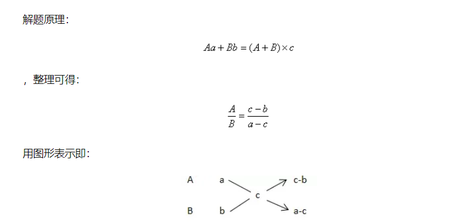

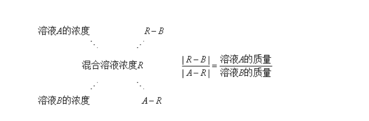


> 看到人数一般就是 十字相乘


例子: 某单位共有职工72人，年底考核平均分数为85分。根据考核分数，90分以上的职工评为优秀职工，已知优秀职工的平均分数为92分，其他职工的平均分数是80分，问优秀职工的人数是多少

一看就是混合类问题：根据题目列公式 

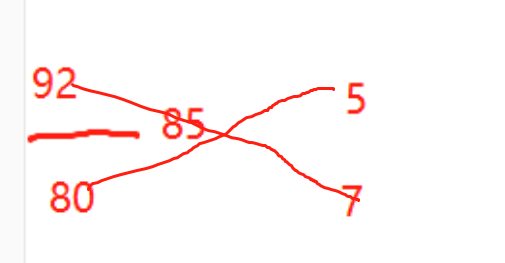

  12x=72 x=6  5x=30


 例: 某高校艺术学院分音乐系和美术系两个系，已知学校男生人数占总人数的30%，且音乐系男女生之比为1：3，美术系男女生人数之比为2：3，问音乐系和美术系的总人数之比为多少？ 

 分析：求总人数之比，则令总人数为公式里的C，列式：男生所占比例=男生人数/总人数 


换个思路问： 求美术系和音乐系女生之比？

分析：求女生 那就是女生做分母    2/3  /   1/3     混合 3/7   = 2/5

## 适用题型

凡是满足Aa+Bb=（A+B)r=Ar+Br这一表达式的，均可使用十字交叉法。常见的有以下五个题型：

1.**溶液混合问题**——十字交叉得到的比例为混合前溶液的质量比

2.**分组平均数混合**——十字交叉得到的比例为两组数据的数量之比

3.**比例混合**——十字交叉得到的比例为两组数据的整体量之比

4.**利润率混合**——十字交叉得到的比例为混合前对应商品的销量之比

5.**增长率混合**——十字交叉得到的比例为两个年份的基期量之比

+ 真题演示

### 溶液混合问题

*（16联考-8）甲、乙两个相同的杯子分别装满了浓度为20%和30%的两种溶液，将甲杯中倒出一半溶液，用乙杯中的溶液将甲杯加满混合，然后再将已经加满的甲杯中的溶液全部倒入一杯清水中且未溢出，溶液浓度变为20%。若该溶液密度与水完全相同，问原甲杯中溶液的质量是这杯清水质量的多少倍？*

*A.1 B.2 C.3 D.4*

**解析：**水可看作0%溶液。第一次甲乙混合后浓度为25%的溶液，与浓度为0%的水，混合后变为20%：

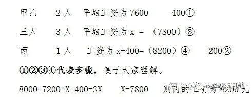

得到20%：5%=4:1。选D


*（16京-2）将1千克浓度为X的酒精，与2千克浓度为20%的酒精混合后，浓度变为0.6X。则X的值为？*

*A.50% B.48% C.45% D.40%*

**解析：**


得到0.6X-0.2X=20% X=50%。选A


*（19沪B-66）有一瓶浓度为15%的盐水500克，每次加入34克浓度为60%的盐水，则至少加（ ）次该盐水，使这瓶盐水的浓度超过30%。*

*A.6 B.7 C.8 D.9*

**解析：**若混合后浓度刚好为30%


十字交叉可得两种盐水的溶液之比=（60%-30%）：（30%-15%）=2:1。由此比例可得500克：X=2:1，因此X=250，因每次加入34克盐水，则250÷34≈7.4，可得至少加8次，选C

### （二）分组平均数混合

**公式：数量1×平均数1+数量2×平均数2=总数×总平均数**

*（17联A-19）甲乙两队举行智力抢答比赛，两队平均得分为92分，其中甲队平均得分为88分，乙队平均得分为94分，则甲乙两队人数之和可能是:*

*A.20 B.21 C.23 D.25*

**解析：**十字交叉


可得甲乙两队人数比=（94-92）：（92-88）=2：4=1：2，

那么甲：乙=1:2，则甲乙总人数为3的倍数，选B。

注意两个量的数量之比，分别对应对方的比例与整体比例之差。结合此题式子好好理解，可以省去写十字交叉的时间，熟练后可以直接心算。


*（18浙A-52）甲、乙和丙是同一公司的同事，甲工资为8000元/月，乙工资为7200元/月，丙工资比3人工资的平均值高400元/月。问丙的工资为多少元/月？*

*A、7800 B、8000 C、8200 D、8400*

**解析：**十字交叉——三人=甲乙+丙，设三人平均工资为X


8000+7200+X+400=3X 则X=7800 则丙的工资为8200元。选C


*（19省部-71、地市-67）某单位有2个处室，甲处室有12人，乙处室有20人。现在将甲处室最年轻的4人调入乙处室，则乙处室的平均年龄增加了1岁，甲处室的平均年龄增加了3岁。问在调动之前，两个处室的平均年龄相差多少岁？*

*A、8 B、12 C、14 D、15*

**解析：**设甲处室原平均年龄为a，乙处室原平均年龄为b，

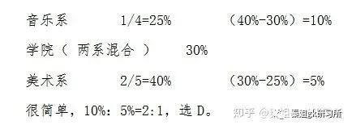

故a-6=b+6 即a=b+12 则选B

### （三）利润率混合

十字交叉得到的比例为混合前对应商品的销量（销售数量）之比

*（17联A-14）商场以每件80元的价格购进了某品牌衬衫500件，并以每件120元的价格销售了400件，要达到盈利45%的预期目标，剩下的衬衫最多可以降价：*

*A.15元 B.16元 C.18元 D.20元*

**解析：**预期总利润=80×500×45%=18000元，前400件的利润=（120-80）×400=16000元，后100件的利润至少为18000-16000=2000元、每件利润20元，降价120-100=20元，选D

*（19苏A-51）某银行为一家小微企业提供了年利率分别为6％、7％的甲、乙两种贷款，期限均为一年。若两种货款的合计数额为400万元，企业需付利息总额为25万元，则乙种贷款的数额是：*

*A.100万元 B.120万元 C.130万元 D.150万元*

**解析：**十字交叉 甲：乙=（7%-6.25%）:（6.25%-6%）=3：1 则乙=400×1/4=100 选A

### （四）比例混合

*（16联考-17）某高校艺术学院分音乐系和美术系两个系别，已知学院男生人数占总人数的30%，且音乐系男女生人数之比为1：3，美术系男女生人数之比为2：3。问音乐系和美术系的总人数之比为多少？*

*A.5:2 B.5:1 C.3:1 D.2:1*

**解析：**凡含比例两部分混合均可用十字交叉法。注意比例要一致：


很简单，10%：5%=2:1，选D。


*（19苏B-65）某景区门票夏季打7折、冬季打3折，对8岁及以下儿童免门票，车20元/人次，游乐设施10元/人次。小朱去年夏季和冬季都带4岁的儿子去该景区1次，每次都陪孩子坐车1次、让孩子玩游乐设施1次。若他们两人夏季在该景区的游玩费用比冬季多50％，则该景区门票的全价是：*

*A.100元 B.90元 C.80元 D.60元*

**解析：**设门票全价为a，则0.3a×7/3+50×1=（0.3a+50）×3/2

十字交叉，得0.3a：50=(1/2):(5/6)=3:5 故a=100 则A

3/2-1=1/2 7/3-3/2=5/6


*（18B-5）小张家养了一只大狗和一只小狗。现在，小狗的体重只有大狗的一半。如果两只狗的体重各增加5千克，那么小狗的体重将达到大狗的60%。据此可知，若两只狗的体重各增加10千克，小狗、大狗的体重比将会是：*

*A.1:2 B.2:3 C.3:4 D.4:5*

**解析：**大狗前量×（小狗/大狗）+大狗增量×（小狗增量/大狗增量）=大狗现量×（小狗现量/大狗现量）

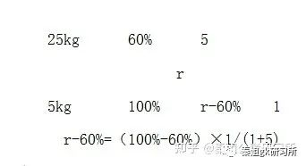

另外


得到r-60%=（100%-60%）×1/(1+5) 选B

### （五）增长率混合

十字交叉得到的比例为两个年份的基期量之比

*（19浙A-12）小张去年底获得一笔总额不超过5万的奖金，她将其中的60%用来储蓄，剩下的用来购买理财产品，一年后这笔奖金增值了5%。已知储蓄的奖金增值了3.3%，问购买理财产品的奖金增值了多少？*

*A、5.35% B、6.45% C、7.55% D、8.65%*

**解析：**


选C


*（19浙A-73）某企业四个分公司今年的销售额之和是去年的1.2倍。其中，甲分公司的销售额增长了50%，乙分公司的销售额与去年相同，丙和丁分公司的销售额均增长了25%。已知去年甲、丙、丁三个分公司的销售额之比为2：3：5，则乙分公司今年的销售额占4个分公司总量的：*

*A.1/3 B.2/7 C.4/13 D.5/18*

**解析：**设甲、丙、丁去年分别为8、12、20，则今年分别为12、15、25。（40+a）×1.2=a+52 a=20 20/72=5/18。选D

*（15鲁-53）某市制定了峰谷分时电价方案，峰时电价为原电价的110%，谷时电价为原电价的八折，小静家六月用电400度，其中峰时用电210度，谷时用电190度，实行峰谷分时电价调整方案后小静家用电成本为调整前的多少？*

*A、95.75% B、87.25% C、90.5% D、85.5%*

**解析：**更靠近量大的，选A


# 周期循环

周期循环是指事物的某一特征按照一定规律反复出现，从第一次开始到结束为一个周期

+ 自己总结周期或者循环，然后推测某一位置的情况
+ 和星期相关的周期问题，难点在于根据已知的‘’某日是星期x ‘去确定 另外一个日期是星期几


##   **求某年某月某日是周几问题** 


> 平年365 闰年366（2月29）

例1：2012年3月份的最后一天是星期六，则2013年3月的最后一天是星期几？

平年：365=52周+1 

闰年：366=52周+2


但是考试会这么考试吗？肯定不会啊。我们看下面的例子

2020.1.16 是周四，那么2020.4.20是？

>  解题步骤：（1）先粗算 （2）后修正 （3）加日期差
>
> 粗算即按每个月都是30天计算，修正的时候再进行大月小月的加减


2020.1.16 -2020.4.16 是30*3

1月份31    +1 

2月份29   -1 

3月份 31 + 1

=30*3+1+4=95/7=13....4  周4+4=周一


来在随便出一题，2023.4.20是周三 问2023.5.25是周几?


##  **每隔3天就是每4天** 


+ [2016年江苏省第67题]小明、小红、小桃三人定期到某棋馆学围棋,小明每隔3天去一次,小红每隔4天去一次,小桃每隔5天去一次。若2016年2月10日,三人恰好在棋馆相遇,则下次三人在棋馆相遇的日期是( )。 

 小明每4天去一次，小红每5天去一次，小桃每6天去一次，下次同时去应该是经过4、5、6的最小公倍数的天数以后。4、5、6的最小公倍数为60。那么接下来我们就可以将选项代入，求出来经过的天数刚好为60天则为正确选项。比如代入B选项，经过的天数=月份差×30+修正+日期差=(4-2)×30-1+1+(11-10)=61天，代入B选项多了一天，则需要往前推一天，即2016年4月10号。因此，选择D选项。 


## 周期问题求最值

> 余数问题决定大小


+ 列子： 某新建小区计划在小区主干道两侧种植银杏树和梧桐树绿化环境，一侧每隔3棵银杏树种一棵梧桐树，另一侧每隔4棵梧桐树种1棵银杏树，最终两侧各种植了35棵树，问最多栽种了多少棵银杏树？（ ） 


## 一个月有几个工作日

+ 【2013国考69题】根据国务院办公厅部分节假日安排的通知，某年8月份有22个工作日。

  当年的8月1日可能是周几？

  (A)周一或周三

  (B)周三或周日

  (C)周一或周四

  (D)周四或周日

  31- 7*4=3 天  剩下的3天肯定有2天工作日 选d

+ 小王在每周的周一和周三值夜班，某月他共值夜班10次，则下月他第一次值夜班可能是几号？    （       ）

  A.2

  B.3

  C.4

  D.5

  

  答案：D

  析：四周值班八次，多出的两次至少需要三天，所以最后三天分别为周一、周二、周三，则下个月的1号为周四，下个月的第一个周一为5号，选D


# 牛吃草问题/消长问题

**牛吃草问题又称为消长问题或牛顿问题**，草在不断生长且生长速度固定不变，牛在不断吃草且每头牛每天吃的草量相同，供不同数量的牛吃，需要用不同的时间，给出牛的数量，求时间。带大家把牛吃草问题转化为相遇或追及模型来考虑。

>  一片草地上有牛在吃草，牛一边吃草一边长，
>
>  花生老师设定的是总有一部分牛在**吃草原上的原有草，称之为干活牛**；
>
>  一部分牛一直在**吃新长出来的草，称之为白给牛**。（白吃牛+干活牛=牛的总数） 
>
>  核心公式：
>
>  1. **每日草的生长量=白吃牛的数量=（牛的数量 * 吃草时间1－牛的数量 * 吃草时间2）/时间差**  
>  2. **原有草- 干活牛*时间** 
>  3. **时间= 原有草/干活牛** 


我们来看一个例子：

某河段中的沉积河沙可供80人连续开采6个月或60人连续开采10个月。如果要保证该河段河沙不被开采枯竭，问最多可供多少人进行连续不间断的开采?(假定该河段河沙沉积的速度相对稳定) 

​	解析：白吃牛的数量=（牛的数量 * 吃草时间1－牛的数量 * 吃草时间2）/时间差  

60 * 10-80 * 6= 320/4=30

也可以列方程

设原有河沙量为y，每月沉积河沙量为x，根据80人连续开采6个月，可得y=(80-x)×6，根据60人连续开采10个月，可得y=(60-x)×10，解得x=30，y=300。

若要不被开采枯竭，每月开采量=每月沉积量，故最多可供30人进行连续不间断的开采。


我们来扩展下这个题目： 问原来这个河沙有多少堆积？

> **原有草- 干活牛*时间** 
>
> （80-30）*6=300  或者 （60-30） *  10=300


我们来扩展下这个题目： 100个人需要挖多久？ 记住 永远是有白吃牛的！！

> **时间= 原有草/干活牛** 
>
> 300/（100-30）30/7=45天


# 容斥问题

## 基本概念

容斥问题即包含与排斥问题，它是一种计数问题。在计数时，几个计数部分有重复包含时，为了不重复计数，应从他们的和中排除重复部分，采用这种计数方法的题型称为容斥问题。

举个例子。幼儿园的小朋友准备六一儿童节的表演节目。参加合唱的有20个，参加舞蹈的有12个，参加朗诵的有25个，既参加合唱又参加舞蹈的有6个，既参加舞蹈又参加朗诵的有9个，既参加合唱又参加朗诵的有14个，三个节目都参加的有3个，三个节目都不参加的有2个，请问这个班级总共有多少个小朋友？

这就是在一堆集合之间，它们有相互交融的地方，又有相互排斥的地方，就几个集合之间又有重复的，又有相互独立的部分，这一类叫做容斥类问题。


## 核心公式

全部人数 -不符合人数=各部分人数和 减去重复部分

> 核心思想：人只能被计算一次

+ 2集合
  + 二集合公式A+B-只满足两个条件的个数
+ 3集合问题
  + 三集合公式A+B+C-只满足两个条件的个数-2三个条件都满足的个数 

+ 注意
  + 既喜欢A又喜欢B 和 既喜欢B又喜欢C   和 既喜欢C又喜欢A 其实是任一集合交接的地方
  + 只喜欢2个集合及以上的人数是对 集合重复部门的总人数   注意这一点区别


我们来看下列题

1.  有70名学生参加数学、语文考试,数学考试得60分以上的有56人,语文考试得60分以上的有62人,都不及格的有4人,则两门考试都得60分以上的有多少人?( ) 

   

   直接套公式：70-4=56+62 -X  ->x=12

   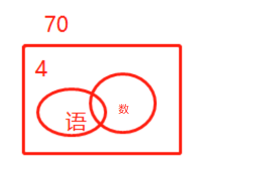

2.   工厂组织工人参加技能培训，参加车工培训的有17人，参加钳工培训的有16人，参加铸工培训的有14人，参加两项及以上培训的人占参加培训总人数的2/3，三项培训都参加的有2人，问总共有多少人参加了培训？ 

​        设总人数为3x

​     3x=17+16+14-（2x-2）-2*2  ->3x=27  

​    这里为什么是 2*2 因为在三个集合里面都被加上了，所以减去的数量要  *  2

>  三集合公式A+B+C-只满足两个条件的个数-2三个条件都满足的个数 
3. 针对100名旅游爱好者进行调查发现，28人喜欢泰山，30人喜欢华山，42人喜欢[黄山](http://huangshan.huatu.com/)，8人既喜欢黄山又喜欢华山，10人既喜欢泰山又喜欢黄山，5人既喜欢华山又喜欢黄山，3人喜欢这三个景点，则不喜欢这三个景点中任何一个的有( )人。

​     注意既喜欢和只喜欢的区别

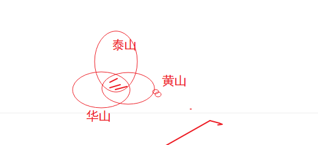

  28+30+42-10-5-3+3 
因为2个都喜欢的全部都减去了，所以最后要加3个公共的

4. （联考江西2018-77）某高校做有关碎片化学习的问卷调查，问卷回收率为90%，在调查对象中有180人会利用网络课程进行学习，200人利用书本进行学习，100人利用移动设备进行碎片化学习，同时使用三种方式学习的有50人，同时使用两种学习方式的有20人，不存在三种学习都不用的人。那么这次共发放了多少份问卷？

   分析：	注意题目问的是共发放了多少份问卷

   180+200+100-20-50*2=360
   360/0.9=400


# 最值


## 最值-最不利极限提概述

原理： 抽屉原理

常见问法：至少有多少小球才能保证每盒子中有5个

解题思路：当前抽屉列出最不利情况+1

常见错误：忘记小抽屉

>  小抽屉+正常抽屉*  不利情况  +1

我们来看下列题

1. 【2012国考66题】有300名求职者参加高端人才专场招聘会，其中软件设计类、市场营销类、财务管理类和人力资源类分别有100、80、70、50人。至少有多少人找到工作，才能保证一定有70名找到工作的人专业相同?
   （A）71
   （B）119
   （C）258
   （D）277

   **「保证一定有70名找到工作的人专业相同」意味着在这之前，所有专业都有69人找到工作了（不足69人则占满位置即可），此时再加1人即可。**

   50+69*3+1 尾数法 c

2. 在2011年世界产权组织公布的公司全球专利申请排名中，中国中兴公司提交了2826项专利申请，日本松下公司申请了2463项，中国华为公司申请了1831项，分别排名前3位，从这三个公司申请的专利中至少拿出多少项专利，才能保证拿出的专利一定有2110项是同一公司申请的专利？

   1831+2109*3=

3. 某单位五个处室分别有职工5、8、18、21和22人，现有一项工作要从该单位随机抽调若干人，问至少要抽调多少人，才能保证抽调的人中一定有两个处室的人数和超过15人？（ ）
   A、34B、35C、36D、37

   **注意这里问的是2个抽屉！！**

   15/2=7....

   5+8+3*7+1=15


## **最值-和定最值问题**-重点

和定最值，顾名思义在和为定值的情况下求某一元素的极限情况

​	这种题目要本着要想其中一个数尽可能大/小，则其余的数尽可能的小/大，并且有个固定的解题方法，分为三步，

	+ 第一步排序定位，
	+ 第二步反向构造数列，
	+ 第三步加和求解
+ 注意
  + 解方程解出来的结果如果不是整数应该如何取舍，此时的取舍并非四舍五入**，而是问至多则向下取整，问至少则向上取整**
  + 看题目要求的数量是是否有 **各不相同**

我们来看下列题

1. 5名学生参加某学科竞赛，共得91分，已知每人得分**各不相同**，且最高是21分，则最低分至少是：

   分析:

    1. 题目问最低，反过来其他人就是最高
    2. 每人得分各不相同
    3. 5名学生 91 分
    4. 且最高是21分
s
   设当前最低分x

   21+20+19+18+x=91 ->x=13

2. 现有21本故事书要分给5个人阅读，如果每个人得到的**数量均不相同**，那么得到故事书**数量最多**的人**至少**可以得到（ ）本。

   x+(x-1)+(x-2)+(x-3)+(x-4)=21

   ​		5x=31 x=6.2

   **至少 x>=6.2 那就是7**

3. 一学生在期末考试中6门课成绩的平均分为92.5分，且6门课的成绩是**互不相同**的整数，最高分是99分，最低分是76分，则按分数从高到低居第三的那门课至少得分为( )。

   ​			99+98+x+x-1+x-2+76=92.5*6 ->x=95

4. 某连锁企业在10个城市共有100家专卖店，每个**城市的专卖店数量都不同**。如果专卖店数量排名第5多的城市有12家专卖店，那么专卖店数量排名最后的城市，**最多**有几家专卖店?

   最多有几家，那么其他城市就最少，有因为给了中间这个城市12

   12+13+14+15+16+x+x-1+x-2+x-3+x-4=100

   x-> 4

5. 某贸易公司有三个销售部门，全年分别销售某种重型机械38台、49台和35台，问该公司当年销售该重型机械数量最多的月份，至少卖出了多少台？

   注意 题目没有谁 **不相同！！！**

   12x=38+49+35

   12x=122

   至少 x>=10... 那就是11

6. （2015陕西）植树节到来之际，120人参加义务植树活动，共分成**人数不等**且每组不少于10人的6个小组，每人只能参加一个小组，则参加人数第二多的组最多有多少人：

   ​	问人数第二多 那么反过来其他组的就要足够少，又因为每组不少于10人

   10+11+12+13+x+x+1=-120

   x=36.5   最多 x<=36.5  x=36

## 最值-函数最值

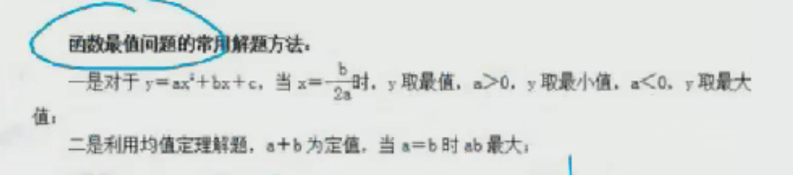


我们来看下列题

1. 某苗木公司准备出售一批苗木，如果每株以4元出售，可卖出20万株，若苗木单价每提高0.4元，就会少卖10000株，问在最佳定价的情况下，该公司最大收入是多少万元？

   收入=单价*数量

   设最大收入y 单价提高x  

   y=（4*0.4x） *  ( 20-x)

   + 第一种 y=80+4x-0.4x的平方   x=4/0.8=5
   + 第二种 x1=-10  x2=20    (x1+x2)/2=5

2. 某报刊以每本2元价格发行,可发行10万份,若该报刊单价提高0.2元,发行量减少5000份,则该报刊可能的最大销售收入为多少万元?

   y=(2+0.2x)(10000-5000x)    ->(-10+20)/2=5

   ​		代入的 3*7.5=22.5

3. 某汽车租赁公司有200辆同型号的汽车，每辆车的日租金为100元时可全部租出;当每辆车的日租金增加5元时，未租出的汽车就会多4辆，租出的车每天需要维护费20元。每辆车的日租金为多少时，租赁公司的日收益最大?

   ​	设日租金增加5x元，那么未租出的汽车多4x辆，日收益为y，根据题意可得：

   ​		y=(100+5x-20)* (200-4x)

   ​	   x=17 

   100+17*5=185

4. 

## 最值-三端最值

常用思路： 要想2端的某一端最多/最少，**2端都应尽量多/少**


1. 一个班级组织跑步比赛，共设100米、200米、400米三个项目。班级有50人，报名参加100米比赛的有27人，参加200米比赛的有25人，参加400米比赛的有21人。如果每人最多只能报名参加2项比赛，那么该班最多有多少人未报名参赛?

   

   第一步，判断本题为容斥问题，需要结合最值思维解题。第二步，班级总数为50人，**要想使未报名的最多，反向构造报名的人数最少**。**报名人次一定，则需要每人报名次数最多。由题意每人都可以最多报名2项**，那么报名人数最少为(27+25+21)÷2=36.5，最少36.5，取整为37人。第三步，未报名人数为50-37=13人。因此，选择 C 选项。

2. 有10元、20元、50元面值的钞票共10张，总额为250元。问10元的钞票最多有多少张?

   ​	3*50+10x+20y=250

   ​	x+y=7

3. 有甲、乙、丙三种盐水，浓度分别为5%、8%、9%，质量分别为60克、60克、47克，若用这三种盐水配置浓度为7%的盐水100克，则甲种盐水最多可用：

   A . 49克
   B . 39克
   C . 35克
   D . 50克

   分析： 要想甲最多 丙应该也要最多

   先用甲 丙构造浓度为7%

   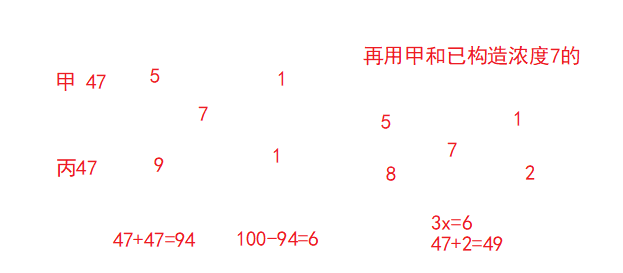


# 排列组合 -必考

## 基本定义

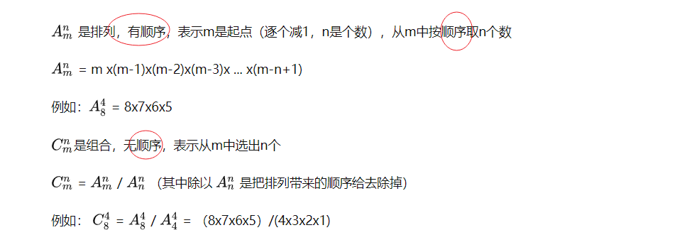


+  加法原理-分类计算

完成一件事情有n类方法，第一类有 m1 种方法，第二类有 m2 种方法，……，第n类有 mn 种方法，那么完成这件事总共有 m1+m2 +……+ mn 种方法。

+ 乘法原理-分布计算

完成一件事请需要n步，第一步有 m1 种方法，第二步有 m2 种方法，……，第n步有 mn 种方法，那么完成这件事总共有 m1∗m2 *……* mn 种方法


## 解题思路

有序为排列，无序为组合　（如果判断有没有顺序，就是看有没有顺序对结果影不影响）

分类用加法、分步用乘法、

从特殊入手 ，全部减不符（至少 否定）

> 至少
>
> 有3行测 5申论，奖励同学三本书，同学至少选择一本申论的情况有多少种？
>
> 正面思维：x>=1 那么x可能为1 2  3    
>
> ​			x=1 C(5,1)*C(3,2)  
>
> ​             x=2 C(5,2)*C(3,1)
>
> ​              x=3 C(5,3)
>
> 反向思维：x>=1 反过来就是一本申论都不选，用总的C(8,2)-C(3,3)
>
> 一般情况情况比较多都是用反向思维进行减法，但是问题的关键要找到这个反向思维的情况，这个我们后面具体练习


我们看下例题

1. 小凯家住在A区，但在B区上学，每天上学必须经过河上的一座桥。小凯从他家到这座桥有若干不同的路可走，而从这座桥到学校可走的路要比从他家到这座桥的路多3条，这样他从家出发经过这座桥到学校共有40种沿不同路线的走法。则小凯从家到这座桥有（）条不同的路。

   

2. 某单位要从8名职员中选派4人去总公司参加培训，其中甲和乙两人不能同时参加。问有多少种选派方法

   

   甲和乙两人不能同时参加的反向是什么？**甲和乙两人同时参加**

   总人数下C(8,4)-C(6,2)=70-15

3. 某宾馆有6个空房间，3间在一楼，3间在二楼。现有4名客人要入住，每人都住单间，都优先选择一楼房间。问宾馆共有多少种安排？（）

   正常思路是不是先选房间，在安排人住进去

   一楼：选三个房间给4个人住 C (4，3) * A(3,3)

   二楼：随便选一个房间 C(3,1)

4. 、某次专业技能大赛有来自A科室的4名职工和来自B科室的2名职工参加，结果有3人获奖且每人的成绩均不相同。如果获奖者中最多只有1人来自B科室，那么获奖者的名单和名次顺序有多少种不同的可能性？

     正常思路是不是先选人在排序 

    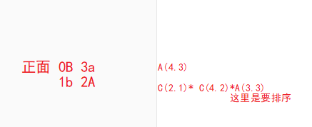

   反面思路：

   ​	最多只有1人来自B科室 那么反过来  就是2B 1A

   【C(6.3)-C(4.1)】A(3.3)

   先选人  在排序

   

## 相邻-捆绑法

   把相邻的元素合并为一个元素，在与其他进行排列，同时合并元素也要进行排列

   注意：总元素改变、内部排序

   

1. 7人站成一排，其中甲乙相邻且丙丁相邻，共有多少种排法

      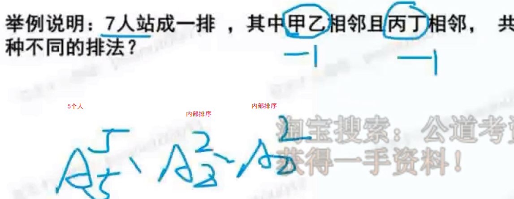

   2.  为加强机关文化建设，某机关在系统内举办演讲比赛，3个部门分别派出3、2、4名选手参加比赛，要求每个部门的参赛选手比赛顺序必须相连，问不同参赛顺序的种数在以下哪个区间之内?

       部门必须相连，这不就是捆绑吗

       我们先排部门 3A3 

       在排部门内部  3A3 * 3A3   * 4A4 

       6×6×2×24=72×24

3. 某市举办经济建设成就展，计划在六月上旬组织5个单位参观，其中一个单位由于人数较多，需要连续参观2天，其他4个单位只需参观1天。若每天最多只能安排一个单位参观，则参观的时间安排共有多少种：

   注意单位连续捆绑   9A5=9*8*7*6*5*4*3*2*1


## 不相邻-插空法

**先将没有位置要求的元素排列好，在将指定的不相邻的元素插入已排好元素的间隙或2端位置**


1. 若有ABCDE 5个人进行排队、要求A和B必须不站在一起，则有多少

​      先把CDE进行排列，A(3.3)  会产生4个空隙，在4个空隙里面选2个A(4,2)

2. 某人射击8枪，命中4枪，4枪命中恰好有3枪连在一起的情况有多少。

   我们先排没有命中的4枪，有 5个空隙，4枪命中恰好有3枪连在一起 看作2个个体

   A(5.2)

3. 某道路旁有10盏路灯，为节约用电，准备关掉其中3盏。已知两端的路灯不能关，并且关掉的灯不能相邻，则有（）种不同的关灯方法。

   这种就是插空法

   先排列7个亮灯 共有8个空隙，但是题目要求并能在2端，所以只有6个空

   也就是在6个空中选2个，有没有顺序呢？没有 所以就是 6C2

4. 某市至旱季水源不足，自来水公司计划在下周七天内选择两天停止供水，若要求停水的两天不相连，则自来水公司共有（）种停水方案。

   首先确定停水的是有位置要求的，那么先把不停水的进行排列

   共有5天，会产生6个间隙，那么在6天中插入

   6C2=15


## 定序问题

先全排列，在**除掉**定序元素的全排列

注意：到底是顺序还是不相邻

1. 7人排队，其中甲乙丙3人顺序一定，一共有多少种不同的排法

   ​	A(7.7)/A(3.3)=7*6*5*4

2. 某工程队有6项工程需要先后单独完成，其中工程乙必须在工程甲完成后才能进行，工程丙必须在工程乙完成后才能进行，又工程丁必须在工程丙完成后立即进行，那么安排这6项工程的不同排法种数是

   顺序是不 A B CD  注意CD是绑在一起的

   所以答案是A(5,5)/A(3,3)

3. 一张节目表上原有3个节目，如果保持这3个节目的相对顺序不变，再添进去2个新节目，有多少种安排方法：

   ​	直接套公式 5a5/3a3=20


## 全错位排序

全错位排序只用记住 1 2 3 4 5 6 各有 0 1 2 9 44 265

1. 5个瓶子都贴了标签，其中恰好贴错三个

​    先从5个瓶子种选择3个，5c3*（3对应的是2）=5 * 4 * 2

2. 四位厨师各做了一道拿手菜，现在要求每个人去品尝一道菜，不能是自己的

   4对应的是9  直接选9即可


## 环形排序

n个不同的元素做成环形排列，共有 n-1种排法

1. 8人围桌而坐，共有多少种坐法。

   ​	8-1=7


## 平均分堆问题


1. 把A B C D E F 6本不同的书分成三堆，有几种不同的分法？

   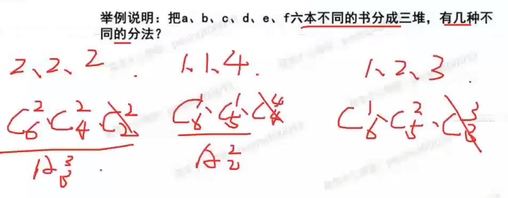

   为什么前面2个要除呢 因为认为给排序了，所以要分别除 3  2 

   最后一个为什么不除 因为


## 相同元素分配问题

利用插板法，解决相关元素分配问题


9个苹果分给3个人，那就是要分成3堆，一字排开，中间插入**2个板**，苹果就被分隔成3堆。

每个人至少分得1个，**所以板不能放在苹果之外，只能在苹果与苹果之间。**

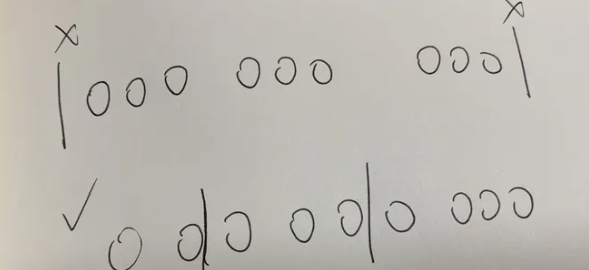


**就是从9个苹果形成的8个空，挑2个插入板，苹果就被分成3堆。**

答案是C82=28种。

注意：插板法的使用必须满足两个条件

**1.元素相同**

在这题里面，用的是苹果。物品，如果不加解释说明，我们一般认为是相同的，比如分计算机、分书本等。但是笔记本、台式机或者语文书、数学书，就不能视为同一种物品。

**2.每堆至少一个**

也就是不存在分给的对象得到0个这种情况，至少得分到1个。

满足这两个条件，我们可以采用插板法。

参考知乎链接：https://www.zhihu.com/question/422265718


1. 9个相同的球，装三个盒子，每个盒子至少一个有多少种装法？

   是不是很简单，8C2

   题目改为每个盒子至少装2个有多少装法呢？

   先给每个盒子一个球，还剩下6个求，5C2


# 概率

概率公式：符合要求/全部

其实就是排列组合的延申


## 几何概型-了解

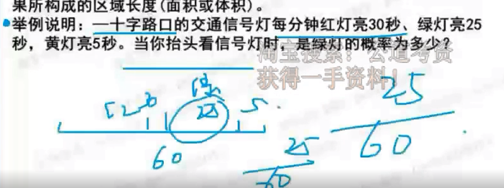


## 列题

1. 从分别写有数字1，2，3，4，5的5张卡片中任取两张，把第一张卡片上的数字作为十位数，第二张卡片上的数字作为个位数，组成一个两位数。则组成的数是偶数的概率是：

   	首先分析 取卡片有没有顺序？有。什么是偶数？能被2整除的。

   注意这里是组成２位数，如果没有说２位数呢？那就需要将个位数、２位数、３位数。。列出来

     　　　 那就直接套公式了 

   1. 要组成偶数，则个位数字必须为偶数。先从2个偶数中选1个作为个位 2C1

   2. 再从剩下的4个数中任取1个作为十位 4C1

   3. 故满足条件的情况数有2×4=8（种），总的情况数为 5A2

2. 某房间共有6扇门，甲、乙、丙三人分别从任一扇门进去，再从剩下的5扇门中的任一扇出来，问甲未经过1号门，且乙未经过2号门，且丙未经过3号门进出的概率为多少？

   甲没有经过1号门的概率为 5*4/6*5=2/3 

   2/3 *  2/3 * 2/3=8/27

3. 小王开车上班需经过4个交通路口，假设经过每个路口遇到红灯的概率分别为0.1、0.2、0.25、0.4，则他上班经过4个路口至少有一处遇到绿灯的概率是∶

   逆向思维，**至少有一处**遇到绿灯的概率＝1－全是红灯的概率，即所求概率为1－0.1×0.2×0.25×0.4＝0.998。

   　　因此，选择D选项。

4.  某次知识竞赛试卷包括3道每题10分的甲类题,2道每题20分的乙类题以及1道30分的丙类题。参赛者赵某随机选择其中的部分试题作答并全部答对,其最终得分为70分。问赵某未选择丙类题的概率为多少? 

   分析：我们首先看有几种情况相加为为70分

   1. 30+20+10* 2  =1C1＊２ｃ１＋３ｃ２＝６
   2. 30+20+20  = 1C1 * 2C2= 1种
   3. 20 * 2+10 * 3＝１

   　１／８

5.   某班级有男生6名，女生4名，现以随机抽签的形式选取三人参加演讲比赛，问抽到一名男生两名女生的概率在以下哪个范围之内？

    有没有顺序？

    分析所有情况为１０Ｃ３

    一名男生和２名女生　６Ｃ１＊　４Ｃ２　

6.   关于12年国考的概率问题.有5对夫妻参加一场婚礼,他们被安排在一张10个座位的圆桌就餐,但是操办者不知道他们之间的关系,随机安排座位,问5对夫妻恰好相邻而坐的概率是多少? 

    环形排列　

    （４Ａ４＊　２＊２＊２＊２＊２）／９Ａ９

7. 某集团企业5个分公司分别派出1人去集团总部参加培训，培训后再将5人随机分配到这5个分公司，每个分公司只分配1人。问5个参加培训的人中，有且仅有1人在培训后返回原分公司的概率：

   错位排序

   ５个人任意分配　５Ａ５　

   一个人是对的，４个人是错的　　５Ｃ１＊９

   ４５／１２０＝３７．５％

8.  某篮球队12个人的球衣号码是从4到15的自然数，如从中任意选出3个人参加三对三篮球赛，则选出的人中至少有两人的球衣号码是相邻自然数的概率为多少： 

   分析：题目出现至少，考虑逆向思维

   ９个人是没有位置要求，产生１０个空隙

   １－（　１０Ｃ３　　／１２Ｃ３）

   

   #   

## 比赛问题

> 输的位置在哪里?

我们先看一个现实的例子 ，

1. 如果是一个3局2胜的羽毛球比赛 2:1，最后一局会是输的吗？肯定不是，最后一局只能是赢得。
2. 那么输的一场的位置可能在哪里？只能是前2局


我们来看看列题

1.  现有甲、乙两个水平相当的技术工人需进行三次技术比赛，规定三局两胜者为胜方。如果在第一次比赛中甲获胜，这时乙最终取胜的可能性有多大？ 

    由于甲、乙水平相当，则甲、乙单局获胜的概率均为 0.5 

     根据“三局两胜”可知，乙要获胜，则剩下两局必须都获胜  0.5*0.5=1/4

2.  [2014年浙江省第51题]两支篮球队打一个系列赛,三场两胜制,第一场和第三场在甲队的主场,第二场在乙队的主场。已知甲队主场赢球概率为0.7,客场赢球概率为0.5。问甲队赢得这个系列赛的概率为多少? 

   2：0    0.7*0.5

   2：1  （0.7 * 0.5 * 0.7 ）+ （0.3 * 0.5 * 0.7）

3.  某场羽毛球单打比赛采取三局两胜制。假设甲选手在每局都有80%的概率赢乙选手,那么这场单打比赛甲有多大的概率战胜乙选手: 

   2：0   0.8*0.8=0.64

   2：1  这里是不是要确定乙在前2局，那一局输了 2C1 * 0.2 * 0.8 *0.8

4. 把第三题改为5局三胜呢？

   同样的思路

   3：0

   3：2 如何确定2局输的位置呢？最后一局甲肯定不能输，那就是在前4局选2个给乙

   ​	4C2*0.2 * 0.8 * 0.8 *  0.8

   3：1 如何确定1局输的位置呢？最后一局甲肯定不能输，那就是在前3局选2个给乙

   ​	3C1*0.2 * 0.8 * 0.8 

   

## 其他题型

1.  某单位组织党员参加党史、党风廉政建设、科学发展观和业务能力四项培训，要求每名党员参加且只参加其中的两项。无论如何安排，都有至少5名党员参加的培训完全相同。问该单位至少有多少名党员? 

   是不是最值-最不利问题“？

   ？*4+1 如何求?  4C2

2. 某个社区老年协会的会员都在象棋、围棋、太极拳、交谊舞和乐器五个兴趣班中报名了至少一项。如果要在老年协会中随机抽取会员进行调查，至少要调查多少个样本才能保证样本中有4名会员报的兴趣班完全相同：

   A . 93
   B . 94
   C . 96
   D . 97

    老年协会的会员都在5个兴趣班中至少报名一项，则不同的报名情况数有5+10+10+5+1=31种；
   所以至少要调查31×3+1=94人才能保证有4名会员报的兴趣班完全相同 

   蒙也蒙B或者D

3. 


# 工程问题

核心公式： 工作效率*时间=工作量

解题思路：

+ 已知时间，设总工作量一般为最小公倍数，求出效率，然后推出其他数据
+ 比例关系、份数思想，直接把效率拿出来用
+ 整体思想，合作完工经常使用 ab一起干，干了多少天


## 已知时间

我们来看下例题

1.  某项工程,甲工程队单独施工需要30天完成,乙施工队单独施工需要25天完成,甲队单独施工了4天后改由两队一起施工,期间甲队休息了若干天,最后整个工程共耗时19天完成,问甲队中途休息了几天?( ) 

   已知时间，设工作量为最小公倍数

   1. 30 25的最小公倍数为150
   2. 分别求出效率  甲  150/30=5 乙 150/25=6
   3. 总工作量减去2人分别干的 150-5*4- 15 * 6=40
   4. 所以甲休息了 15-（40/5）=7 天 

2.  一口水井，在不渗水的情况下，甲抽水机用4小时可将水抽完，乙抽水机用6小时可将水抽完。现用甲、乙两台抽水机同时抽水，但由于渗水，结果用了3小时才将水抽完。问在渗水的情况下，用乙抽水机单独抽，需几小时抽完： 

   分析：

   1.  4、6 最小公倍数为12   甲：12/4=3  乙：12/6=2
   2. 求出渗水的速度 12/3=4   3+2-4=1  渗水效率为1
   3. 12/2-1 =12 

   ​     

3.  甲乙丙三个工厂每天共可以生产防水布2万平方米。现有一批救灾物资要生产,如果将防水布生产任务交给甲乙联合或乙丙联合或甲丙联合完成,分别需要24天、30天和40天。如果三个工厂联合完成生产任务,且每个工厂每天的产能各增加1万平方米,问可以比在不增加产能的情况下提前几天完成? 

   分析：
     1. 且每个工厂每天的产能各增加1万平方米  2+3=5 原来是2 也就是三个工厂一起干效率是原来的2.5
           2. 24天、30天和40天 总工作量为120
               3. 甲乙：5  乙丙：4 甲丙：3
                    		4.  联合起来  （5+4+3）/2=6 *2.5=15
                              		5. 120/6-120/15=12 天

  4.  一项工作，如果小王先单独干6天后，小刘接着单独干9天可完成总任务量的2/5；如果小王单独干9天后，小刘接着单独干6天可完成总任务量的7/20。则小王和小刘一起完成这项工作需要多少天：

     分析

     1. 设工作重量为 100 小王为x 小刘为y
     2. 根据题目得出 6x+9y=40 9x+6y=35 ->15X+15y=75->x+y=5
     3. 100/5=20


## 效率问题

1.  甲、乙、丙三人共同完成一项工程,他们的工作效率之比是5:4:6。先由甲、乙两人合作6天,再由乙单独做9天,完成全部工程的60%,若剩下的工程由丙单独完成,则丙所需要的天数是 

   分析：

   1. 先求出总工作量 9*6+4*9=90  90/0.6=150 
   2. 150-90=60  60/6=10天

2.   A工程队的效率是B工程队的2倍,某工程交给两队共同完成需要6天。如果两队的工作效率均提高一倍,且B队中途休息了1天,问要保证工程按原来的时间完成,A队中途最多可以休息几天?( ) 

   分析：

   1. 先求出总工作量  (2+1)*6=18天
   2. 效率提高2倍为 4 2
   3. 18-5*2=8 剩余8  8/4=2天
   4. 6-2=4天

3.  工厂有5条效率不同的生产线。某个生产项目如果任选3条生产线一起加工，最快需要6天整，最慢需要12天整；5条生产线一起加工，则需要5天整。问如果所有生产线的产能都扩大一倍，任选2条生产线一起加工最多需要多少天完成？ 

      	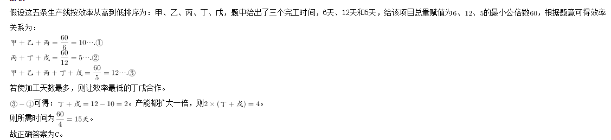

## 合作问题

1.  A、B、C三支施工队在王庄和李庄修路,王庄要修路900米,李庄要修路1250米。已知A、B、C三队每天分别能修路24米、30米、32米,A、C队分别在王庄和李庄修路,B队先在王庄,施工若干天后转到李庄,两地工程同时开始同时结束。问B队在王庄工作了几天?( ) 

   分析： 两地工程同时开始同时结束，我们利用整体思想通过   工程总量/工作效率=合作工作时间

   1. （900+1250）/（24+30+32）=25天 也就是说一共要干25天
   2. 问的是B A和B先在王庄干 900-（25*24）=300 
   3. 300/30=10天

2. [单选] 甲、乙、丙三个[工程队]的效率比为6：5：4，现将A．B两项工作量相同的工程交给[这三个]工程队，甲队负责A工程，乙队负责B工程，丙队参与A工程若干[天后]转而参与B工程。两项工程同时开工，耗时16天同时结束，问丙队在A工程中参与施工多少天？

   分析：

   1. 先求出总工作量（6+5+4）*16=240
   2. 120-16*6=24
   3. 24/4=6天

3.   某市有甲乙丙三个工程队,工作效率比为3：4：5.甲队单独完成A工程需要25天,丙队单独完成B工程需要9天.现由甲队负责B工程,乙队负责A工程,而丙队先帮甲队工作若干天后转去帮助乙队工作.如果希望两个工程同时开工同时结束,则丙队要帮乙队工作多少天? 

   1.  甲队单独完成A工程需要25天,乙需要25×3/4=75/4天,丙需要25×3/5=15天
      丙队单独完成B工程需要9天,甲需要9×5/3=15天,乙需要9×5/4=45/4天
   2. 合作时间1÷（1/25+4/75+1/15）+1÷（1/15+4/45+1/9）
      =1÷4/25+1÷4/15
      =25/4+15/4
      =10天
   3. 丙队要帮乙队工作15×（1-4/75×10）=15×7/15=7天 

4.  某商铺甲乙两组员工利用包装礼品的边角料制作一批花朵装饰门店。甲组单独制作需要10小时，乙组单独制作需要15小时，现两组一起做，期间乙组休息了1小时40分，完成时甲组比乙组多做300朵。问这批花有多少朵? 

   **这题有点意思，因为中途是有人休息的，所以我们求工作总量的时候，要减去这部分不是共同工作的量**

   分析

   1. 已知时间 得出工作量和效率 30  3 2
   2. 总工作量为30 乙休息了1小时40分。说明休息的时候 甲还在一个人单独干 30-3*5/3=25
   3. 25/5 =5个小时   3*5=15 2*5 =10   甲做了20 已做了10 
   4. 20-10=10  等于300朵  30*30=900朵

5.  2台大型收割机和4台小型收割机在一天内可收完全部小麦的3/10 。8台大型收割机和10台小型收割机在一天内可以收完全部小麦。如果单独用大型收割机和单独用小型收割机进行比较,要在一天内收完小麦,小型收割机要比大型收割机多用多少台?( ) 

   ​	 析假定全部小麦为1。假设大型收割机与小型收割机的效率分别为X、Y，则可得：2X+4Y=3/10，8X+10Y=1，解得X=1/12，Y=1/30。因此单独用大型收割机收完需要12台，单独用小型收割机收完需要30太，相差18台。故正确答案为C 


# 几何图形


性价比太低，不建议

看平常积累，不加以练习


# 利润问题

+ 几个名字：成本、定价、利润
+ 核心公式：售价=成本+利润
+ 拓展公式：总成本/总利润/总销售额=单个成本/单个利润/当个售价 X 数量
+ 特有名词
  + 折扣：实际售价是原来定价的几层
  + 利润率：利润占成本的比列，成本100  利润20 利润率就是 20%  利润/成本
+ 推荐解题方法
  + 首选方程
  + 赋值法


## 分批销售


>  分批销售看收入=第一批的利润+第二批的利润
>
> 成本（1+利润率）+成本（1+利润率）* 折扣=收入


1. 某商店2万元购进一批商品，按原价卖出这批商品的五分之二后，由于市场情况发生变化，决定以七五折销售所剩商品，等商品全部卖出后结算发现这批商品亏损2000元，则降价前这批商品的利润率约为：

   A . 6%
   B . 7%
   C . 8%
   D . 9%

   分析：求什么设什么 。设利润率为x

   （2*2/5）（1+X）+ 1.2(1+x) * 3/4 =1.8

2.  某商店花10000元进了一批商品,按期望获得相当于进价25%的利润来定价,结果只销售了商品总量的30%。为尽快完成____,商店决定打折销售,这样卖完全部商品后,亏本1000元。则商店是按定价打几折销售的?() 

   分析：

   1. 设打了x折 根据收入公式
   2. 3000*1.25+7000*1.25 * x=9000
   3. x=0.6

3.  某家具店购进100套桌椅，每套进价200元，按期望获利50%定价出售，卖掉60套桌椅后，店主为了提前收回资金，打折出售余下的桌椅，售完全部桌椅后，实际利润比期望利润低了18%，余下的桌椅是打几折出售的

   分析：这里有一个坑点 实际利润比期望利润低了18% 这里是期望利润的82%

   ​	 60*200* (1+0.5) + 40* 200* 1.5=200*100+8200

      x=0.85

4.  服装店买进一批童装，按每套获利50%定价卖出这批童装的80%后，按定价的八折将剩下的童装全部卖出，总利润比预期减少了390元，问服装店买进这批童装总共花了多少元

   ​	设总成本为x

   ​	0.8x * 1.5 + 0.2 X *1.5 * 0.8=1.5x-390 

   ​	

5.  [2014年浙江省第57题]商店进了100件同样的衣服,售价定为进价的150%,卖了一段时间后价格下降20%继续销售,换季时剩下的衣服按照售价的一半处理,最后这批衣服盈利超过25%。如果处理的衣服不少于20件,问至少有多少件衣服是按照原售价卖出的?  难题-看到直接放弃


## 基础题

1.  **某商品定价为进价的1.5倍，售价为定价的8折，每件仍可以获利24元，该商品定价为多少：** 

   0.8x-x/1.5=24 

   x=180

2.   老王两年前投资的一套艺术品市价上涨了50%，为尽快出手，老王将该艺术品按市价的八折出售，扣除成交价5%的交易费用后，发现与买进时相比赚了7万元。问老王买进该艺术品花了多少万元（）

    设老王买进时花了x万元，市价上涨50%即利润率为50%，此时市价为1.5x，扣除5%成交价的交易费用即卖出价为原来的95%，所以列方程为1.5×0.8×（1-5%）x-x=7，可解得x=50。故本题选D。 

3.  某件商品如果打九折销售，利润是原价销售时的2/3;如果打八折后再降价50元销售，利润是原价销售时的1/4。该商品如果打八八折销售，利润是多少元? 

   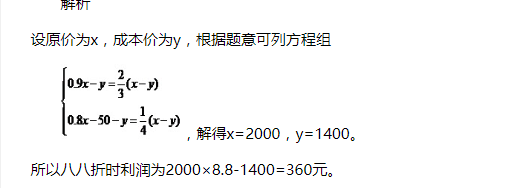

4. 

   


# 鸡兔同笼问题

鸡数量= (最多腿-实际腿)/实际差值

+ 常见题型： 工资报酬、考试对错

鸡兔同笼，头共46，足共128，鸡兔各几只？

***解析\***：通常我们使用假设法来解题，先假设都是鸡或者都是兔，多的或者少的足是由于把兔当做了鸡或者把鸡当做了兔而造成的，由此可以先解出兔或鸡的数量，再根据总头数，求出鸡或者兔的数量。

- 假设笼子里都是鸡，那么有足46*2=92只，少了128-92=36只足是由于把兔当做了鸡而造成的，每把一只兔当做了鸡就少了两只足，所以兔的数量=36/2=18只，由于总头数是46只，所以鸡的数量是46-18=28只。
- 假设笼子里都是兔，那么有足46*4=184只，多了184-128=56只足是由于把鸡当成了兔而造成的，每把一只鸡当成了兔就多了两只足，所以鸡的数量=56/2=28只，由于总头数是46只，所以兔的数量是46-28=18只。

我们来看下例题

1.  某零件加工厂按照工人完成的合格零件和不合格零件支付工资，工人每做出一个合格零件能得到工资10元，每做一个不合格零件将被扣除5元，已知某人一天共做了12个零件，得工资90元，那么他在这一天做了多少个不合格零件： 

    可以列方程 x合格 y不合格

   

# 数字推理

+ 观察数列，无明显数字特征且变化幅度平缓，优先考虑作差
  + 作差、作和无规律，
    + 数列无明显特征，考虑多级数列作差。相邻两项作差，前一项减后一项，得到新数列
  + 考虑
  + 考虑递推数列
  + 考虑因数分解
+ 数列全部为分数，优先考虑分数数列
  + 考虑做积找规律。


# 参考资料

+ https://mp.weixin.qq.com/mp/appmsgalbum?__biz=Mzk0ODM5Mzg1OQ==&action=getalbum&album_id=2526910158070071297&scene=173&from_msgid=2247483662&from_itemidx=1&count=3&nolastread=1#wechat_redirect
+ 花生十三

