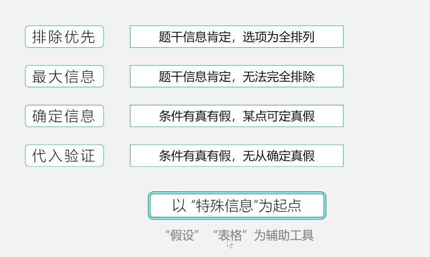
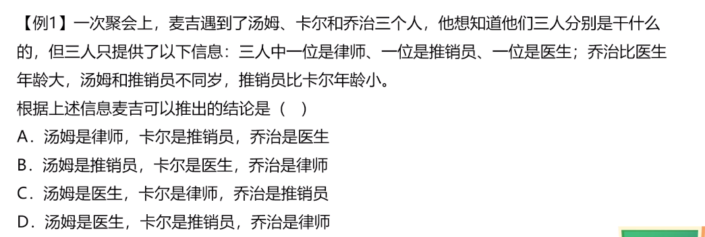
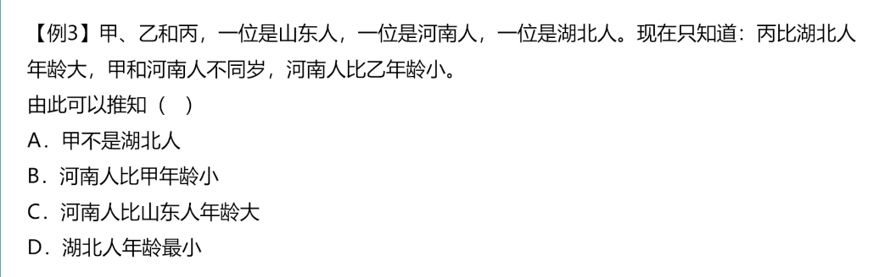
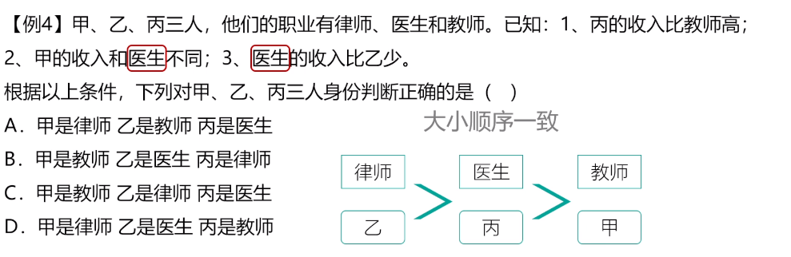
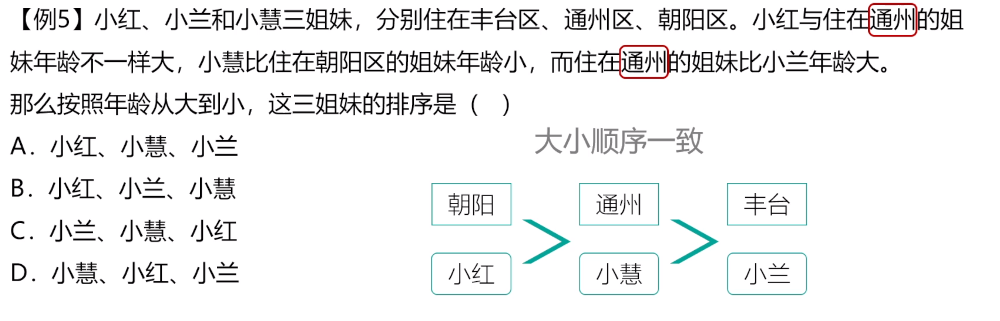
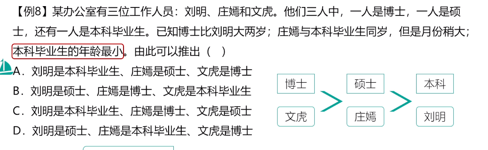
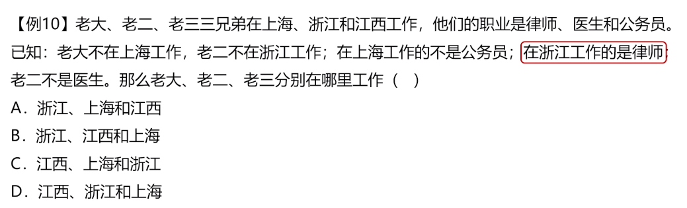
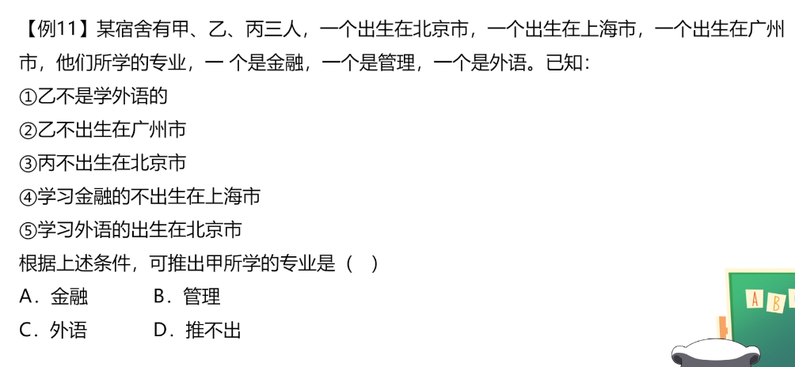
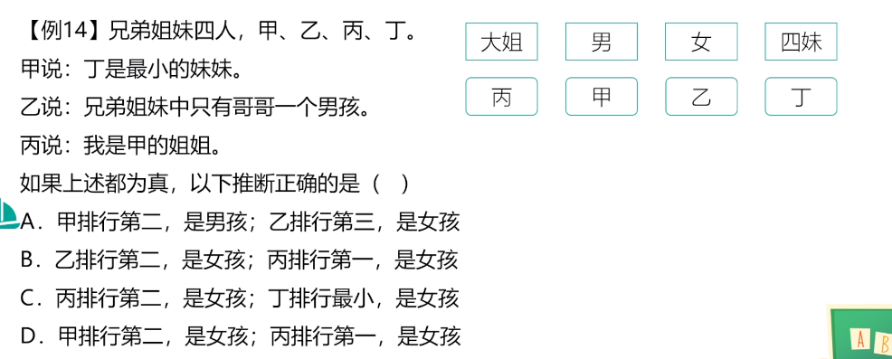

# Table of Contents

个人总结

1. 最大信息
2. 找确定条件

题型

三个人，不同职业、不同城市 进行选择。

1.

这种就比较简单 直接代入即可

2. 

发现这里面河南人出现的信息最多，根据最后一句话，得出 丙是河南

|      |      |      |
| ---- | ---- | ---- |
| 乙   | 丙   | 甲   |
| 山东 | 河南 | 湖北 |

3. 

4. 

   观察发现 通州这个条件，可以推出小惠

5. 

   这题根据本科毕业生 可推出时刘

6. 

根据 老二不在浙江，在浙江的是律师，老二不是医生，那么老二就是公务员

浙江是律师，上海不是公务员，那么就是江西 直接B

7. 

根据5  23 得出 甲学外语在北京

8. 

