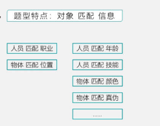
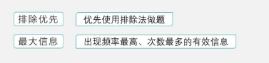
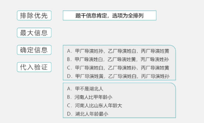
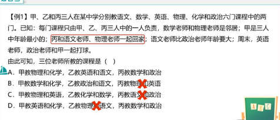
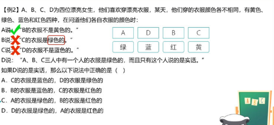
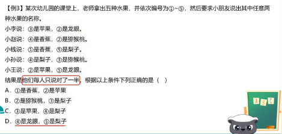

# Table of Contents

* [题型特点](#题型特点)
* [题干信息肯定](#题干信息肯定)
* [题干信息有真有假](#题干信息有真有假)
* [思路分析](#思路分析)

# 题型特点

对象匹配信息

# 题干信息肯定

为什么是最大信息？信息出现的多，表示稳定

[三人成众](./分析推理-三人成众.md)
[4321](分析推理-4321.md)

# 题干信息有真有假

[只对一半](./分析推理-只对一半.md)

# 思路分析

最大信息 确定信息都可以看作【特殊信息】

----

列题

-----

----

这题大部分人都会做错，为啥，没看清题目，直接以为是不确定题型，但其实题目没说完
