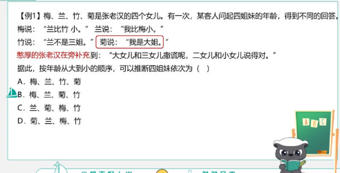

# Table of Contents

* [题型特点](#题型特点)
* [题干信息肯定](#题干信息肯定)
* [题干信息有真有假](#题干信息有真有假)
* [思路分析](#思路分析)
* [特殊强化](#特殊强化)
* [经典题目](#经典题目)

# 题型特点

对象匹配信息

# 题干信息肯定

为什么是最大信息？信息出现的多，表示稳定

[三人成众](./分析推理-三人成众.md)
[4321](分析推理-4321.md)

# 题干信息有真有假

[只对一半](./分析推理-只对一半.md)

# 思路分析

最大信息 确定信息都可以看作【特殊信息】

----

列题

-----

----

这题大部分人都会做错，为啥，没看清题目，直接以为是不确定题型，但其实题目没说完

# 特殊强化

1. 特殊信息

最特殊的信息：菊

菊不可能是大姐，菊只可能是三 秒B走人

----

2. 并列思想

正常思路：

根据1 没有人可以玩3圈，m是不会在第三的

再根据2  m一定玩4 

并列思路：

JL并列 KO并列，选M

-----

3. 

甲丙戊并列

乙丁已并列

庚不同中的不同

直接秒D

---

4. 

常规思路都是代入验证 

三个人都是70分，表示三个人都对7个，错三个

我们先看一个例子

|      | 1    | 2    |
| :--- | ---- | ---- |
| 甲   | x    | √    |
| 乙   | x    | x    |

如果 甲乙加在一起一共得到三十分，那么第一题肯定是x的。

这题突破口【把三个人看作一个整体】

三个人合在一起就是，三个人错了9道题。

----

一个人猜对2个，三个人猜对一个，总共就是猜对5个。

1号只能是二等奖

2号只能是特等奖

3号只能是五等奖

# 经典题目

1. 在一场圆桌会议中有甲、乙、丙、丁、戊 5 位参会人员按逆时针顺序依次落座，每人都
   只会两门语言，假设甲会日语和德语，丁会英语和俄语。
   以下情况可确保每个人都可以和左右邻座的人自由交谈的是（ ）
   A．乙会英语和日语，丙会德语和英语，戊会俄语和法语
   B．乙会法语和德语，丙会法语和俄语，戊会日语和英语
   C．乙会法语和汉语，丙会德语和英语，戊会德语和俄语
   D．乙会德语和汉语，丙会法语和德语，戊会俄语和德语

这里注意：是围成一个圈圈

甲、乙、丙、丁、戊

这里用排除法会比较好

现根据甲会日语和德语，排除AC

丁会英语和俄语,排除D

----

2. 某小学中午放学后，学生们排队去食堂吃午饭，某一窗口共有七个学生排队，分别是：
   甲、乙、丙、丁、戊、己、庚。对于他们的排列顺序，已知：
   ① 排在乙后面的第三个人是庚；
   ② 排在丁前面的第二个人是戊；
   ③ 甲紧排在丙后面；
   ④ 己排在乙和丙之间，且己排在第四位。

乙 XX庚

戊X丁

丙甲

乙 ？(己)丙甲

如果乙是1，那么庚是4不行

如果乙是2，丁是3 己4庚5丙6甲7 成立

----

3. 有 12 本书从左到右依次放在一书架上。其中四本是小的平装本，两本是大的平装本，
   三本是布面装订本，三本是皮革面装订本。已知第一本是大的平装本，第四本是皮革面装订本，
   三本布面装订本彼此不相邻，三本皮革面装订本放在一起，四本小的平装本也放在一起且在最右
   边。问下列哪一本肯定是大的平装本（ ）
   A．第 3 本
   B．第 6 本
   C．第 7 本
   D．第 8 本

三本布面装订本彼此不相邻  三本皮革面装订本放在一起 四本小的平装本也放在一起且在最右
边

大    x x 皮 x  x x x 小 小 小 小

因为三布不可能相邻 所以345肯定是皮

大    x 皮 皮 皮x x x 小 小 小 小 第八本一定是大

----

4. 某公司成立了篮球、足球和乒乓球三个业余活动小组，甲、乙、丙均报名参加，三人在
   不同的小组，且每人只参加了一组。对于他们参加业余活动小组的情况，有如下三种猜测：
   （1）甲参加了篮球组，乙参加了足球组。
   （2）丙没参加足球组，乙参加了篮球组。
   （3）甲没参加篮球组，乙参加了乒乓球组。
   如果上述三种猜测都只对了一半，则甲、乙、丙分别参加的是（ ）
   A．乒乓球组、足球组和篮球组
   B．足球组、篮球组和乒乓球组
   C．篮球组、乒乓球组和足球组
   D．足球组、乒乓球组和篮球组

三种猜测都只对了一半，先看最右边，肯定只有一个对，再看左边，2个甲一阵一假，那么丙肯定对

排除BC

代入即可

---

5. 

4个人没人得6分，那么4个人错的就是16

再看题目发现，【3789】比较特殊，【12456 10】都是一半对一半错，也就是6X2=12，【3789】只能错一个，少数服从多数，

排除BC，再看AD，发现除了第五个，其他都一样。代入，发现A不对。选D
