# Table of Contents

* [什么是真假推理](#什么是真假推理)
* [矛盾](#矛盾)
* [反对](#反对)
* [等价](#等价)
* [总结](#总结)

# 什么是真假推理

关于一件事情，给出若干讨论(命题),限定其中的真假数量

题型特点：有真有假有关系

# 矛盾

一组矛盾关系锁定一真一假

+ 直言命题 

  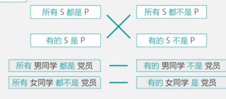

+ 假言命题

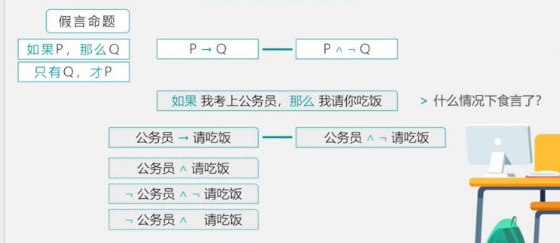

其实也可以这么理解

P->Q  选言是 -P或Q 摩根定律就是 【P且-Q】

+ 选言

直接利用摩根定律

列题

找矛盾，看其余

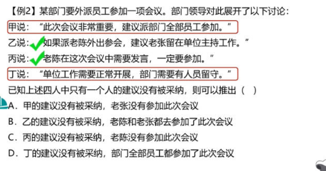

原始状态找矛盾

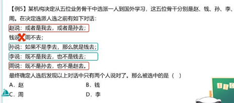

# 反对

可能同真或者同假

+ 直言命题

直言命题 上反对 下反对

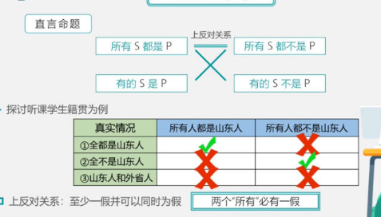

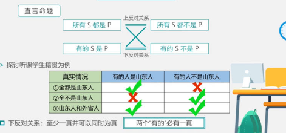

+ 例题

  

  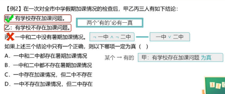

  

# 等价

必定同真同假

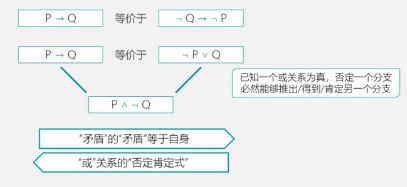

总的说还是利用选言的肯定否定式，所以要好好需要翻译推理

例题：

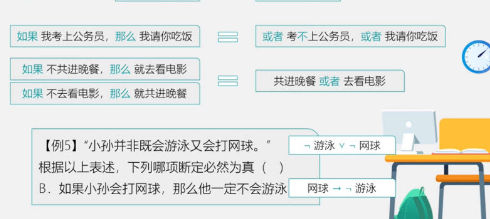

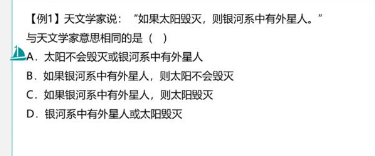

# 总结

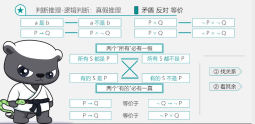
