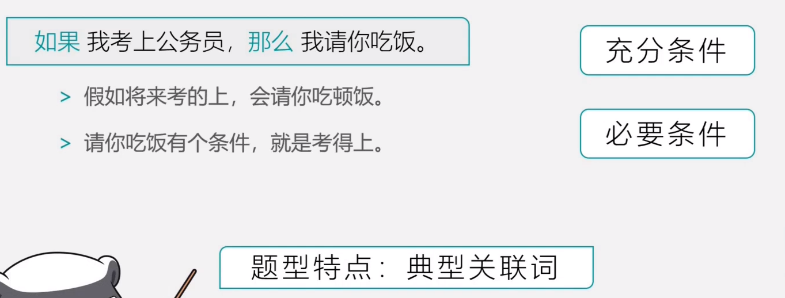
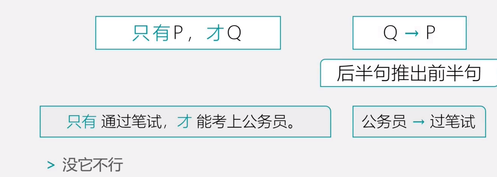
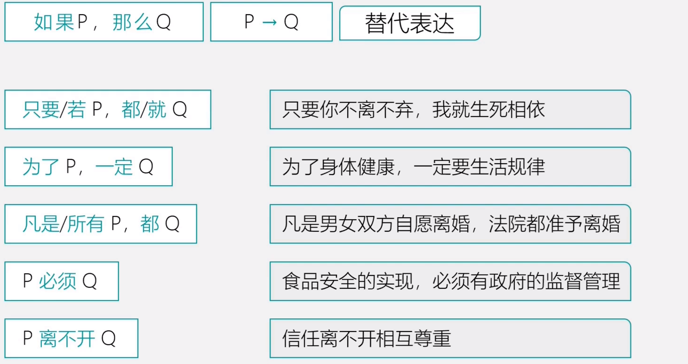
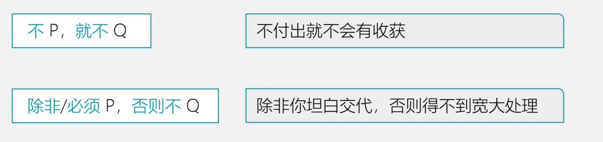
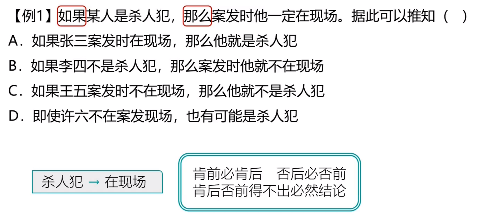
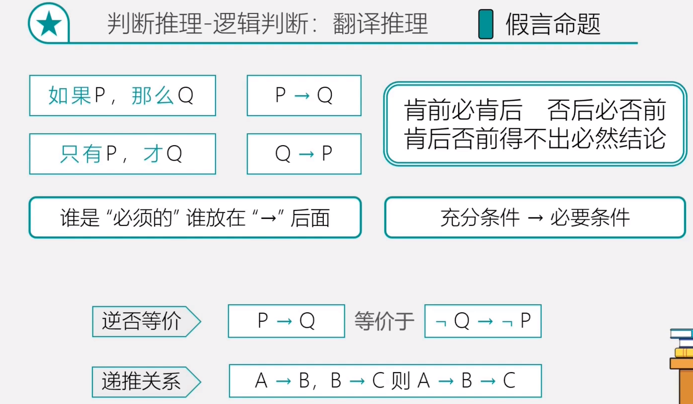

# Table of Contents

* [什么是命题](#什么是命题)
* [常用符号](#常用符号)
* [假言命题](#假言命题)
  * [典型特点](#典型特点)
  * [充分条件](#充分条件)
  * [必要条件](#必要条件)
  * [推理规则](#推理规则)
  * [逻辑关联词](#逻辑关联词)
  * [例题](#例题)
  * [总结](#总结)

# 什么是命题

# 常用符号

# 假言命题

## 典型特点

## 充分条件

## 必要条件

谁必要，谁在后面。

## 推理规则

+ 肯前必肯后，否后必否前 -> 其实就是逆否公式
+ 否前肯后，无必然结论 

## 逻辑关联词

## 翻译技巧

1. 谁是必须，谁放在后面
2. 

## 例题

## 总结

