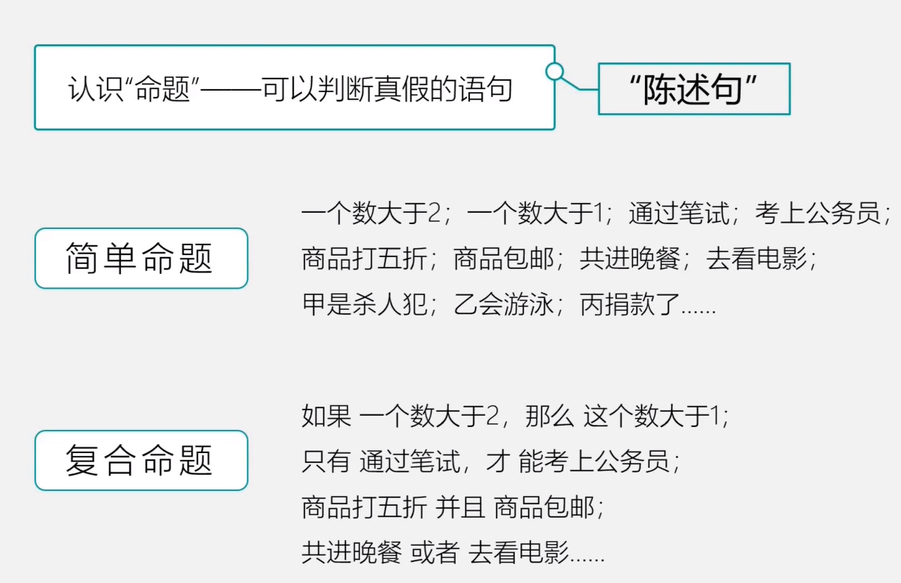
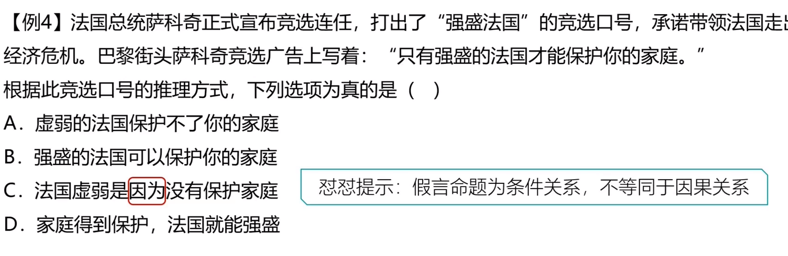
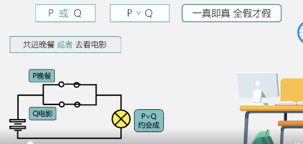
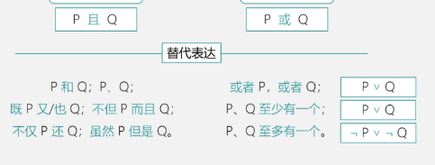
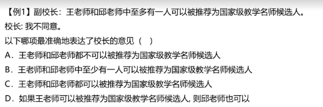
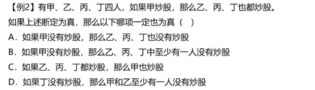
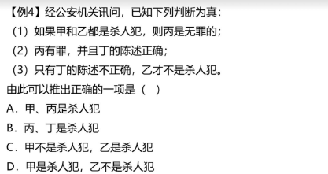
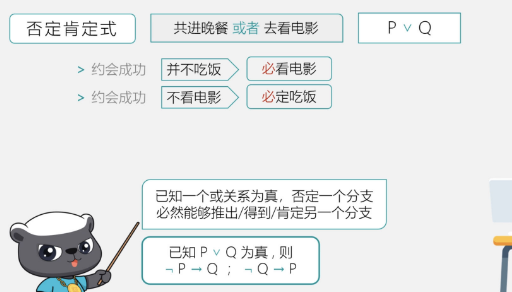
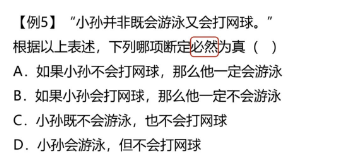
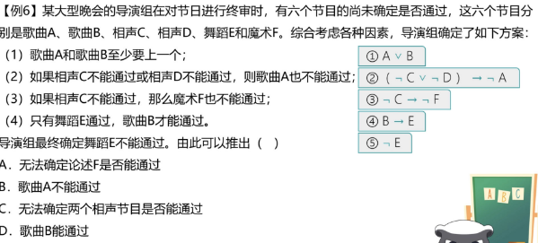

# Table of Contents

* [什么是命题](#什么是命题)
* [常用符号](#常用符号)
* [假言命题-基于假设](#假言命题-基于假设)
  * [典型特点](#典型特点)
  * [充分条件](#充分条件)
  * [必要条件](#必要条件)
  * [推理规则](#推理规则)
  * [逻辑关联词](#逻辑关联词)
  * [翻译技巧](#翻译技巧)
  * [例题](#例题)
  * [总结](#总结)
* [选言命题-基于事实](#选言命题-基于事实)
  * [符号](#符号)
  * [替代表达](#替代表达)
  * [摩根定律](#摩根定律)
  * [否定肯定式/假言联言转换](#否定肯定式假言联言转换)
  * [例题](#例题-1)


# 什么是命题




# 常用符号


# 假言命题-基于假设

## 典型特点


## 充分条件


## 必要条件


谁必要，谁在后面。


## 推理规则

+ 肯前必肯后，否后必否前 -> 其实就是逆否公式
+ 否前肯后，无必然结论 


## 逻辑关联词


## 翻译技巧

1. 谁是必须，谁放在后面


## 例题





## 总结


# 选言命题-基于事实


## 符号

P且Q P^Q

P或Q PVQ



这里的或包含了三种可能关系

+ p 或-q

+ -p 或 q

+ p或q

  转成汉字语言 就是至少有一个成立

## 替代表达



这里我们要注意 PQ至多有一个的表达方式 【 -p v -q】

## 摩根定律




至多有一人，结合上面学的。-王或-邱

在利用摩根定理  王且邱



甲->(乙且丙且丁)

-乙或-丙或-丁->-甲

A:肯前否后  B:肯前否后  C  错误 D 甲乙至少一个人，那就是-甲或-乙 在结合摩根定律 -甲肯定成立，一真则真


这里要关注几个点

1. 假言是一中假设关系
2. 联言是几个确定的事实
3. 联言是分支可单独使用




直接根据2分别代入1 3 得到 甲不是杀人犯 乙是杀人犯


## 否定肯定式/假言联言转换

这里其实式对或的三种关系的运用



只能先否定在肯定。

我们在回头看看上面题目


直接根据2分别代入1 3 

-甲或-乙

乙

否定了-乙必然能得到甲

```java
我们在换个思路，现在是联言转假言，假言转联言也是一样的

 P->Q 等价于 非P或Q 

P->Q  Q是成立的，那就说明否定了-p 那么原来就是-p或Q
```




-(游泳且网球)

-游泳或-网球 这里就包含了三种关系，至多会一个


## 例题



根据4去到推
