# Table of Contents

* [导学](#导学)
* [加强](#加强)
  * [通用类加强](#通用类加强)
  * [因果类](#因果类)
  * [对比实验](#对比实验)
* [削弱](#削弱)
  * [提问方式](#提问方式)
  * [通用类虚弱](#通用类虚弱)
  * [方法不可行](#方法不可行)
  * [因果类](#因果类-1)
  * [对比试验](#对比试验)
  * [样本不科学](#样本不科学)

# 导学

论证是运用论据证明论点得逻辑过程。

话题一致

# 加强

+ 提问方式

  + 最能加强
  + 不能加强上述论证得是【无关或者虚弱】
  + 上述论证得前提假设【前提假设 本身就加强】

  

## 通用类加强

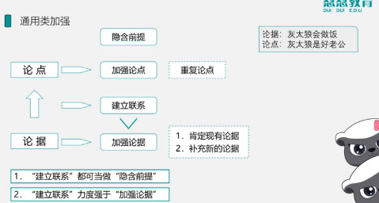

这里注意建立联系

+ 具有代表性
+ 大多数
+ 其他也一样

---

BD无关，A论点只有损害,C重复了2次。

---

+ 肯定现有论据
+ 补充新论据

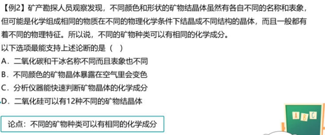

----

BCD都在补充论据

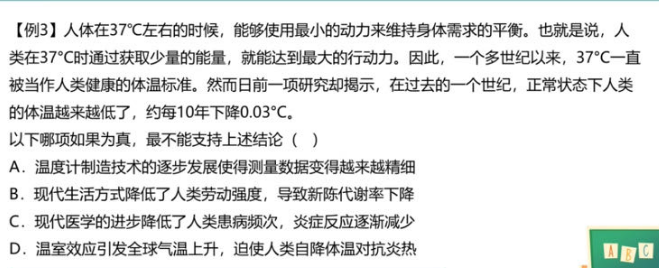

---

典型得建立联系

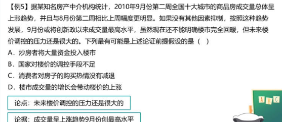

----

这里要多看下

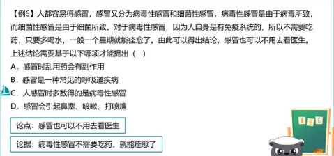

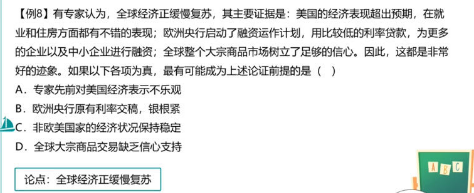

其他也一样

----

前提加强

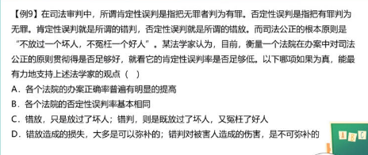

错的基本相同 才能体现对的误判足够低

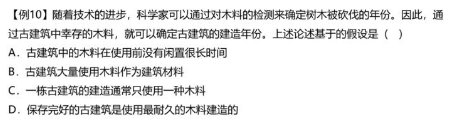

砍的木头立马用 检测年龄才是有效的

## 因果类

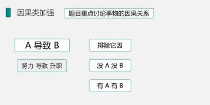

+ 排除他因
+ 没A没B
+ 有A有B

-----

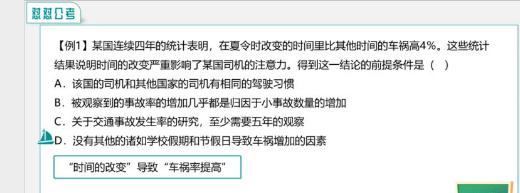

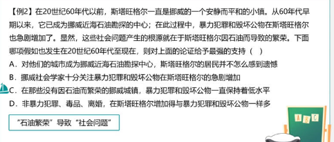

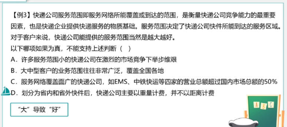

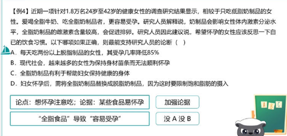

## 对比实验

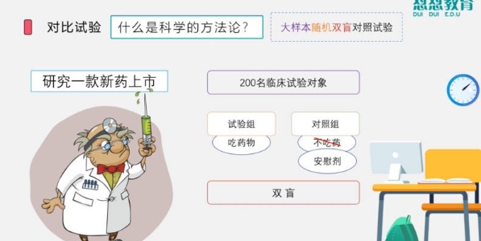

单因子变量

+ 设计
+ 加强
+ 虚弱

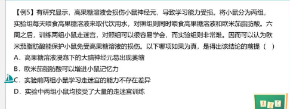

---

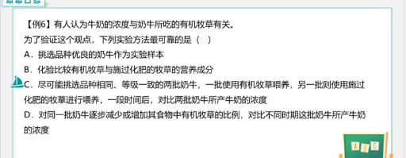

---

---

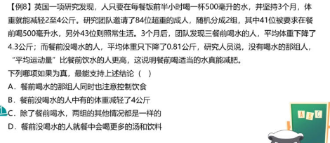

# 削弱

 ##  提问方式

## 通用类虚弱

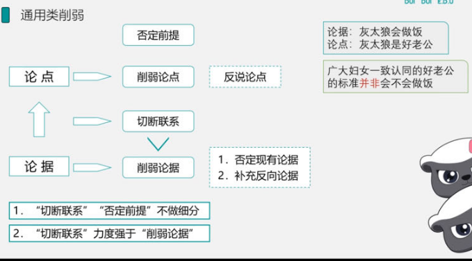

----

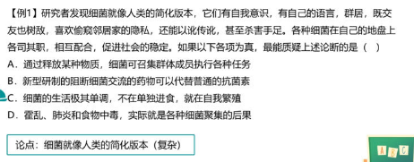

-----

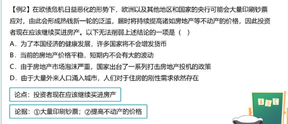

----

---

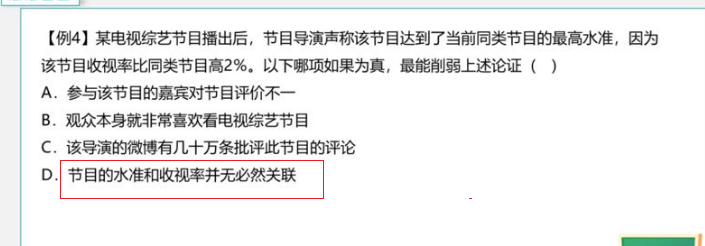

---

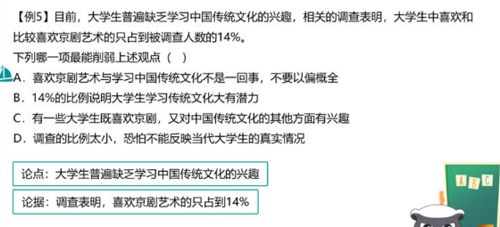

注意这里切断联系

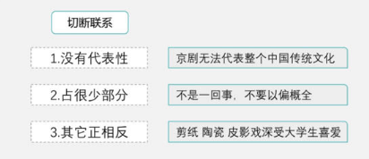

----

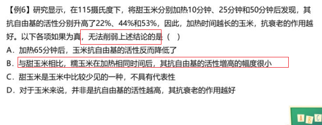

---

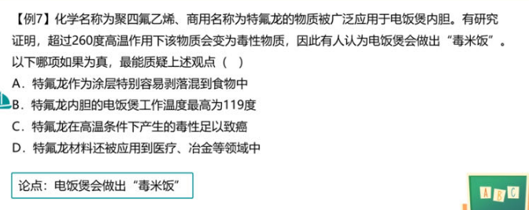

## 方法不可行

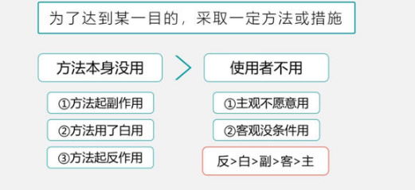

副作用<白用<反作用

-----

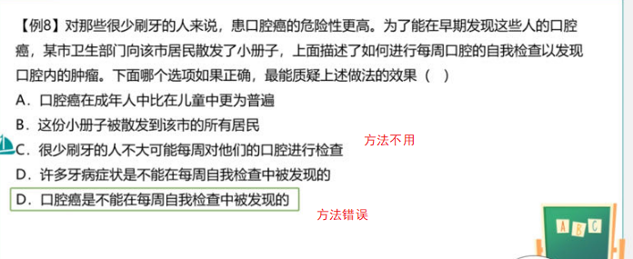

---

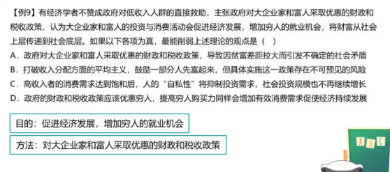

---

---

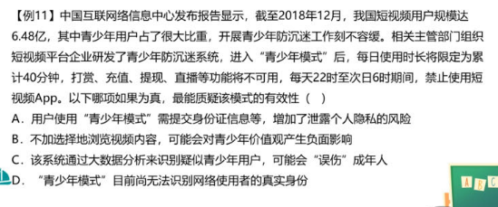

## 因果类

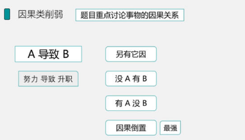

---

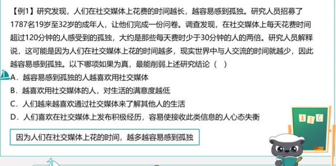

---

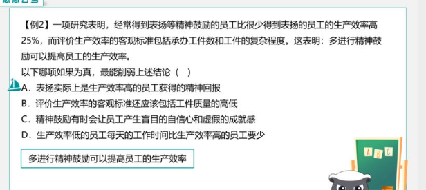

---

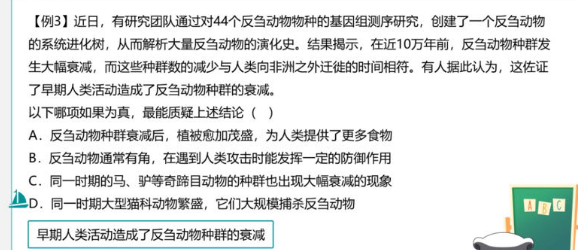

---

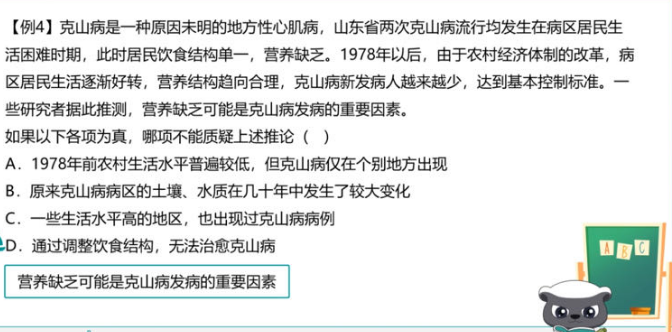

4无关选项

## 对比试验

单因子变量

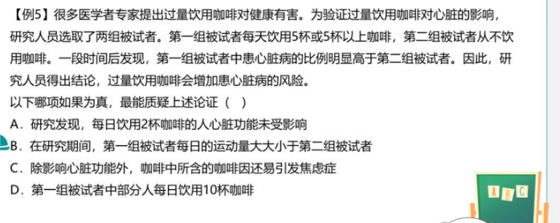

---

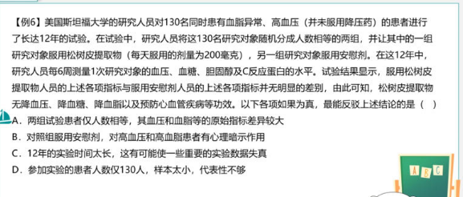

## 样本不科学

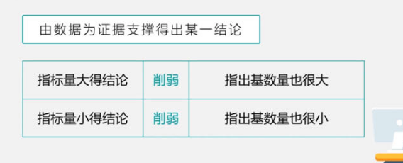

----

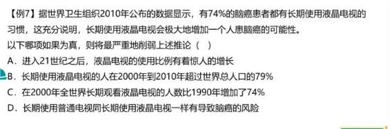

---

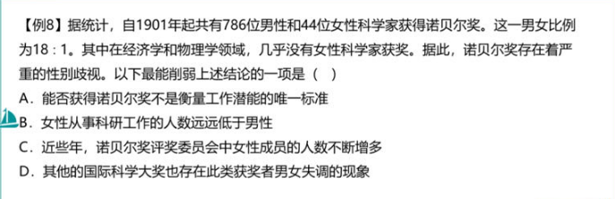

---

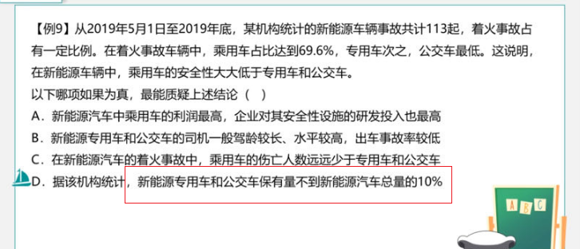
