# Table of Contents

* [导学](#导学)
* [加强](#加强)
  * [通用类加强](#通用类加强)
    * [重复论点](#重复论点)
    * [加强论据](#加强论据)

# 导学

论证是运用论据证明论点得逻辑过程。

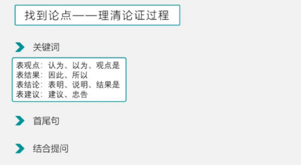

话题一致

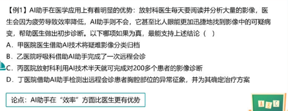

# 加强

+ 提问方式

  + 最能加强
  + 不能加强上述论证得是【无关或者虚弱】
  + 上述论证得前提假设【前提假设 本身就加强】

  

## 通用类加强

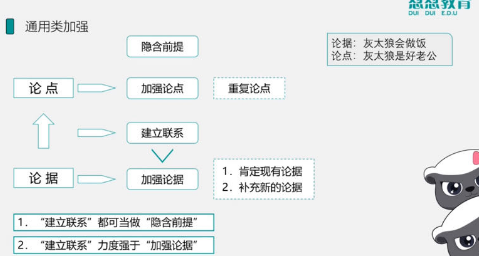

这里注意建立联系

+ 具有代表性
+ 大多数
+ 其他也一样

---

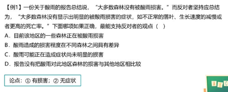

BD无关，A论点只有损害,C重复了2次。

---

+ 肯定现有论据
+ 补充新论据

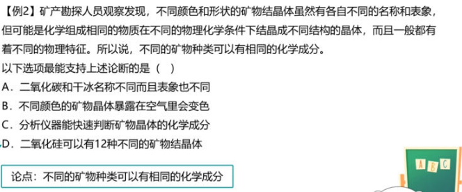

----

BCD都在补充论据

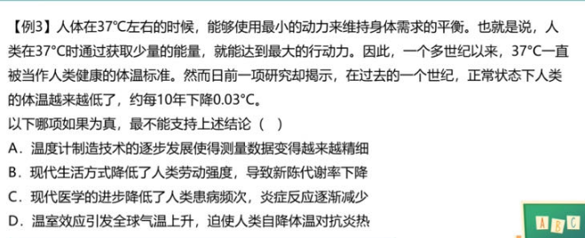

---

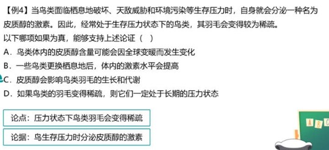

典型得建立联系

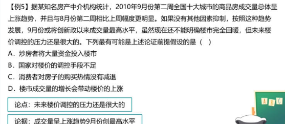

----

这里要多看下

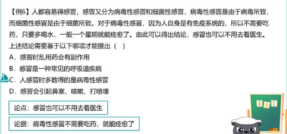

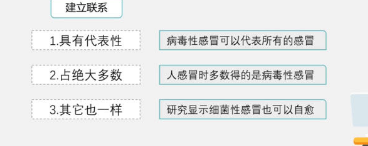

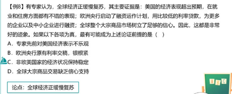

其他也一样

----

前提加强

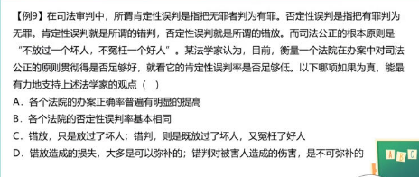

错的基本相同 才能体现对的误判足够低

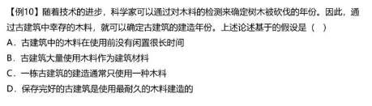

砍的木头立马用 检测年龄才是有效的

## 因果类

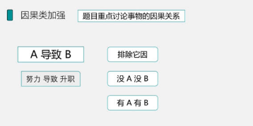

+ 排除他因
+ 没A没B
+ 有A有B

-----

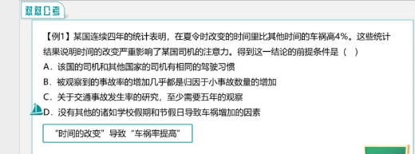

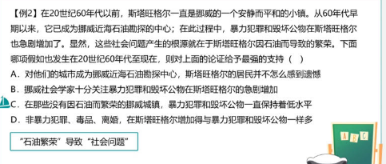

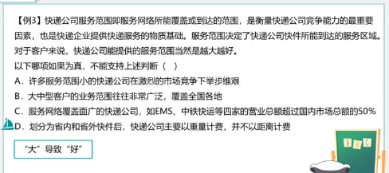

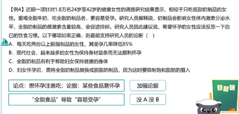

## 对比实验

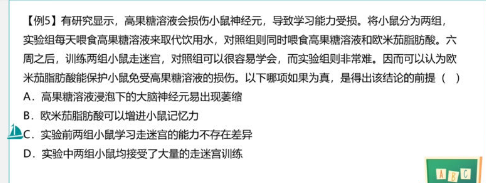