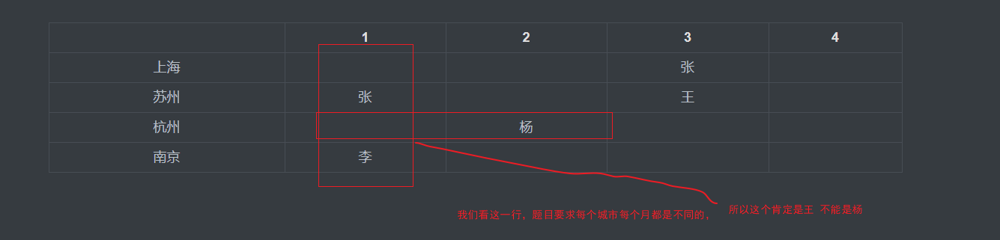

2

1. 

根据题目画表格可得

|      |  1   |  2   |  3   |  4   |
| :--: | :--: | :--: | :--: | :--: |
| 上海 |      |      |  张  |      |
| 苏州 |  张  |      |  王  |      |
| 杭州 |      |  杨  |      |      |
| 南京 |  李  |      |      |      |

