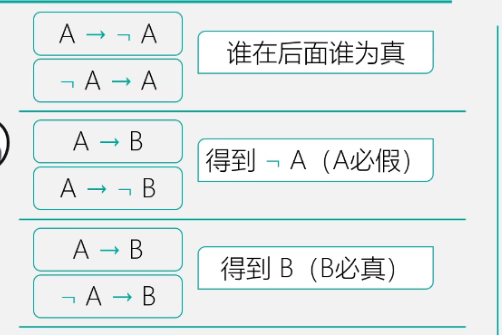
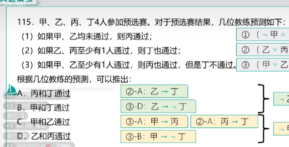

# Table of Contents

* [题目特征](#题目特征)
* [三个公式](#三个公式)
* [例题](#例题)


# 题目特征

1. 归谬需要自己构建
2. 没有推理起点
3. 说白了就是没头绪就是二难

# 三个公式



其实后面2个，逆否下就是相等的了

# 例题

1. ```java
   例：某市要建花园或修池塘，有下列4种假设：修了池塘就要架桥;架了桥就不能建花园;建花园必须植树;植树必须架桥。
   据此不可能推出的是：
   A.最后有池塘
   B.最后一定有桥
   C.最后可能有花园
   D.池塘和花园不能同时存在
   ```

   分析

   1. ①花园或池塘②池塘→架桥③架桥→¬花园④花园→植树→架桥
   2. 可以看到  花园→¬花园 那么根据公式  ¬花园一定成立
   3. 所以C不可能成立

2. ```java
   
   青山村山清水秀，环境优美，村民们在村委会带领下规划自己的美好未来。他们计划：
   （1）如果兴建葡萄庄园或修建民宿，就要开发乡村旅游；
   （2）如果发展水产养殖或开发乡村旅游，则要修建民宿；
   （3）如果不兴建葡萄庄园，就发展水产养殖；
   （4）如果开发乡村旅游，则要改造村容村貌。
   如果上述计划得以实施，可以得出以下哪项？
    A、青山村会兴建葡萄庄园
    B、青山村会改造村容村貌
    C、青山村不会修建民宿
    D、青山村不会发展水产养殖
   ```

   分析

   1.  ①  葡萄庄园||修建民宿->乡村旅游
   2. ② 发展水产养殖||乡村旅游->修建民宿
   3. ③！葡萄庄园->水产养殖
   4. 其实根据上面 ①  ② 就可以得出  葡萄庄园->修建民宿    ③②  ! 葡萄庄园->修建民宿 根据归谬可得一定会修建民宿
   5. 直接选B

3. 

   	  1. ！(甲&&已)->丙 等价于 甲||已 ->丙
      	  2.  已||丙->丁
      	  3. 甲||已 ->丙
      	  4. 甲||已 ->!丁
      	  5. 根据 1 2 4 得到   甲->丁  甲 ->!丁 所以！甲一定为真 同理！已一定为真 直接选A

4. 
