# Table of Contents

* [定位点](#定位点)
* [十一种图形张开图](#十一种图形张开图)

# 定位点

4种依据

+ 直四：也就是可以把A图形直接可以移到B，那么A的右上和B的左上是相同点

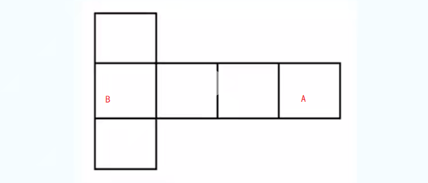

+ 弯3：

  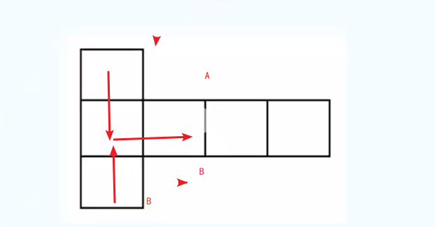

+ 弯四：

  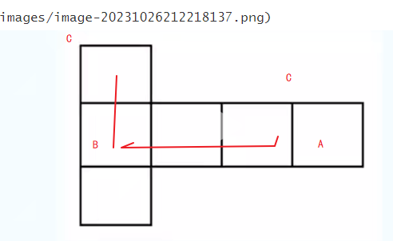

+ 双弯3：一般没有直4才会出现。最外侧的b点相同

  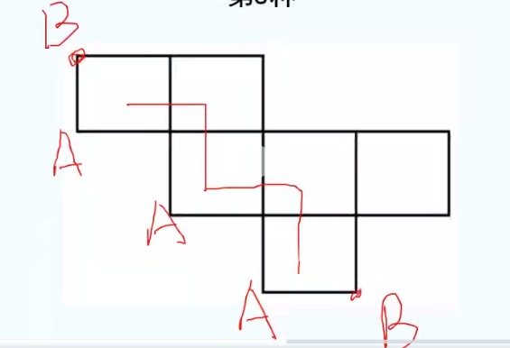

+ 一个点可以引出6条边

# 十一种图形张开图

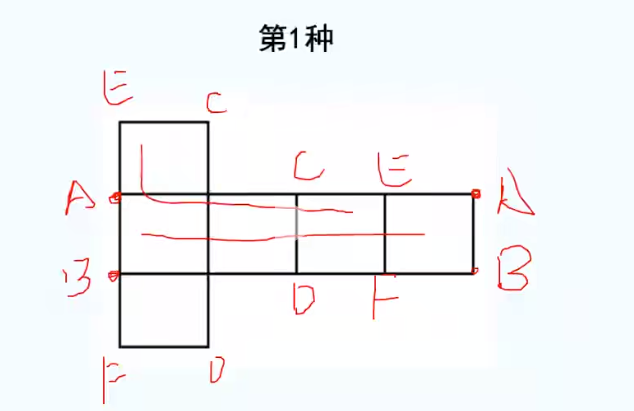

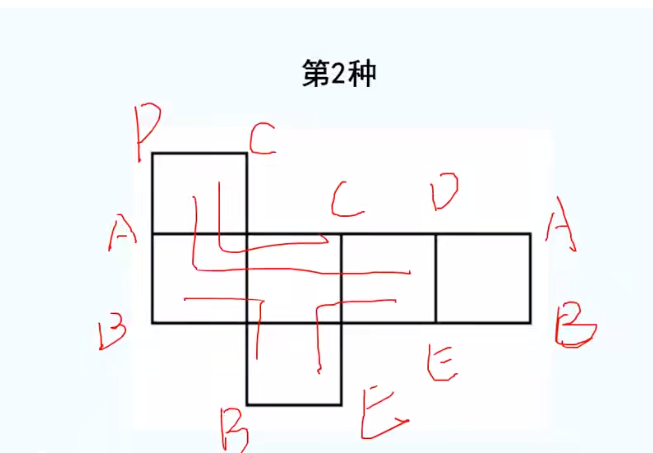

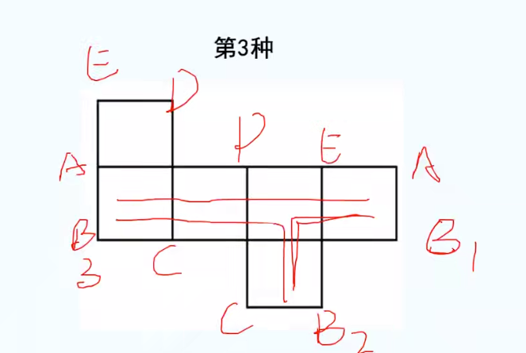

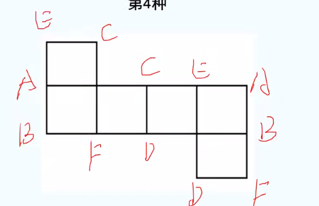

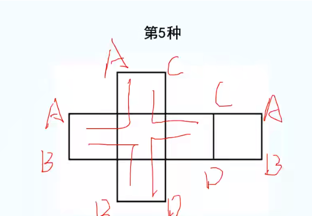

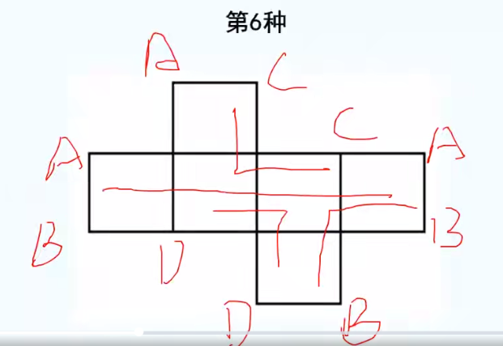

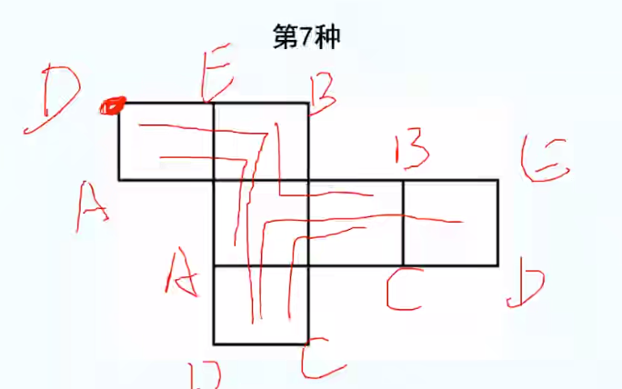

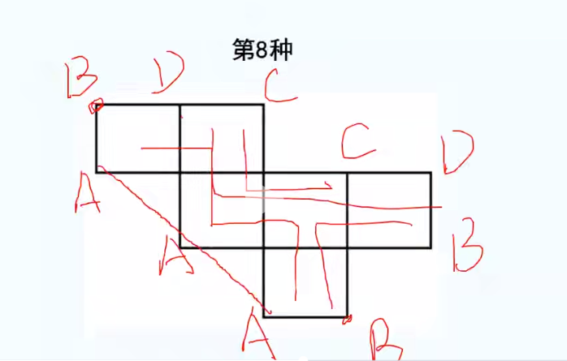

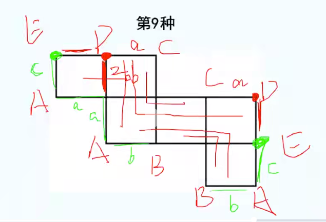

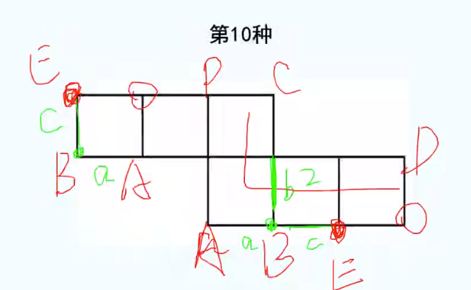
