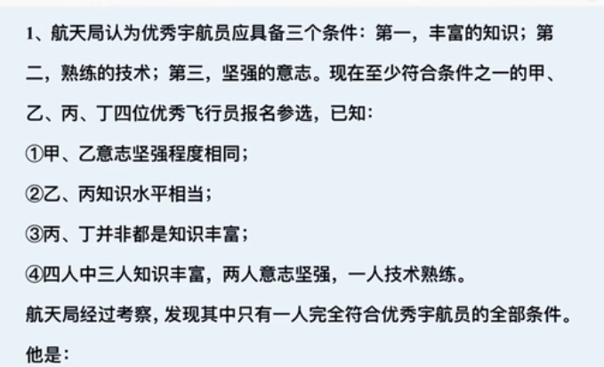
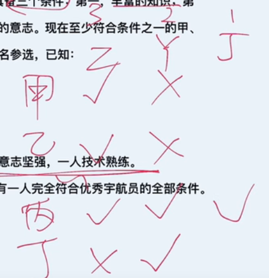

# 题目特征

4人为主 三个条件 2个。。 1人。。。



常规解题方法，画表格




秒杀法

最大找不同：三人知识丰富，属于最大，根据23可以得到丁知识水平不一样

不同找队友：根据1 可以得到丁的队友是 丙 就是答案


# 例题 

1. 
```java
某高校选派甲、乙、丙、丁4位专家组成乡村振兴调研小组，担任组长的专家为男性、党员、教授。已知这4位专家中：
（1）每位专家都至少具有组长的一个特征；
（2）有党员3人，男性2人，教授1人；
（3）甲和乙性别相同；
（4）乙是党员当且仅当丙是党员；
（5）丙和丁不全是党员。
由此推出，担任组长的是：

最大找不同：三个党员 不同的是 丁

不同找队友： 性别 丁的队友就是丙 
```

2. 
   ```java
   某次重要考试选拔命题教师，命题教师必须具备三个条件：第一，强烈的责任心；第二，丰富的知识；第三，严格的自律性。现在至少符合条件之一的甲、乙、丙、丁四名优秀教师报名参加。已知：
   ①甲、乙自律性程度相同。
   ②乙、丙责任心水平相当。
   ③丙、丁并非都具有强烈的责任心。
   ④四个人中三人具有强烈的责任心、两人具有严格的自律性、一人具有丰富的知识。
   经过考察，发现其中只有一人完全符合命题教师的全部条件，则以下说法正确的有：
       
     
       
   最大找不同：三个责任心 不同的是 丁
   
   不同找队友： 性别 丁的队友就是丙 
   ```


# 五人

```java
某公司招聘时有张三、李四、王五、赵六、钱七5人入围。
从学历看，有2人为硕士、3人为博士；
从性别看，有3人为男性、2人为女性。
已知，张三、王五性别相同，而赵六、钱七性别不同；
李四与钱七的学历相同，但王五和赵六的学历不同。
最后，只有一位女硕士应聘成功。
由此可以推出，应聘成功者为：
    A、张三 B、李四 C、 王五  D、赵六
```

我认为是运用了【并列关系】

```jaba
张三、王五性别相同  排除AC
李四与钱七的学历相同 排除B 选D
```


2. ```java
   某校招聘专任教师时有张强、李颖、王丹、赵雷、钱萍5名博士应聘。3人毕业于美国高校，2人毕业于英国高校；2人发表过SSCI论文，3人没有发表过SSCI论文。已知，张强和王丹毕业院校所在国家相同，而赵雷和钱萍毕业院校所在国家不同；李颖和钱萍发表论文的情况相同，但王丹和赵雷发表论文的情况不同。最终，英国高校培养的一位发表过SSCI论文的博士被录取。
   由此可以推出：
   
    A、
   张强没发过SSCI论文
   
    B、
   李颖发表过SSCI论文
   
    C、
   王丹毕业于英国院校
   
    D、
   赵雷毕业于英国院校
       
       同分析：D
   ```

3. 