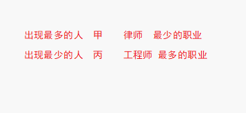
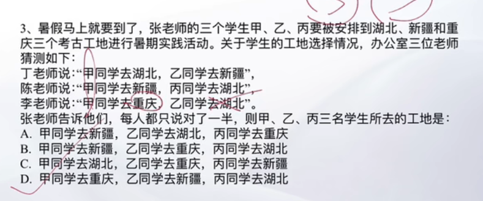
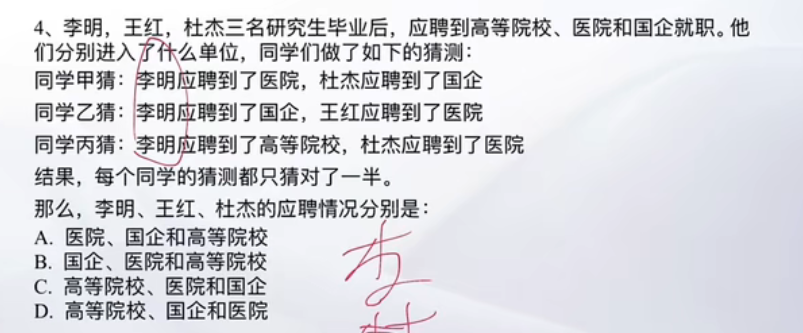
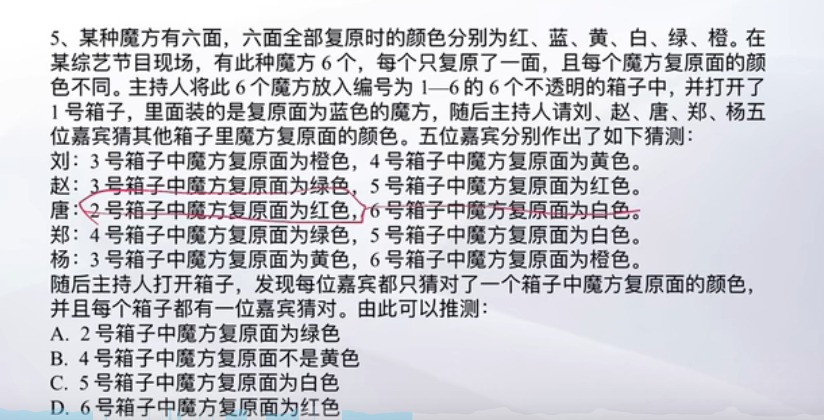
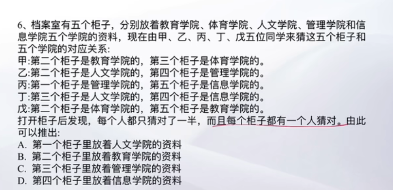

# Table of Contents

* [总结](#总结)
* [只对一半](#只对一半)
* [全都有人对](#全都有人对)


# 总结


只对一半：最大最小手拉手

其他：利用最小消息法


# 只对一半

1. ```java
   甲、乙、丙三人大学毕业后选择从事各不相同的职业：教师、律师、工程师。其他同学做了如下猜测：
   小李：甲是工程师，乙是教师。
   小王：甲是教师，丙是工程师。
   小方：甲是律师，乙是工程师。
   后来证实，小李、小王和小方都只猜对了一半。那么，甲、乙、丙分别从事何种职业：
   
    A、
   甲是教师，乙是律师，丙是工程师
   
    B、
   甲是工程师，乙是律师，丙是教师
   
    C、
   甲是律师，乙是工程师，丙是教师
   
    D、
   甲是律师，乙是教师，丙是工程师
       
       
   ```

   

   

   

   2. ```java
      幼儿园马老师和三个小朋友情情、可可和安安一起玩“猜一猜，我最棒”游戏，马老师对小朋友们说：“我把手中的红球、黄球和蓝球分别放在这个柜子的三个抽屉里，请你们猜一猜每只抽屉里放的是什么颜色的球？猜对了奖励小红花！”然后，她请小朋友们闭上眼睛，把三只球分别放在三个抽屉里，小朋友猜的情况如下：
      情情说：“红球在最上层的抽屉，黄球在中间抽屉。”
      可可说：“红球在中间抽屉，蓝球在最上层的抽屉。”
      安安说：“红球在最底层的抽屉，黄球在最上层的抽屉。”
      老师告诉她们，每人都只猜对了一半。
      请问：红球、黄球和蓝球各在哪一层抽屉里：
      
       A、
      红球在中间抽屉，黄球在最上层的抽屉，蓝球在最底层的抽屉
      
       B、
      红球在中间抽屉，黄球在最底层的抽屉，蓝球在最上层的抽屉
      
       C、
      红球在最上层的抽屉，黄球在最底层的抽屉，蓝球在中间抽屉
      
       D、
      红球在最底层的抽屉，黄球在中间抽屉，蓝球在最上层的抽屉
          
          直接上口诀 秒D
      ```

   3. 

   4. 

   5. 

   


# 全都有人对

直接看最小信息法，全都有人对，那么信息最小的肯定是对的，代入在排除





