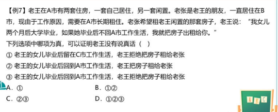
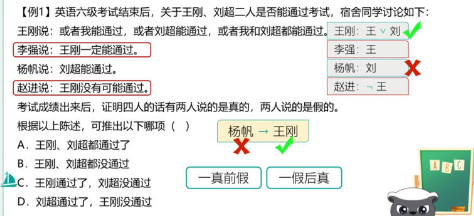

# Table of Contents

* [什么是真假推理](#什么是真假推理)
* [矛盾](#矛盾)
* [反对](#反对)
  * [反对拓展](#反对拓展)
* [等价](#等价)
* [推出关系](#推出关系)
* [总结](#总结)

# 什么是真假推理

关于一件事情，给出若干讨论(命题),限定其中的真假数量

题型特点：有真有假有关系

# 矛盾

一组矛盾关系锁定一真一假

+ 直言命题 

  

+ 假言命题

其实也可以这么理解

P->Q  选言是 -P或Q 摩根定律就是 【P且-Q】

+ 选言

直接利用摩根定律

列题

找矛盾，看其余

原始状态找矛盾

# 反对

可能同真或者同假

+ 直言命题

直言命题 上反对 下反对

+ 例题

  

  

  

## 反对拓展

+ 基础知识

  

+ 上反对关系和下反对关系 看上面文章 例题也不写了
+ 

​    矛盾不能同时成立 

   推出关系与肯前是下反对关系

+ 

  矛盾不能同时成立 

   推出关系与否后是下反对关系

----

需要全部转换为或关系，是可以做出来的，但是毕竟麻烦。

----

注意这里，当得到红1是，真话就出来了，之前学的否定肯定式，乙肯定是真的。 蓝4 黄不是2 就是3

那么绿只能是2

# 等价

必定同真同假

总的说还是利用选言的肯定否定式，所以要好好需要翻译推理

例题：

# 推出关系

+ 原理

基于直言命题中的推理关系， 全部->有的->某个（要好好理解这个推理关系）

且->单独->或

一真前假，一假后真。

---

例题：

一真前假 杨假的 说明 刘没过 那就是王过了 

----

注意：这里是且->某个，也就是丙->甲

也就是丙在说谎，那么乙是真话。

----

 1->3 4->3 根据一真前假

小王、小李都没考上，选D走人

----

+ 

这题难度会高点

首先写出题目的关系，题目都是假言命题，我们要箱转化为选言命题，目的就是为了方便找到【推出关系】、

写出来后就会发现，

 丙->甲 一真前假，那么 丙是假的。乙就是真的：文专 或 书知

----

先转为或

1. -甲或 -乙
2. 乙 或甲
3. 甲

可以看到 3->2 一真前假，就是-甲 ，那么1就是真话选A

----

# 总结

