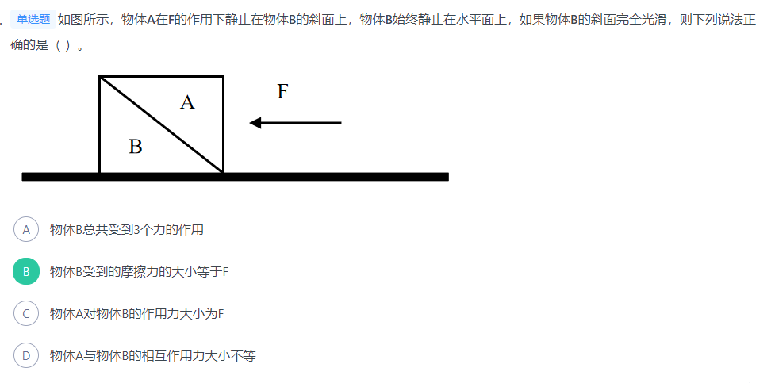
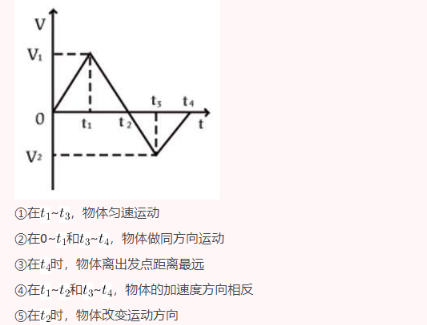
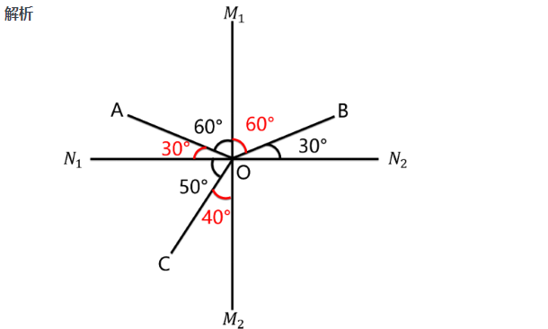
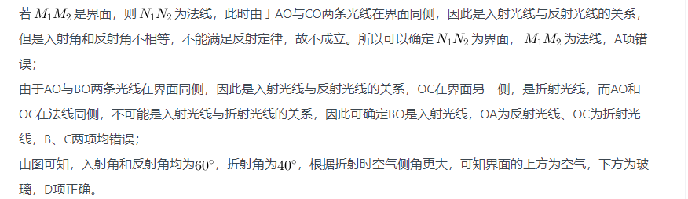
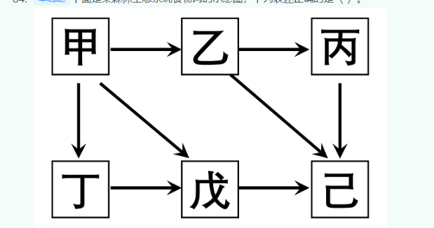
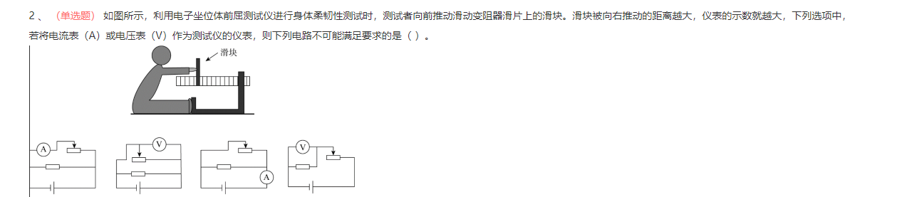
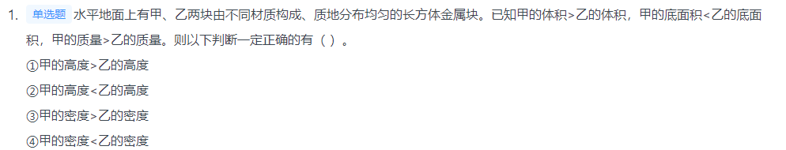
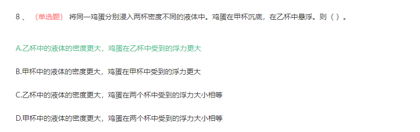

# Table of Contents

* [溶液](#溶液)
* [力](#力)
* [运动](#运动)
* [光的反射 折射](#光的反射-折射)
* [热量](#热量)
* [化学反应](#化学反应)
* [生态系统](#生态系统)
* [光合作用](#光合作用)


# 溶液

1. 在一定温度下，向一定量溶剂里加入某种溶质，**当溶质不能继续溶解时**，所得到的溶液叫做这种溶质的饱和溶液。
2. 


# 力

1. 根据杠杆原理，动力 动力臂 阻力 阻力臂。
2. 极限就是最大静摩擦力
3. 

A项：物体B始终静止在水平面上，故物体B受到向下的重力、水平面对其向上支持力、A对B的作用力、平面对其向右的摩擦力四个力的作用，而非3个力的作用，错误；
B项：物体B静止，表明在水平面上受力平衡，由于其受到水平向左的力为F，故其受到的摩擦力大小必为F，且水平向右，正确；
C项：A对B的作用力大小为F与物体A的重力的合力，错误；
D项：根据作用力与反作用力原理，物体A与物体B的相互作用力大小必然相等，错误。


# 运动

1. 自由落体运动是初速度为零，**加速度为g的匀加速直线运动**，即其速度随时间变化图像是过原点的直线，
2. 

在速度-时间（v-t）图像中：

+ 纵坐标表示速度，纵坐标的大小表示速度的大小、纵坐标的正负表示速度的方向；

+ 斜率表示加速度，斜率的大小表示加速度的大小、斜率的正负表示加速度的方向；

+ 图像与横轴围成的面积表示位移，面积的大小表示位移的大小，若围成的面积在横轴的上方则位移方向为正、若围成的面积在横轴的下方则位移为负。

  ```java
  ①由图像可知，在~，物体的速度均匀减小，即物体做匀减速直线运动。在~，物体的速度变为负但均匀增大，即朝反方向做匀加速直线运动。因此，在~，物体先减速后朝反方向加速，并非匀速运动，错误；
  
  ②由图像可知，在0~，物体的速度为正，即朝正方向做直线运动，在~，物体的速度为负，即朝反向做直线运动，错误；
  
  ③由图像可知，在0~，物体的速度为正，始终朝正方向做直线运动，距离出发点越来越远，即位移越来越大。从~，物体的速度变为负，即从时开始朝反向做直线运动，距离出发点越来越近，即位移越来越小，因此在时，物体离出发点距离最远，错误；
  
  ④由图像可知，在~，从左往右看，直线呈现下降的趋势，即加速度方向为负。在~，从左往右看，直线呈现上升的趋势，即加速度方向为正，两个时间段的加速度方向相反，正确；
  
  ⑤由③的分析可知，在时，物体的速度由正变负，意味着速度方向发生改变，即物体运动方向发生改变，正确。
  
  综上所述，①②③错误，④⑤正确
  ```

  

----


3. 


# 光的反射 折射

1. 光斜射在介质不均匀的界面上，会同时发生折射和反射。

   光的反射定律：入射光线、反射光线、法线三者**在同一平面内**，入射光线和反射光线分居法线两侧，**且入射角等于反射角**。

   光的折射定律：入射光线、折射光线、法线三者在**同一平面内**，入射光线和折射光线分居法线两侧，**且入射角不等于折射角**。并且，当光在空气-玻璃的界面上发生折射时，**总是空气侧角更大**。






# 热量

1. 液体沸腾需要达到沸点且继续吸热
2. 从冰箱内拿出一个装有冰块的杯子，原先杯子所处的环境为以下，拿出冰箱后，由于外部气温高，杯子逐渐升温，同时冰块开始融化；升温到时，此时杯中物质为冰水混合物，冰水混合物温度为不变.当冰块全部融化为水后，杯子温度和水温逐渐升高变为常温


# 化学

## 化学反应

1. 甲酸反应后生成氢气和二氧化碳，是由一种物质生成两种物质的反应，属于**分解反应**
2. **有机物**主要由**碳元素和氢**元素组成（也可能有氧、氮等其他元素），一定是含碳的化合物
3. 所有的化学反应均遵守**能量守恒定律**


## 化学实验

+ 仰视读数，真实装的液体，要比需要的液体（水）体积大，溶液浓度就会变小
+ 

# 生态系统

1. 

在食物网和食物链中，能量和物质都是逐渐递减的，因此到了后面的营养级，能量和物质通常已经很少，不足以养活太多的捕食者，因此食物链顶端的生物（如大型猛兽和猛禽）一般数量都是最少的，而不是最多的，己错误；

生态系统中能量的最终来源是太阳能，而非生产者甲，错误


# 光合作用

1. 在阳光作用下植物的绿叶利用二氧化碳和水合成碳水化合物,同时释放出氧气
2. 在光合作用时，叶绿体先将光能转化为电能，产生电位差后，内部经过一系列转化形成活跃的化学能


# 电路分析

1. 根据并联电路电压相等




分析：如果是A，表示电阻越小。如果是V，表示电阻越大

A项：定值电阻与滑动变阻器并联，电流表测试滑动变阻器支路的电流，当滑片向右滑动时，电阻变小，而支路的电压不变，故电流表的示数变大，符合要求，排除；

B项：定值电阻与滑动变阻器并联，电压表测试滑动变阻器的电压，根据并联电路电压相等，所以也测试定值电阻和电源的电压，所以滑片向右滑动时，电压表示数不变，不符合要求，正确；

C项：定值电阻与滑动变阻器并联，电流表测试总电路电流，当滑片向右滑动时，其所在的支路电阻变小，电压不变，故支路电流增大，所以总电流即电流表的示数增大，符合要求，排除；

D项：定值电阻与滑动变阻器串联，电压表测试定值电阻的电压，当滑片向右滑动时，电阻变小，电流增大，所以根据欧姆定律公式U=IR，则定值电阻的电压即电压表示数增大，符合要求，排除。


# 物理

## 质量密度体积

+ 质量=密度*体积
+ 一般来说，在水里，谁的密度大，谁下沉。盐水>水>油


-----



甲的底面积小于乙，但是体积大于乙，说明高度肯定大于乙

甲的质量>乙的质量  同时 甲的体积>乙的体积 没办法推出谁的密度大


## 浮力

+ 浮力=液体密度*体积



由于两杯中鸡蛋均为全部被浸没，故v排相等，因此鸡蛋所受浮力只与液体密度ρ液有关，再根据两个杯中鸡蛋的浮沉状态可知，甲杯中鸡蛋密度大于液体密度，乙杯中鸡蛋密度等于液体密度。进而可推知甲杯中液体密度小于乙杯中液体密度，排除B、D项，鸡蛋在乙杯中受到的浮力更大，只有A项正确。