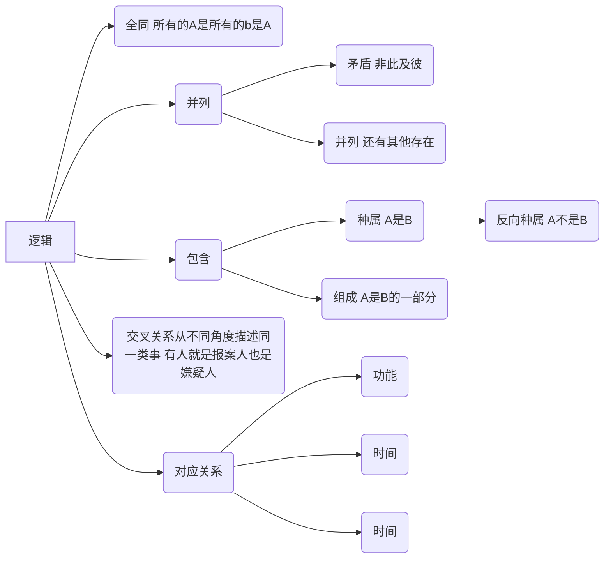

# Table of Contents

  * [常见题型](#常见题型)
  * [解题思路](#解题思路)
  * [语义关系](#语义关系)
  * [语法关系](#语法关系)
  * [逻辑关系](#逻辑关系)


## 常见题型

1.两词型：A:B

2.三词型：A:B:C

3.填空型：A对于（　）相当于（　）对于B


## 解题思路

+ 两词型和三词型题目需要**先判断题干**中词语的关系，**再确定选项**中的词语关系，最后套入逻辑关系。
+ 填空型题目**将选项代入题干**，判断前后词语间关系是否一致。
+ 在类比推理中，常考的关系包含：**语义关系、语法关系和逻辑关系**。
+ **二级分析看特点**


## 语义关系

+ 近反义

  + 近义关系：【国泰民安：河清海晏】【顿悟：醍醐灌顶】

  + 反义关系：【声色俱厉：和颜悦色】

  + 二级辨析：褒义、贬义、中性

    > **褒义词：是词性带有赞许，肯定感情的词 贬义词：是词义带有贬斥、否定、憎恨、轻蔑感情色彩的词。 中性词**：中性词是针对词语的感情色彩而言的，不仅仅是形容词，动词、名词都可以，它专指褒义、贬义词语之外不能体现特殊情感倾向的词，即中性感情色彩的词语。

+ 比喻、象征：【优雅：天鹅】


## 语法关系

> 一般来说，主语是指一个句子所陈述的对象，比如做了某事的人，比如具有某种性质的东西。而对于这个主语进行陈述的部分，我们称之为“谓语”，为了分析简便，有人会把谓语中的中心动词，也就是谓语部分中起决定作用的动词称为谓语，或者谓语动词，把谓语动词所支配的部分称为宾语。如“我打了他”中的“他”就是“打”的宾语。
>
> 定语，是指一个句子或者短语中对名词进行修饰的部分，比如红色的苹果，红色就是定语，而“的”字是定语的标记，有时可以省略。
>
> 状语，一般是指一个句子或者短语中对动词进行修饰的部分，位于动词之前，比如狠狠地打，狠狠就是状语，而“地”字是状语的标记，在少数情况下可以省略。
>
> 补语，一般是指一个句子或者短语中对于动词进行补充说明的部分，描述动作的结果、程度，位于动词之后，比如开得快，快就是补语，“得”是补语标记，一般不省略。

+ 主谓关系

+ 动宾关系

+ 主宾关系

+ 偏正结构

  > [偏正结构](https://zhidao.baidu.com/search?word=偏正结构&fr=iknow_pc_qb_highlight)是由修饰语和[中心语](https://zhidao.baidu.com/search?word=中心语&fr=iknow_pc_qb_highlight)组成，结构成分之间有修饰与被修饰关系的短语；动词、名词、形容词与它们前面起修饰作用的成份组成的短语。名词前的修饰成份是定语；定语（状语）和中心语的关系是偏和正的关系；[偏正短语](https://zhidao.baidu.com/search?word=偏正短语&fr=iknow_pc_qb_highlight)包括定中短语与状中短语。


## 逻辑关系





可用花圆圈表示的一类关系，包括

+ 全同

  所有的A是B，并且所有的B是A

+ 并列

  + 矛盾（非此及彼）
  + 反对关系（存在小三）

+ 包含

  + 种属 ： A是B
  + 组成 ：A是B的一部分

+ 交叉关系：从不同角度描述同一类事 有人就是报案人也是嫌疑人

+ 对应关系

  + 功能：[净水器：除杂质]

  + 时间顺序：[下单：付款：送货]

  + 必要条件: 天下雨：地上湿  

  + 原材料： 大豆：酱油

  + 目的关系 ：

  + 先后顺序 二级辨析看主体

    ```java
    备课∶授课∶复习
    
    　　A.挂号∶诊断∶治疗
    
    　　B.称重∶挑选∶结账
    
    　　C.命题∶答题∶收卷
    
    　　D.立案∶侦查∶审判
    ```

    

    


## 类比推理的解题方法

一个很有意思的类比推理题目的解题方法：**剥洋葱法**，将类比推理词语之间的逻辑关系分层级，类似于洋葱的多层皮。在做题时，一层一层套入逻辑关系，无法确定答案时，再套入下一层的逻辑关系。

其中，洋葱的最外层为题干前后词语之间的逻辑关系，中层为一组词语中，某个元素内部的逻辑关系，个别情况下会考查词语的总体性质、感情色彩等。

另外，近义词和反义词的考查虽然只有一层逻辑，类似于言语理解，属于较难的题目。


## 例题

我们来看看例题

1. 分母︰除数 --全同

   ```
   A．内角︰外角　　B．加减法︰乘除法　　C．横坐标︰纵坐标　　D．百分比︰百分率
   
   分析：分母︰除数 二者是全同关系 
   A 不是 B 不是 C 不是 D是 
   ```

2. 番茄之于（）相当于（）之于蹴鞠 --并列

   ```
   A.美洲；中国  
   
   B.白菜；篮球  并列关系
   
   C.植物；人类
   
   D.炒饭；健身
   ```

3. 有形损耗：无形损耗 --并列-矛盾

   ```
   分析题目是什么关系？有形和无形之外，是不是没有第三者了？ 那就是 并列-矛盾
   A.中国哲学：西方哲学   还有其他哲学
   B.蒸馏酒：葡萄酒      蒸馏酒是需要通过蒸馏工艺的酒，葡萄酒是以葡萄为原材料制作的酒，二者是从不同方面区分酒的，有的蒸馏酒是葡萄酒，有的葡萄酒是蒸馏酒，二者为交叉关系
   C.急性中毒：慢性中毒   二者都是中毒的一种，并且除了急性中毒就是慢性中毒，二者为矛盾关系
   D.有色金属：稀有金属   有色 无色 稀有 不稀有？ 有色金属可分为重金属、轻金属、贵金属及稀有金属，所以稀有金属是有色金属的一种，二者为种属关系
   ```

4. 儿童读物∶启蒙读物--包含

   ```
   启蒙读物是教育儿童的读物，属于儿童读物，为种属关系。
   
   A、连续变量∶离散变量   并列？
    B、刑事诉讼∶民事诉讼  并列？
    C、生产资料∶生活资料  
    D、一类疫苗∶麻疹疫苗   直接选
   ```

5.  有理数∶无理数∶实数--包含

```
　题干词语间逻辑关系：有理数是有限小数及无限循环小数，无理数是无限不循环小数，实数分为有理数和无理数，因此前两者之间是矛盾关系，前两者和第三者之间是包容关系。 这种题目好恶心
A.洋房∶楼房∶房屋
B.阴刻∶阳刻∶雕刻
C.西汉∶东汉∶汉朝   直接选
D.西欧∶东欧∶欧洲
```

6. 与“驾车：雾灯：大雾”这组词逻辑关系最为相近的一项是（  ）。


A、探险：山洞：罗盘


B、露营：晴天：帐篷


C、勘探：地图：野外


D、泳衣：救生圈：漂流

   ```
   第一步：判断题干词语间逻辑关系。
   
   在大雾中驾车需要打开雾灯，雾灯为大雾中驾车使用的工具，三者为行为、工具和环境的对应关系。
   
   第二步：判断选项词语间逻辑关系。
   
   A项：在山洞中探险需要使用罗盘，罗盘为山洞中探险使用的工具，三者为行为、工具和环境的对应关系，但词语顺序不一致，与题干逻辑关系不一致，排除；
   
   B项：晴天露营需要使用帐篷，帐篷为晴天露营使用的工具，三者为行为、工具和环境的对应关系，但词语顺序不一致，与题干逻辑关系不一致，排除；
   
   C项：在野外中勘探需要使用地图，地图为野外中勘探使用的工具，三者为行为、工具和环境对应关系，与题干逻辑关系一致，当选；
   
   D项：泳衣和救生圈均为漂流需要使用的工具，三者为行为和工具对应对应关系，与题干逻辑关系不一致，排除。
   
   故正确答案为C。
   ```


## 如何辨别动宾关系

**做句法功能题目时，可以优先判断动词和名词或者常用作动词、名词的词，之后判断这一动作是否可由该名词主动发出，如若可以，则为主谓关系;反之，则为动宾。**

比如鲜花：绽放，可以明确“鲜花”作为名词，“绽放”作为动词，“绽放”这一动作可由“鲜花”主动发出，故二者为主谓关系，即鲜花绽放。下面通过题目进一步感知：

1. 【例1】攻击：发动

   A.注释：文档

   B.前进：勇敢

   C.披荆：斩棘

   D.工作：开展

   ```
   分析可知：“发动”作为动词出现，“攻击”可作为名词，“攻击”作为名词时不可能自身发出“发动”这一行为，故二者为动宾关系，即发动攻击。逐一判断选项
   
   A项，参照所述做法，“注释和文档”是一组动宾结构的短语，但是顺序错了，排除A项;
   
   B项，“勇敢和前进”是一组偏正结构的短语，与题干不一致，排除B项;
   
   C项，“披荆和斩棘”是一组并列结构的短语，与题干不一致，排除C项;
   
   D项，“开展和工作”是一组动宾结构的短语，与题干保持一致。
   
   故正确答案为D。
   ```


2. 【例2】湖水：荡漾

   A.春雨：连绵

   B.蝴蝶：花丛

   C.水草：小溪

   D.闪耀：群星

   ```
   分析确定题干逻辑关系：湖水是名词，荡漾是动词，湖水与荡漾形成主谓关系。逐一分析选项：
   
   A项：春雨是名词，连绵是动词，春雨与连绵形成主谓关系，与题干逻辑关系一致，保留;
   
   B项：蝴蝶与花丛都是名词，为并列关系，排除;
   
   C项：水草与小溪都是名词，为并列关系，排除;
   
   D项：闪耀是动词，群星是名词，群星与闪耀形成主谓关系，但前后关系反了，排除。
   
   故正确答案为A。
   ```


## 如何辨别偏正短语

其次是“偏正关系”，在公考判断中，**偏正关系的结构为：修饰语+中心语**，例如：美丽：女孩，中心语是“女孩”，什么样的女孩，美丽的女孩，“美丽”就是对于“女孩”这个中心语的修饰和限制，“美丽”和“女孩”之间就是偏正关系，再比如：“轻松的工作”、“富强的祖国”、快捷的地铁等等，都是偏正结构。接下来我们通过一个题目来看一下动宾和偏正在类比推理里面的考法。

1. **例：战争：发动**

   **A.编辑：文档**

   **B.前进：勇敢**

   **C.披荆：斩棘**

   **D.活动：开展**

   ```
   首先第一步，辨别题干词语间关系，“战争”和“发动”之间，“发动”是动词，“战争”是名词做宾语，所以题干词语间关系为动宾关系。第二步，分析对比排除选项：
   
   A项，“编辑”为动词，文档为“名词”做宾语，所以A项词语间关系为“动宾关系”，和题干一致，但是由于位置反了，所以排除；
   
   B项，“前进”是动词，勇敢是形容词，怎么前进？勇敢的前进，所以此项中是“前进”作为中心语，“勇敢”对于前进的修饰限制，所以词语间关系为偏正关系，排除；
   
   C项，“披荆”和“斩棘”都是动宾结构的词语，词语间关系应该为并列关系，和题干关系不一致，排除；
   
   D项，“活动”名词做宾语，“开展”是动词，所以词语间关系为动宾关系，且位置和题干一致，当选。
   
   注意：除了词语间关系一致以外，在类比推理题中，还得看每个词语所在的位置也得一致。关系一致，当选。
   ```


## 注意

1. 题目种出现 烟花：爆竹 那么选项中也必须是2个事物
2. 名字比较特殊的，一般是来考命名 如：洗脸盆 招待所
3. 一些常识
   1. 说学逗唱是相声的基本功
   
   2. 唱念做打是京剧
   
   3. 水稻是植物
   
   4. 牛奶发酵成芝士
   
   5. 长白山是火山
   
   6. 鲸鱼不是鱼 是哺乳动物
   
   7. 潮汐能和生物质能是2种可再生能源
   
   8. 水稻是植物
   
   9. 孝顺：彩衣娱亲
   
   10. 苏格拉底是柏拉图的老师
   
   11. 摸鱼是乌贼
   
   12. 跳高是田径
   
   13. 3是多的开始  一举多得
   
       

