# Table of Contents

* [什么是命题](#什么是命题)
* [常用符号](#常用符号)
* [假言命题-基于假设](#假言命题-基于假设)
  * [典型特点](#典型特点)
  * [充分条件](#充分条件)
  * [必要条件](#必要条件)
  * [推理规则](#推理规则)
  * [逻辑关联词](#逻辑关联词)
  * [翻译技巧](#翻译技巧)
  * [例题](#例题)
  * [总结](#总结)
* [选言命题-基于事实](#选言命题-基于事实)
  * [符号](#符号)
  * [替代表达](#替代表达)
  * [摩根定律](#摩根定律)
  * [否定肯定式/假言联言转换](#否定肯定式假言联言转换)
  * [例题](#例题-1)
* [选言命题-补充](#选言命题-补充)
  * [逆向思维](#逆向思维)
  * [要么要么-不相容选言](#要么要么-不相容选言)
  * [肯定否定式](#肯定否定式)
* [集合推理](#集合推理)
  * [4个基本](#4个基本)
  * [3个换位](#3个换位)
  * [2组推理](#2组推理)
  * [1个递推](#1个递推)
  * [思路分析](#思路分析)
* [回顾提升](#回顾提升)
* [集合提高](#集合提高)
* [难题补充](#难题补充)


# 什么是命题

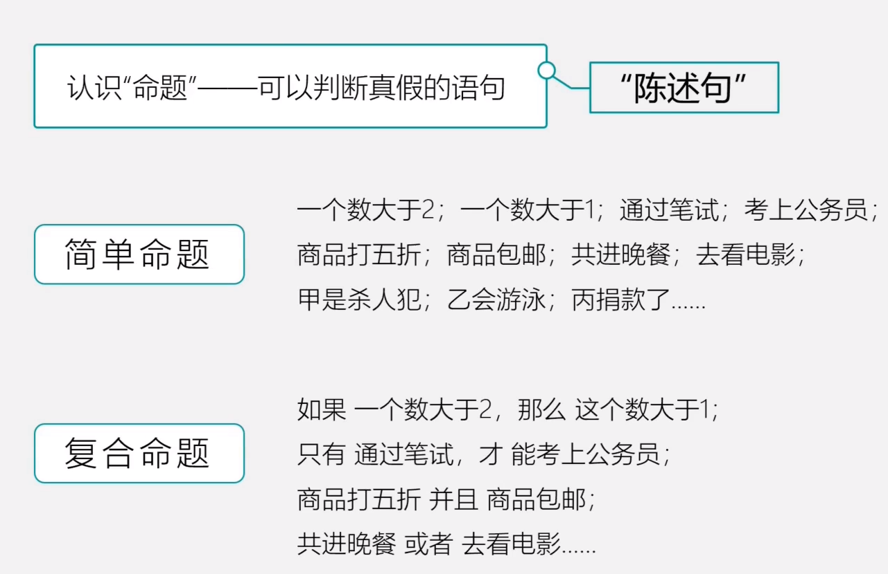


# 常用符号

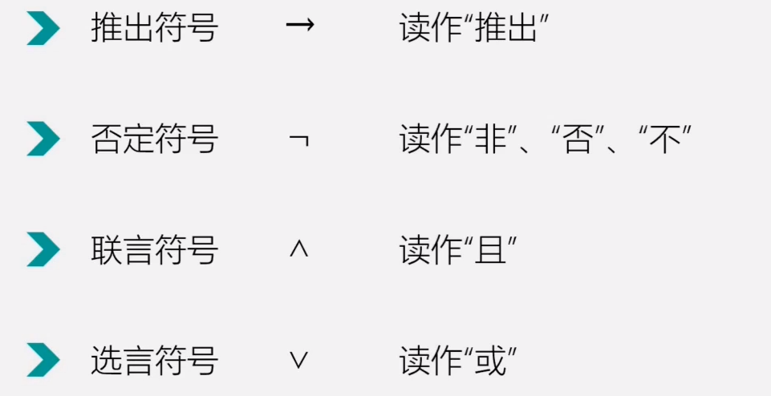

# 假言命题-基于假设

## 典型特点

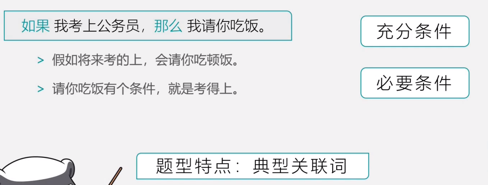


## 充分条件

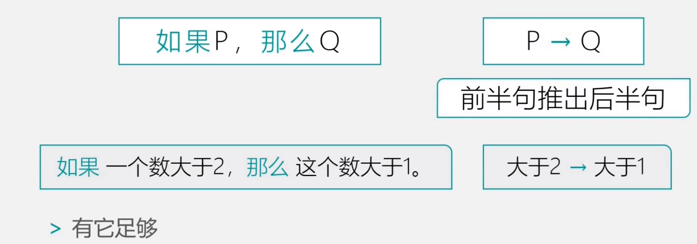

## 必要条件

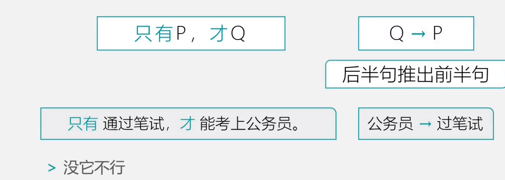

谁必要，谁在后面。


## 推理规则

+ 肯前必肯后，否后必否前 -> 其实就是逆否公式
+ 否前肯后，无必然结论 


## 逻辑关联词

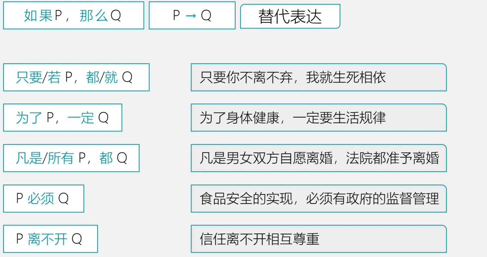


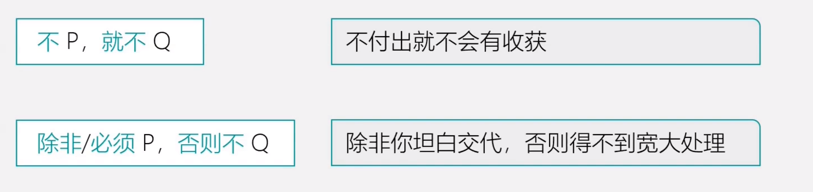


## 翻译技巧

1. 谁是必须，谁放在后面


## 例题

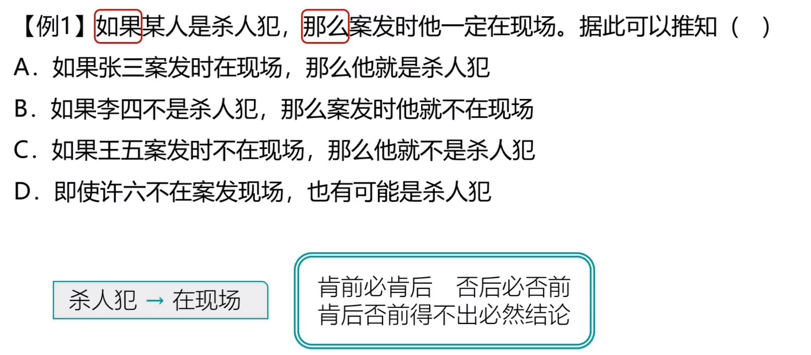

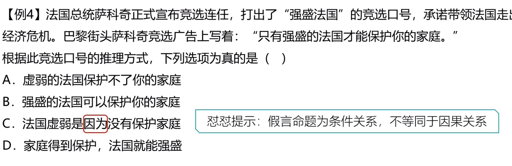

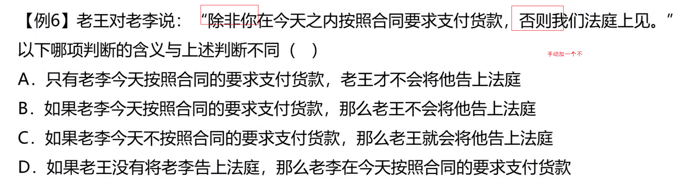


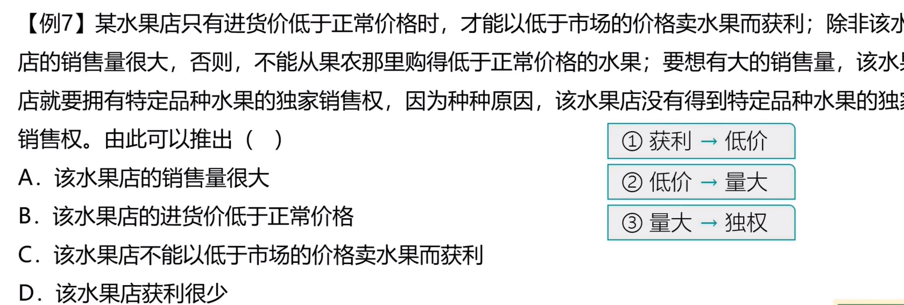

## 总结

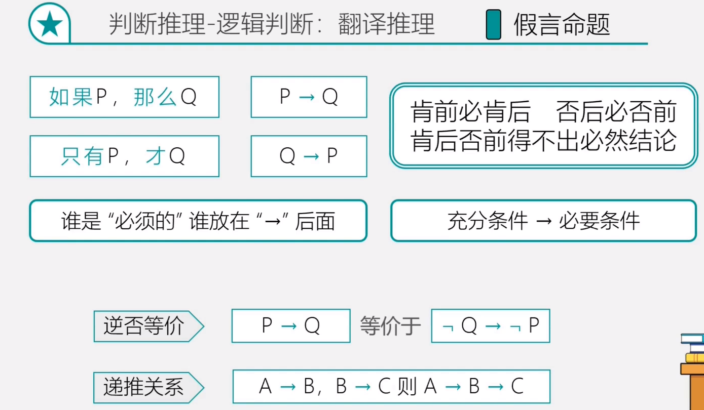


# 选言命题-基于事实


## 符号

P且Q P^Q

P或Q PVQ

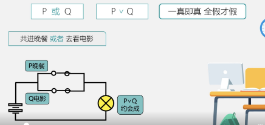

这里的或包含了三种可能关系

+ p 或-q

+ -p 或 q

+ p或q

  转成汉字语言 就是至少有一个成立

## 替代表达

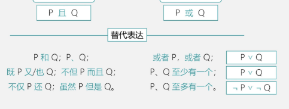

这里我们要注意 PQ至多有一个的表达方式 【 -p v -q】

## 摩根定律

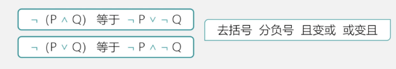

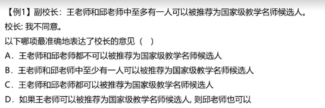

至多有一人，结合上面学的。-王或-邱

在利用摩根定理  王且邱


甲->(乙且丙且丁)

-乙或-丙或-丁->-甲

A:肯前否后  B:肯前否后  C  错误 D 甲乙至少一个人，那就是-甲或-乙 在结合摩根定律 -甲肯定成立，一真则真

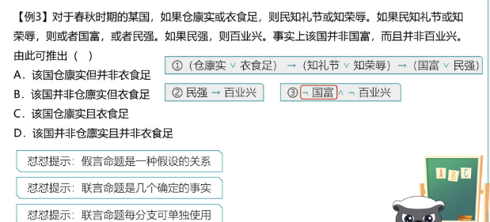


这里要关注几个点

1. 假言是一中假设关系
2. 联言是几个确定的事实
3. 联言是分支可单独使用

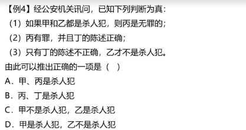


直接根据2分别代入1 3 得到 甲不是杀人犯 乙是杀人犯


## 否定肯定式/假言联言转换

这里其实式对或的三种关系的运用

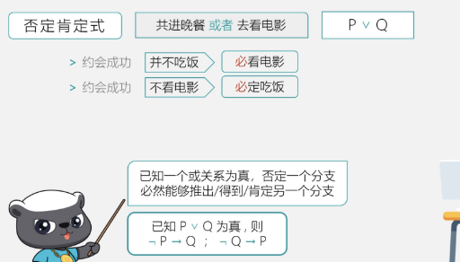

只能先否定在肯定。

我们在回头看看上面题目


直接根据2分别代入1 3 

-甲或-乙

乙

否定了-乙必然能得到甲

```java
我们在换个思路，现在是联言转假言，假言转联言也是一样的

 P->Q 等价于 非P或Q 

P->Q  Q是成立的，那就说明否定了-p 那么原来就是-p或Q
```


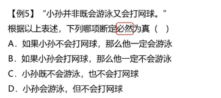

-(游泳且网球)

-游泳或-网球 这里就包含了三种关系，至多会一个


## 例题

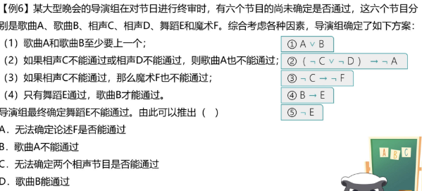

根据4去到推

# 选言命题-补充

## 逆向思维

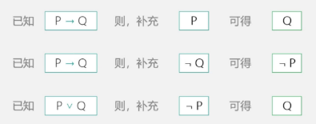

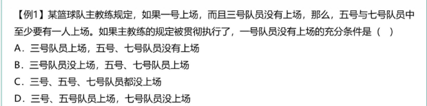

问一号队员没有上场，找题目中有关联的。

原题： 1  且-3->5或7 

摩根定理：-5且-7 ->-1或3

5 7没上，-1或3想要推出-1成立，那么肯定否定式 -3

也就是357都没上

## 要么要么-不相容选言

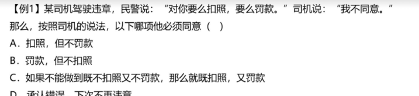


要么P 要么Q,只有一个为真！！

否定：2个分支都成立 2个分支都不成立

## 肯定否定式

或关系只能先否定在肯定

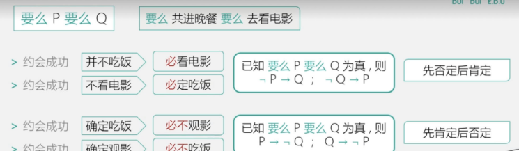

只要一个分支确定了，另外一个分支就确定了，


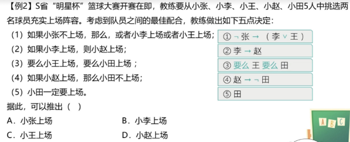

# 集合推理

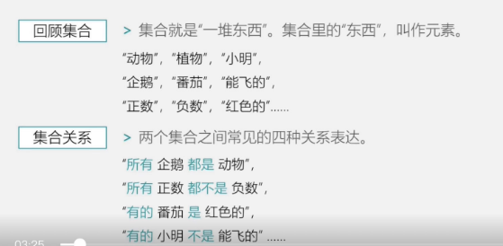


## 4个基本

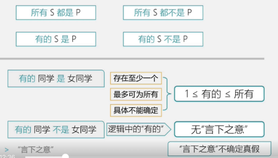

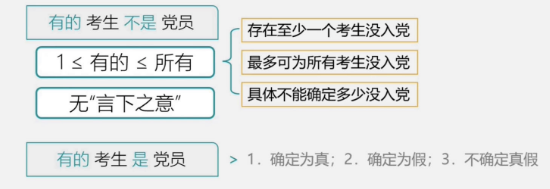

翻译得时候，有得是不能省略得

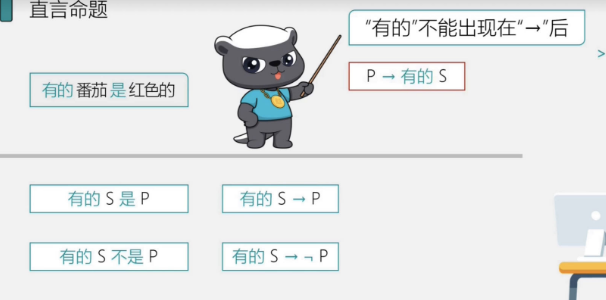

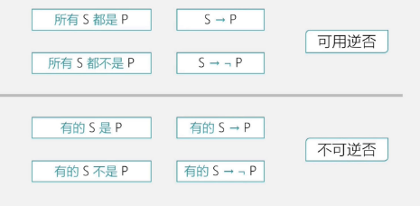


我们看看例题

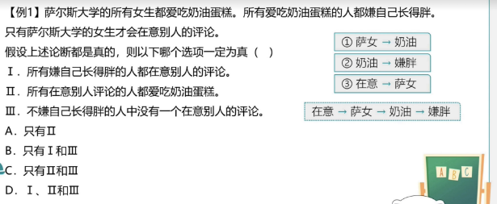

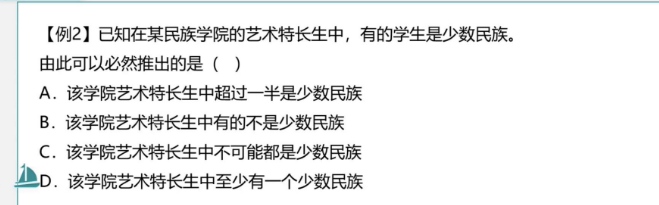

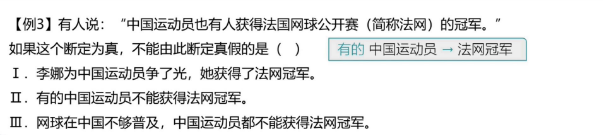


## 3个换位

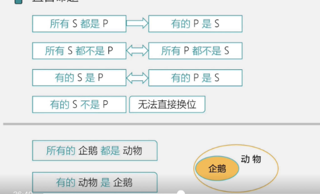.

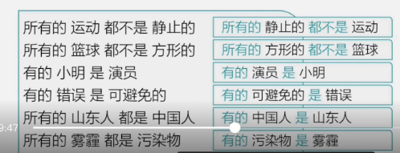

我们来看看例题

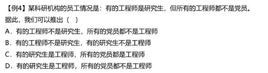

直接转换 选D


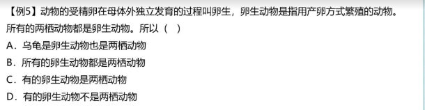

换位选C

## 2组推理

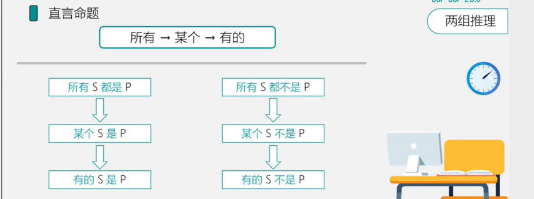

例题：

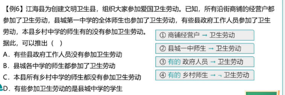

A：言下之意

B: 2组推理

C: 2组推理 反着推不行

## 1个递推


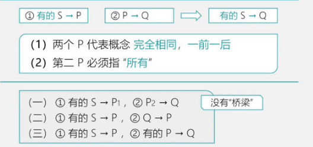

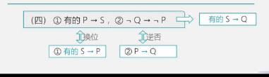

例题：

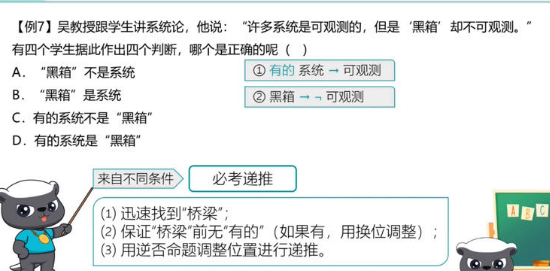

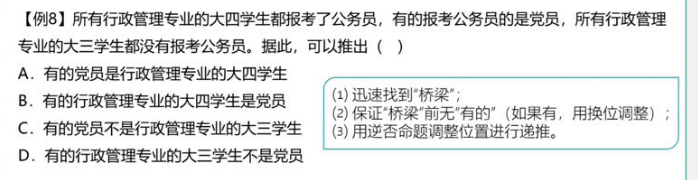


AB是看党员和大四得关系
CD是看党员和大三得关系，必考递推

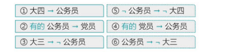

选C 但是AB其实是同类项可以直接排除得

2. 

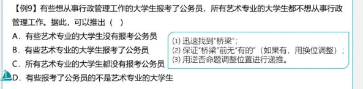


## 思路分析

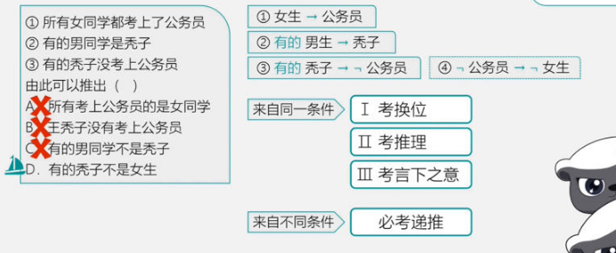


例题：

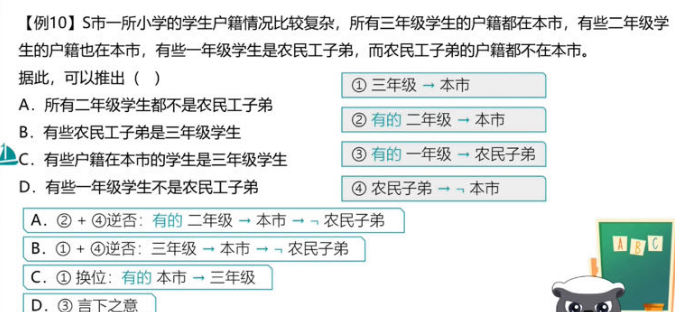


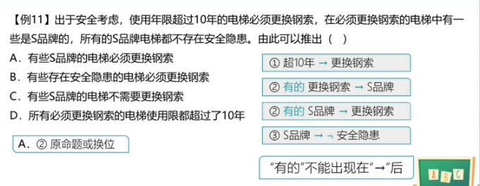

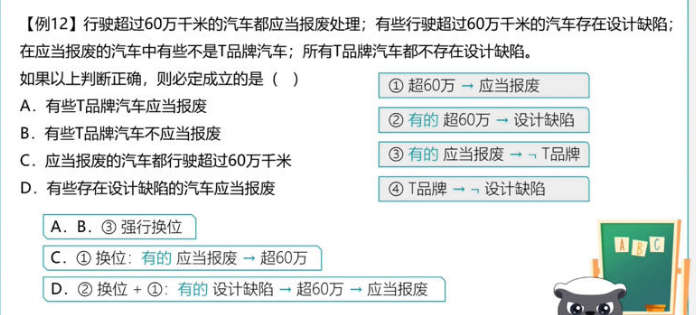


# 回顾提升


1. 具体到某个人做某件事 不需要有箭头

   

2. 只有 才 才 需要拆解为 只有 才 只有才

   

3. 反义疑问句 先变陈述句

   

4. 不 不 也是只有才

5. 如果 那么 是可以省略 只有才不行

   

6. 如果没有关联词 默认从前往后推

   

7. 


# 集合提高

1. 没有一个S是P 等于所有S都不是P   没有一个S不是P等同余所有S都是P
2. 
3. 绝大多数更接近所有
4. 见难题补充第一题


例题：


# 难题补充


1. 和谐小区里的居民具有乐于助人的良好风尚。在该小区里，凡帮助过老刘的人，老张都帮助过，一个人，只要有一人没帮助过他，老周就帮助过他。老王新搬来不久，还没有帮助过其他人。
   根据以上陈述，可以得出以下哪项

    A、

   老周没有帮助过老张

    B、

   老周没有帮助过老王

    C、

   老刘与老张互相帮助过

    D、

   老张和老周互相帮助过

   ```java
   ①谁帮助过老刘→老张就帮助过谁
   ②只要有一人没帮助过他→老周就帮助过他
   ③老王没帮助过任何人
   第二步：分析选项
   老王没有帮助过任何人，代入2，那么老周一定帮过除老王之外得人，这点一定要理解。
       
      
   ```

   

2. 
