# Table of Contents

* [因果-自己证明自己](#因果-自己证明自己)
* [方法不可行](#方法不可行)
* [方法本可行](#方法本可行)
* [对比实现](#对比实现)
* [类比实验](#类比实验)
* [样本不科学-保持数据统一](#样本不科学-保持数据统一)

# 因果-自己证明自己

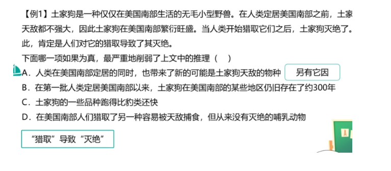

----

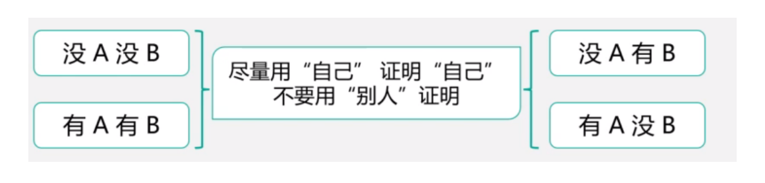

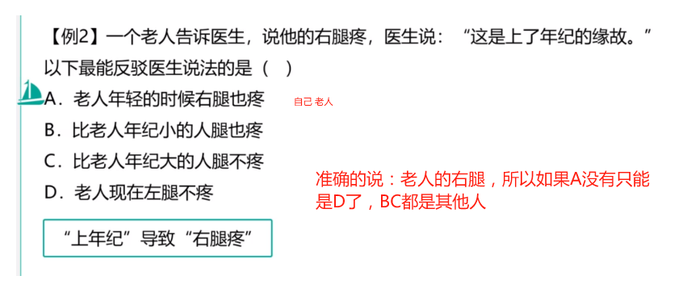

-----

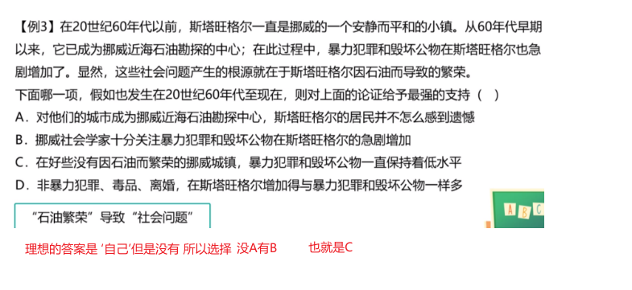

----

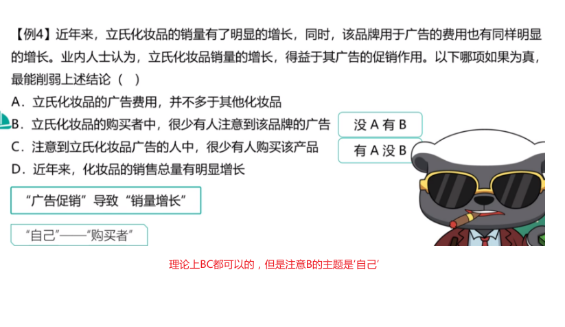

同 

----

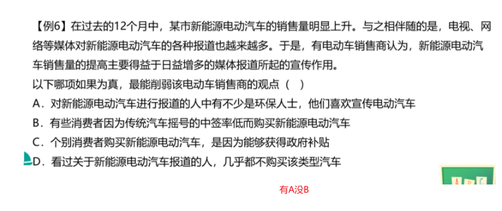

----

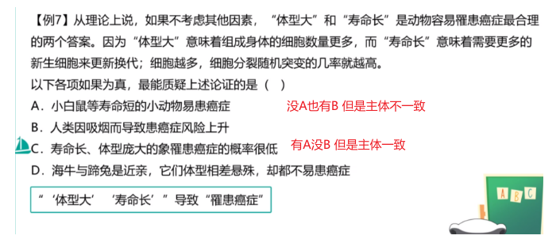

----

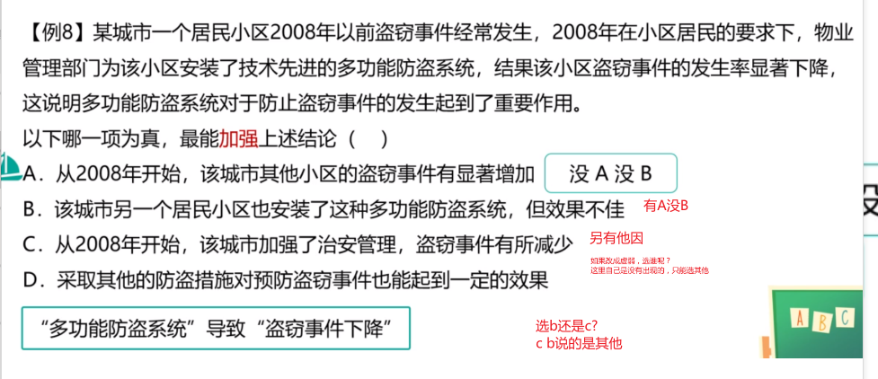

---

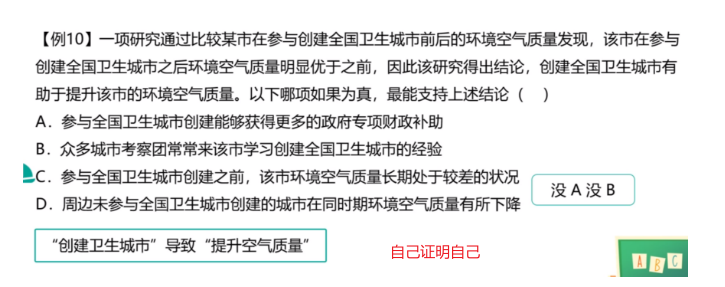

-----

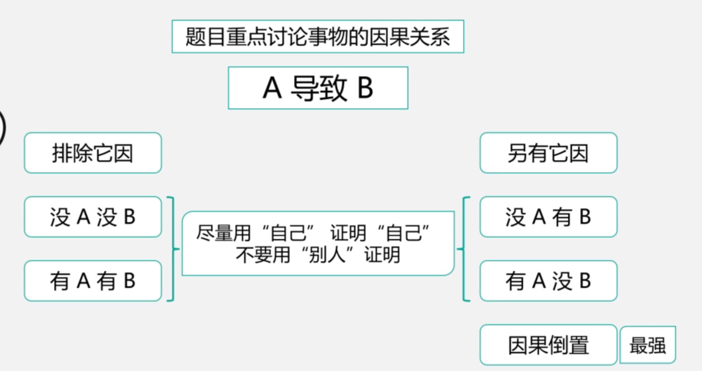**总结**

# 方法不可行

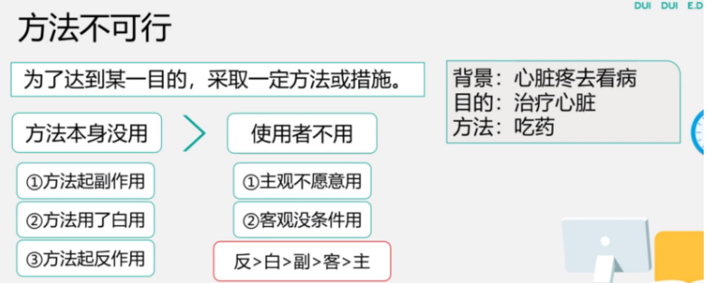

我们来看看列题

----

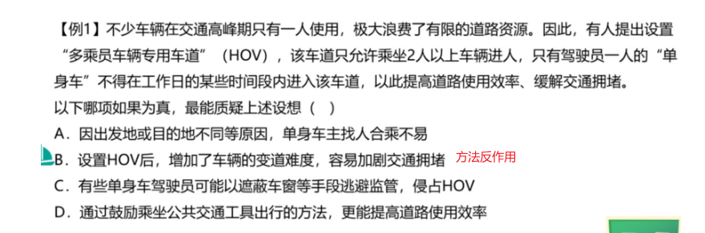

---

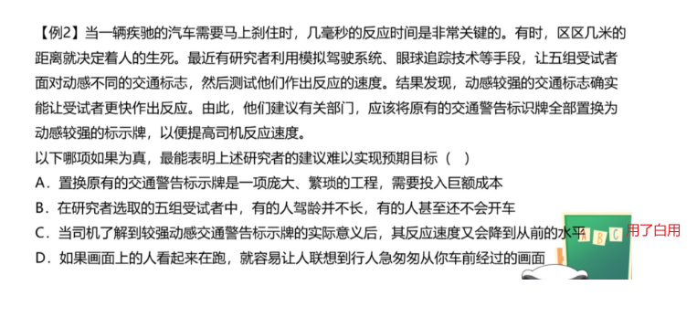

----

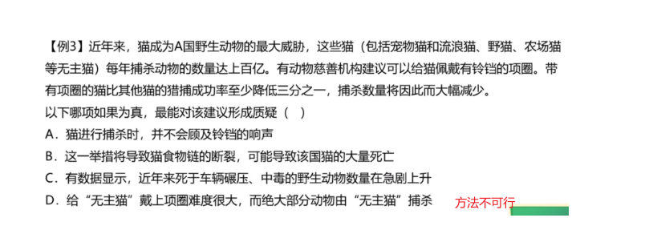

---

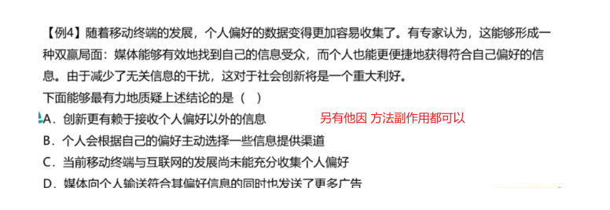

-----

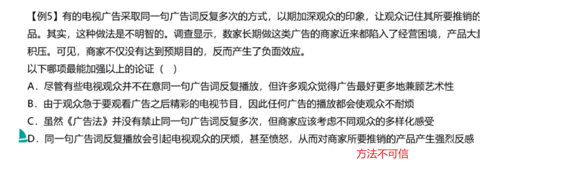

----

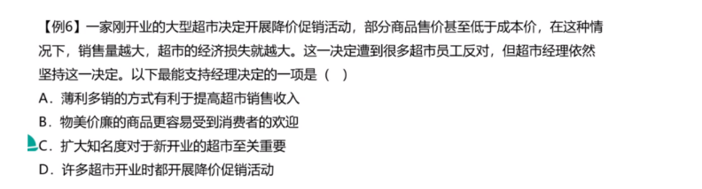

-----

# 方法本可行

不用会更惨>等等就可行

-----

d是【等等就可以】小于C

-----

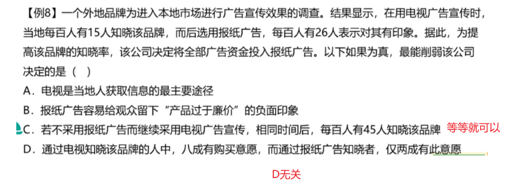

----

# 对比实现

单因子变量

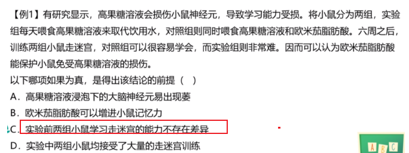

-----

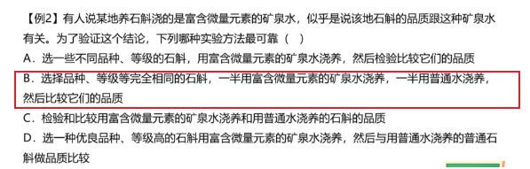

----

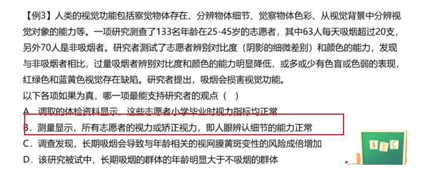

-----

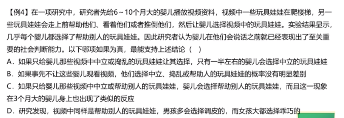

----

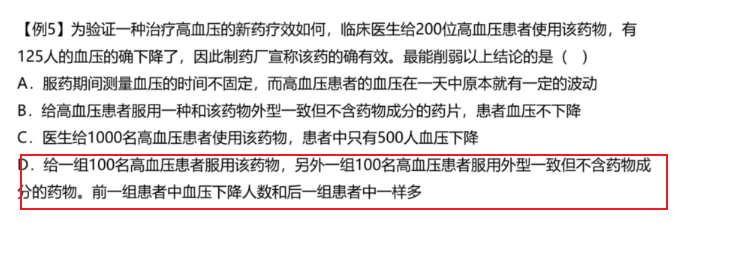

----

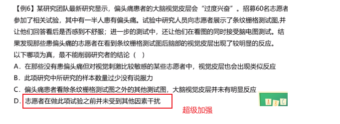

----

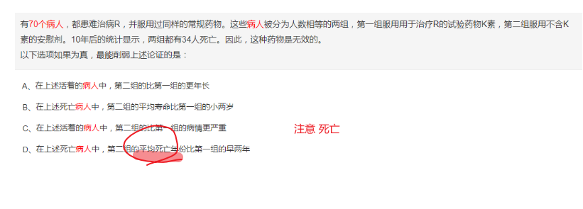

------

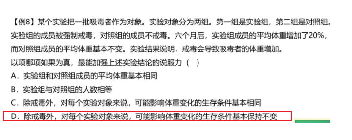

D变量更唯一

 一个是“相同”，另一个是“不变”。什么叫“相同”呢?比如说在做实验之前，有一个人一顿吃一碗米饭，有一个人一顿吃三碗米饭，做实验的时候两人每顿都吃两碗米饭，这叫“相同”，但是显然一顿吃一碗米饭那个人吃撑了、一顿吃三碗米饭那个人没吃饱，吃撑了和没吃饱都会对体重产生影响，所以C选项还有其他的变量，它不能加强。那什么又叫“不变”呢?做实验之前一顿吃一碗米饭的做实验的时候还吃一碗，一顿吃三碗米饭的还吃三碗，这叫“不变”，俩人都是吃饱的状态，起码吃这个问题对实验结果不会产生影响。所以，这道题应该选择D选项。 

----

# 类比实验

----

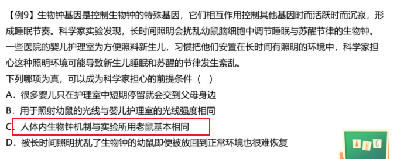

---

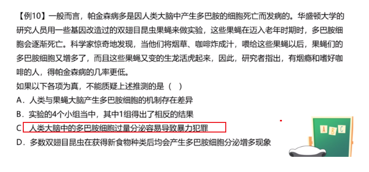

----

# 样本不科学-保持数据统一

其实可以理解，如果基数大，部分优秀也是不具有说服力

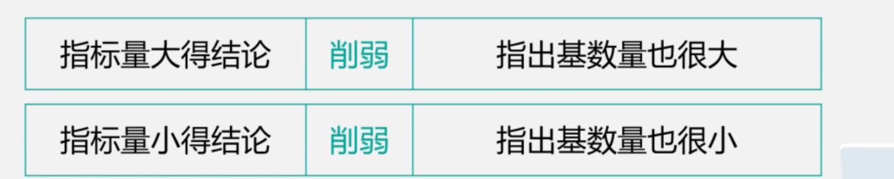

----

---

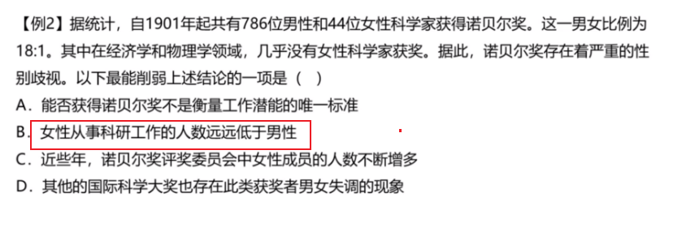

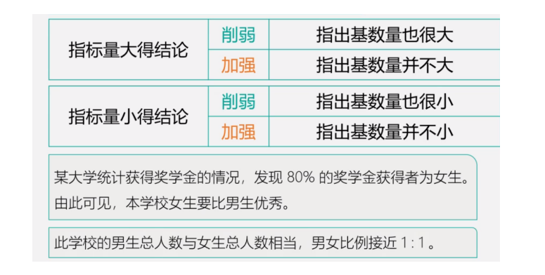

----

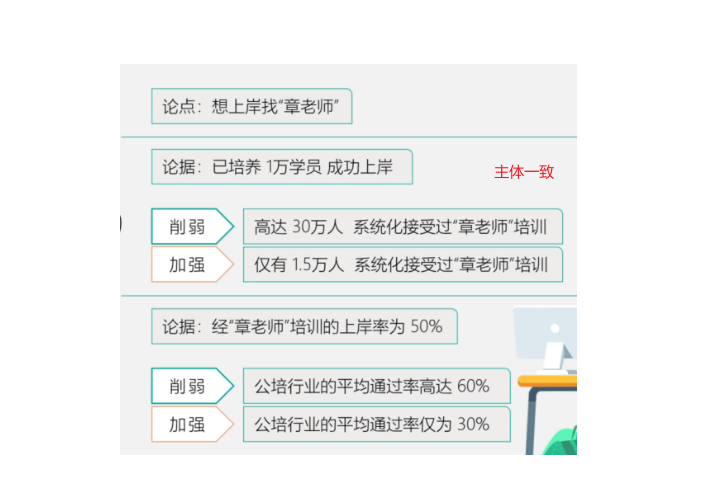

-----

----

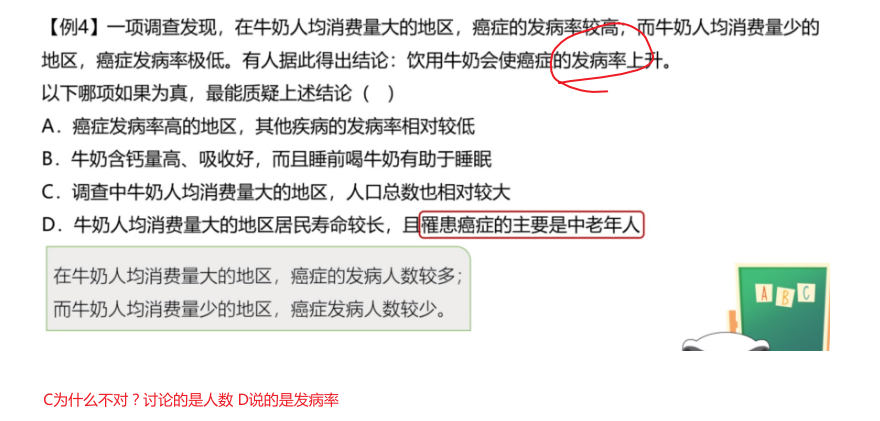

----

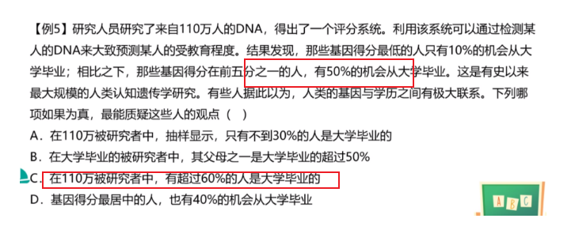

----

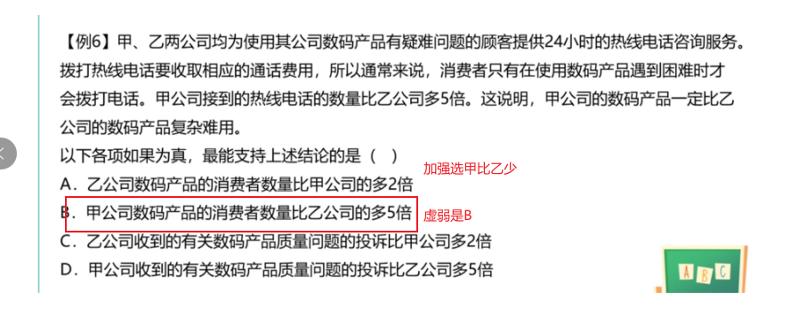
