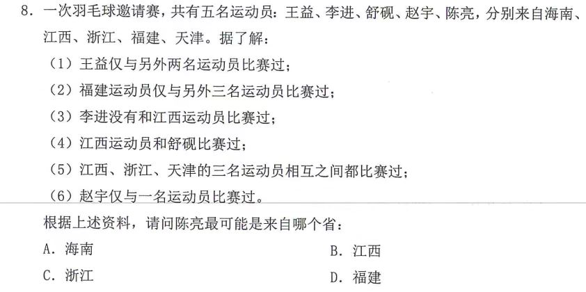

# Table of Contents

* [53](#53)

# 53

直接推理：

1. 根据 2 5 6 赵 海南
2. 根据 3 5  李 福建
3.  同时福建人应该至少和浙江、天津和海南的人比赛过，结合⑤条件，那么就是浙江和天津的人应该是与至少3个人进行过比赛，再结合条件①，可以得到的是王益是江西人 
4. 陈亮就是浙江人

秒杀：问第五个人，选第三个地点。因为出了很多次了，虽不具有普适性，但万一遇到可以直接用，事业单位很喜欢考原题

