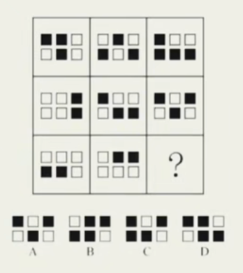
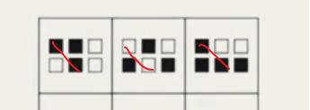
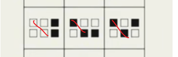
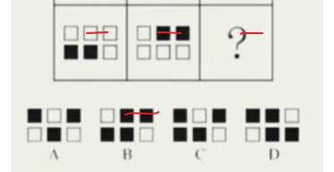
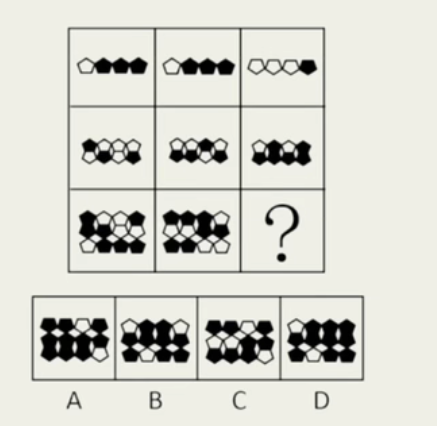
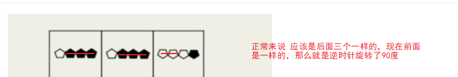
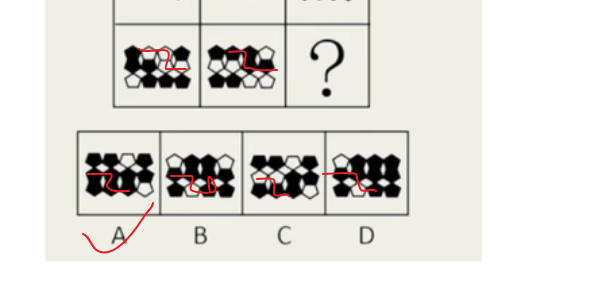
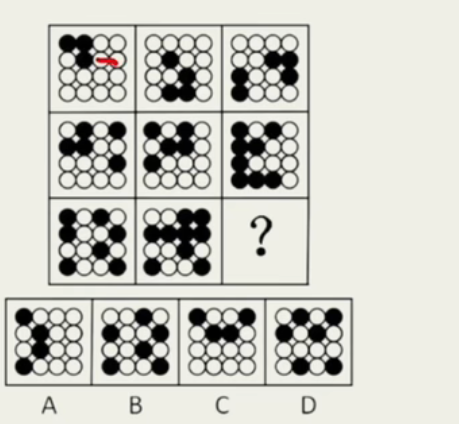
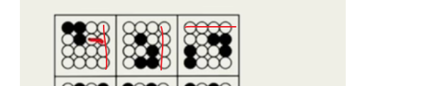
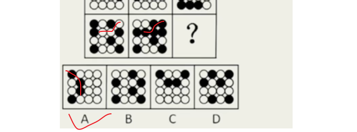

# Table of Contents

* [直接黑白叠加](#直接黑白叠加)
* [黑白 翻转或者旋转](#黑白-翻转或者旋转)

# 直接黑白叠加

1. 

   传统做法：算出 黑+白=  但是算的比较慢

   串珠做法: 把相同位置的放在一起观察，我们看第一行图形

   

   再看第二行

   

   第三行

   

秒B

# 黑白 翻转或者旋转

第一行

说错了 是180度

第三行

再来看一题

