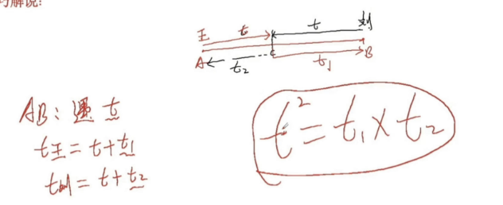
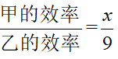
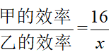
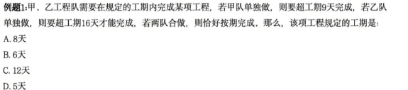
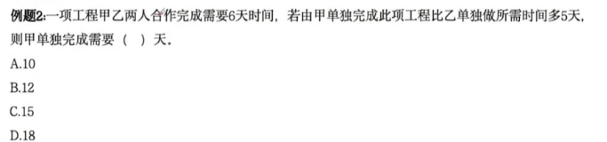
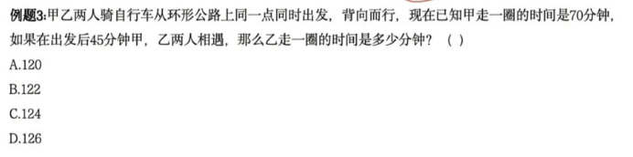
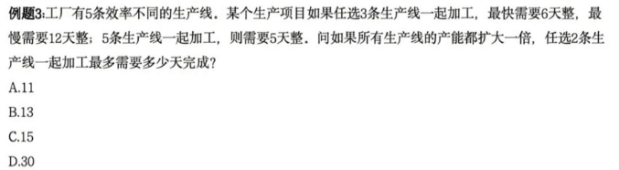

# Table of Contents

* [适用范围](#适用范围)
* [推导公式](#推导公式)
* [例题](#例题)

# 适用范围

+ t：双方合作的时间
+ t1： A完成当前共工作超过t的时间
+ t1： B完成当前共工作超过t的时间

# 推导公式

 设工程规定的工期为x天，由题意可知，甲超工期9天的工作量＝乙x天的工作量，则（总量一定，效率和时间成反比），同理乙超工期16天的工作量＝甲x天的工作量，则。 

# 例题

x * x =16 * 9 

x= 12

-----

6*6=x( x-5)

甲 9 乙 4 但是这是比合作多的时间

9+6=15

----

45 * 45 =25* X

求得x = 81

这个时间需要加上45 即 126

---

这题其实也可以看做是合作问题。 abcde  5天一起加工为5 天

25=1*25

de加起来就是 30天，但是注意产能扩大2倍。所以这里是15天

