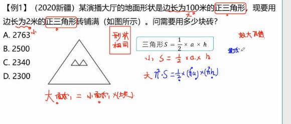
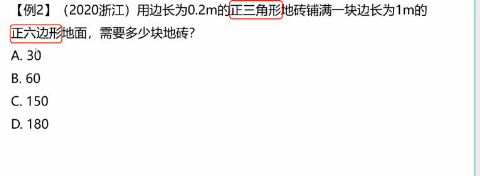
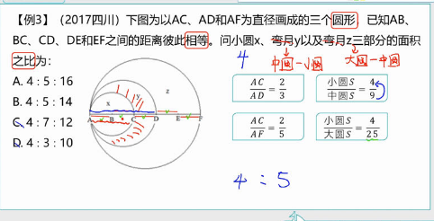
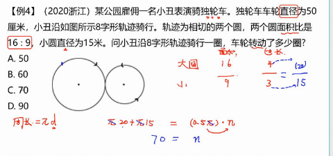

# Table of Contents

* [常见面积/体积/表面积公式](#常见面积体积表面积公式)
  * [小结](#小结)
* [面积比](#面积比)

# 常见面积/体积/表面积公式

+ 正方形的面积=边长×边长
+ **长方形面积=长×宽**
+ 圆：**S=πr²**
+ 三角形：已知三角形底为a，高为h，则S=ah/2
  + 【345】 【5 12 13】
+ 长方体体积：底面积 × 高=长×宽× 高
+ 正方体体积：棱长×棱长×棱长 V=a×a×a = a³
+ 圆锥体积：V=1/3Sh

例题

1. 

   ----

   

   ---

   

   ---

   

---

---

---

---

---

## 小结

# 面积比

注意这里是底和高都放大相同倍数

对于所有的平面图形：正方形、长方形、三角形 面积都是缩小后得n^2

---

注意这里是正六边形 5X5X6=150

---

---

