# Table of Contents

* [2集合](#2集合)
  * [公式](#公式)
  * [例题](#例题)
  * [总结](#总结)
* [3集合](#3集合)
  * [正常公式](#正常公式)
  * [2层](#2层)
  * [只符合](#只符合)

# 2集合

## 公式

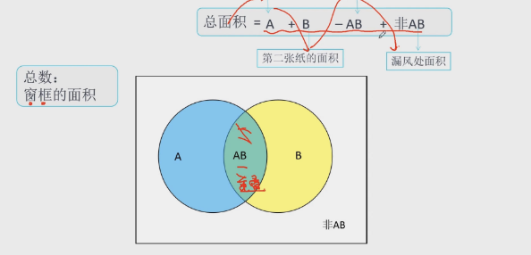

解释一下，为什么要减去这个AB
我们可以看到A和B的面积是有重叠的，所以多要多减一份AB

## 例题

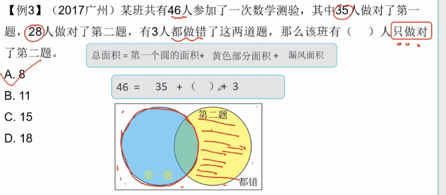

注意求得是B

总=A+B（重复去掉）+非AB

----

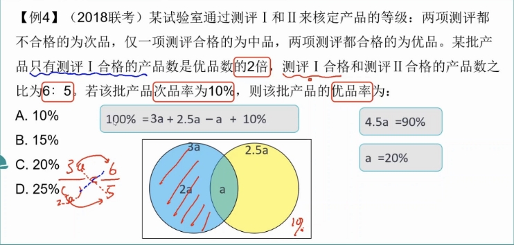

这题目一样的，没给数据，还是套面积图。

----

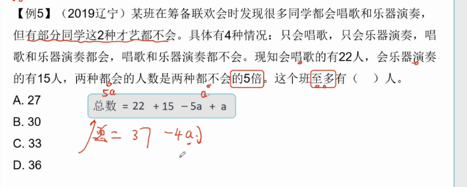

-----

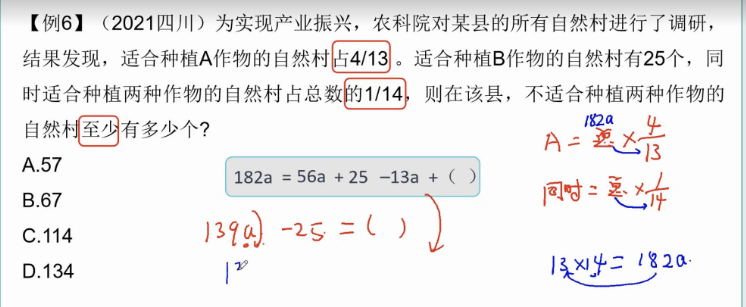

-----

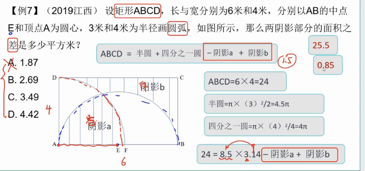

这题有意思，不够识别题型后，列公式就可以了

---

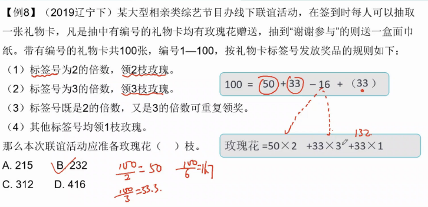

这题要注意，3的条件，其实已经包含在12里面了，所以不能添加计算

---

## 总结

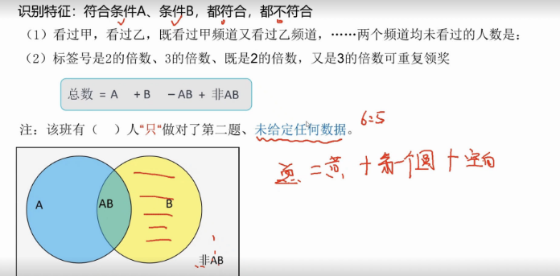

# 3集合

## 正常公式

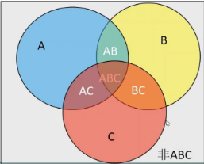

总面积=A+B+C-AB-AC-BC+ABC

ABC 这里其实是AB AC BC三个重复叠加的面积，当-AB-AC-BC 减完的时候，中间ABC其实是空着的，所以我们需要在加一个ABC

------

我们来看看列题

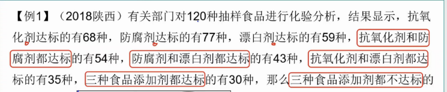

120=68+77+59-54-43-35+30+() 

用尾数法直接选答案

----

## 2层
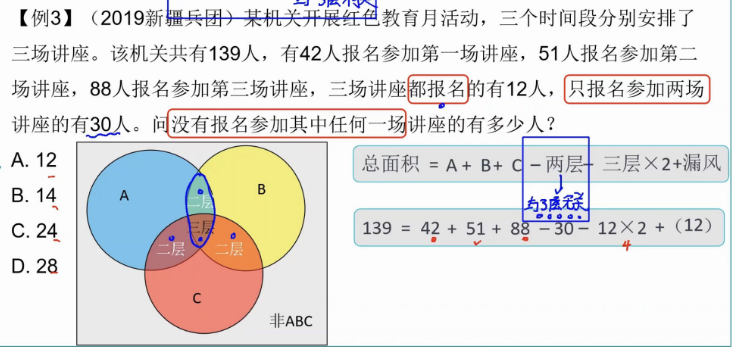

【-2层】是因为面积叠加了2层

【-三层*2】是因为叠加了三层，而我们最终需要的都是一层

----
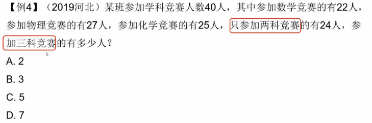

40=22+27+25-24-2*？ 尾数法 选C

## 只符合

---

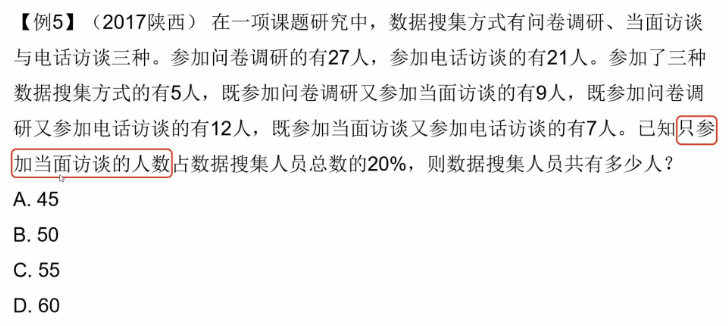

这里有2中解题方式

正常：

按照三集合公式走，设总共为x，当面为0.2x

x=27+21+(0.2x+9-5+7-5+5)-7-9-12+5 

其中(0.2x+9-5+7-2+5) 是求C的整个面积

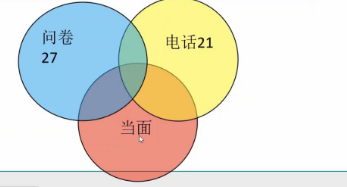

巧妙

 但是我们从图中也可以看出，整个面积其实就是 A+B-AB+0.2x=x

 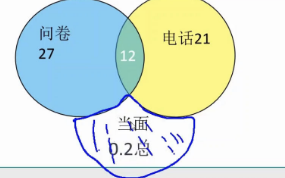

x=0.2x+27+21-12   x=45

---

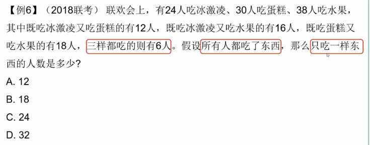

直接画图即可，求得是每个图只有自己的

24-12-(16-6)=2

30-12-(18-6)=6

38-16-(18-6)=10
答案选B

