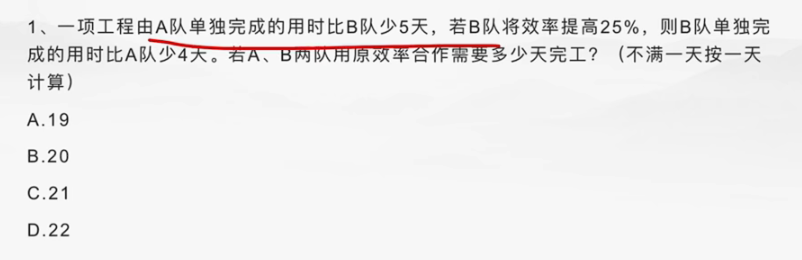

# Table of Contents

* [多人时间](#多人时间)

# 多人时间

一、工程问题中的正反比例：

当工作总量W一定时，效率P和时间t成反比例;

当效率P一定时，时间t与工作总量W成正比例;

当时间t一定时，效率P与工作总量W成正比例。

工程问题当中的正反比例法是指：当工作总量一定时，工作效率与工作时间成反比，已知工作效率比可得到工作时间之比，再根据实际提前的天数或推迟的天数采用比例法进行求解。或者，已知工作时间之比可得到工作效率之比，在根据前后效率只差采用比例法进行求解。

例1：对某批零件进行加工，原计划要18小时完成，改进工作效率后只需12小时就能完成，已知后来每小时比原计划每小时多加工8个零件，问这批零件共有多少个?

【解析】288。先后时间之比=18：12=3：2，可得先后效率之比=2：3，则由题意可得1份=8个零件，2份就是16零件，所以零件总数=16×18=288(个)。

例2：某工程由小张、小王两人合作刚好可在规定的时间内完成。如果小张的工作效率提高20%，那么两人只需用规定时间的就可完成工程;如果小王的工作效率降低25%，那么两人就需延迟2.5小时完成工程。问规定的时间是多少?

A.20 h B.24 h C.26 h D.30 h

【解析】答案：A。“小张的工作效率提高20%”，可设特值为由5提高到6，“两人只需用规定时间的”，根据工作总量不变，效率与时间成反比，得出两人的效率之和由9提高到10，则小王的效率为4。“小王的工作效率降低25%”，就是由4降低到3，则两人的效率之和由9降低到8，还是根据工作总量不变，效率与时间成反比，时间由8份变成9份，“延迟2.5小时”就是9-8=1份，由此推出规定时间8份是2.5×8=20(小时)。

例3：建筑队计划150天建好大楼，按此效率工作30天后由于购买新型设备，工作效率提高20%，则大楼可以提前几天完工?

A.20 B.25 C.30 D.45

【解析】答案：A。工作效率提高20%，原效率与现在效率比为5∶6，所用时间为效率的反比，即6∶5。剩下的工作原定150-30=120天完成，效率改变后只需要100天即可完成。因此节省20天。

来个难题

