# Table of Contents

* [什么是排列、组合](#什么是排列组合)
* [如何计算](#如何计算)
* [分步用乘法](#分步用乘法)

# 什么是排列、组合

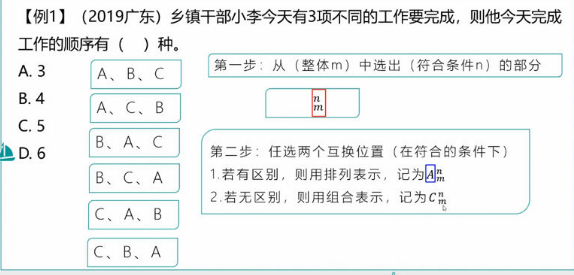

# 如何计算

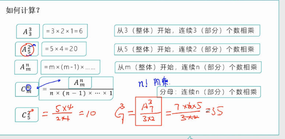

# 分步用乘法

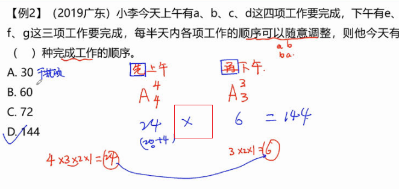

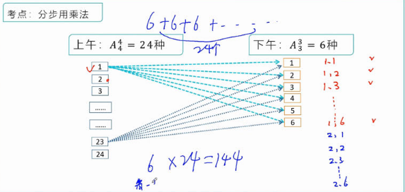

-----

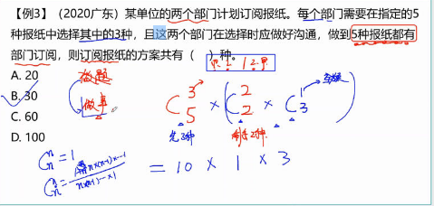

---

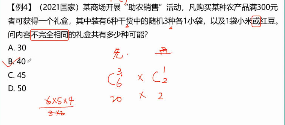

---

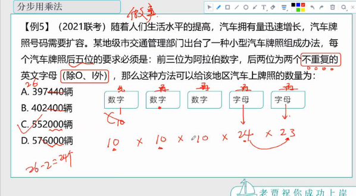

注意这个不重复，如果前面数字不重复得话，就是 9*8*7了

----

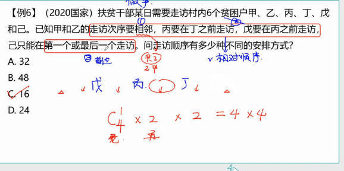

相对顺序先定 ，首尾最好放

---

先找突破口 最难得

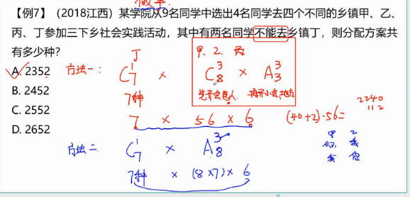

推荐方法一 ：步骤比较清楚

---

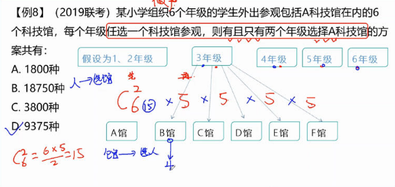

---

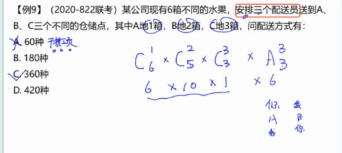

这里有坑，人配送水果到仓库。

----

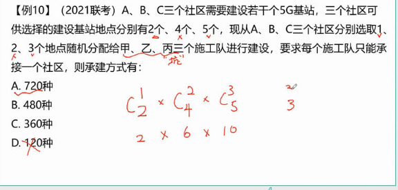

