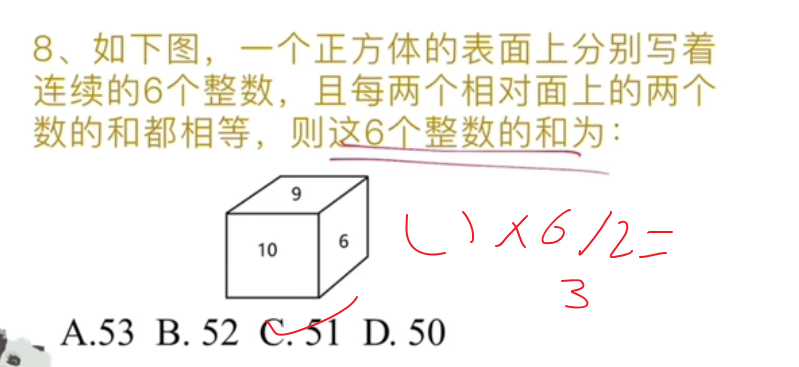
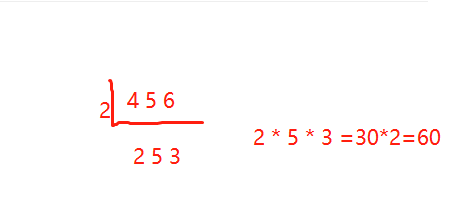
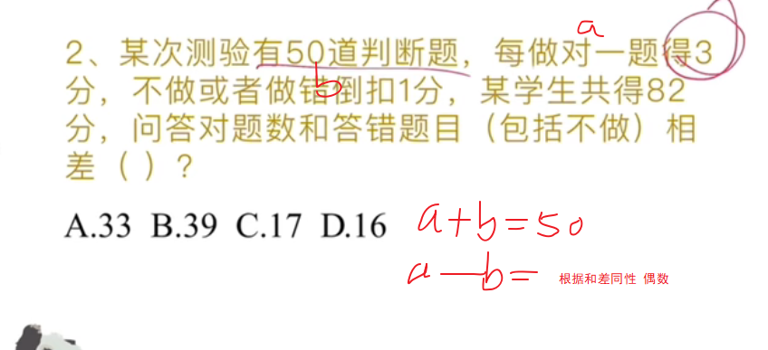
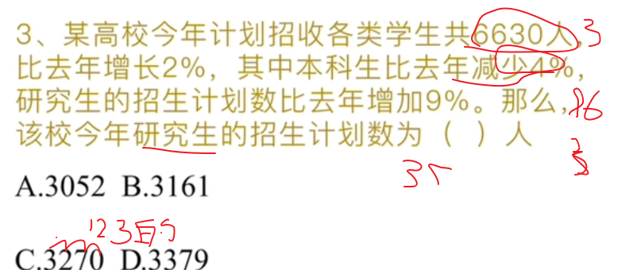
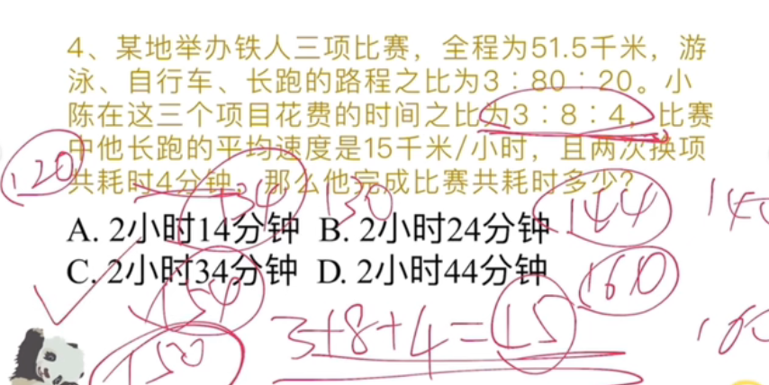
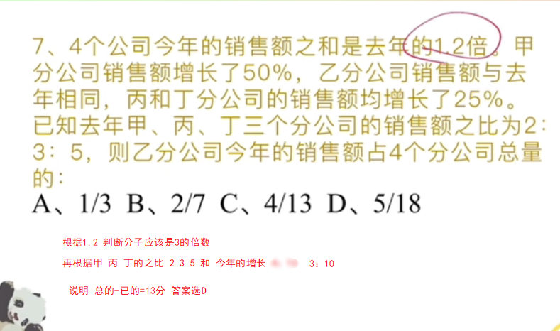
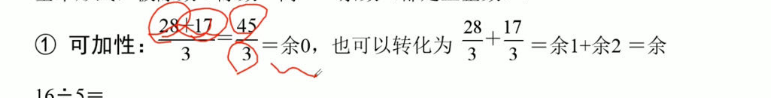
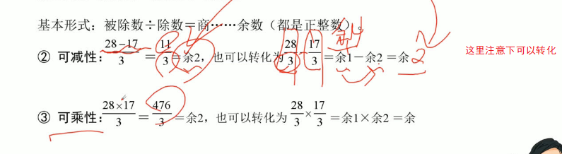

# Table of Contents

* [如何设变量](#如何设变量)
* [等差数列](#等差数列)
* [最小公倍数](#最小公倍数)
* [奇数偶数](#奇数偶数)
* [倍数关系](#倍数关系)
* [倍数关系-不定方程](#倍数关系-不定方程)
* [余数特性](#余数特性)


# 如何设变量

原则就是不出现分数，怎么简单怎么来

1. .设中介量(设“是、比”字后面的为x) 

   ```java
   甲的钱数比乙多100元一设为x
   乙的钱数是丙的3倍一设为x
   甲的钱数比乙多100元，乙的钱数是两的3倍一设为x
   ```

2. .按比例关系去设

   ```java
   0一年级与二年级人数之为6:5  一年级6x 二年级5x
   2一年级人数是二年级的
   3一年级人数是二年级的1.2倍 (120%)
   4一年级人数比二年级多20%
   ```


# 等差数列


+ 是数列为奇数项时：Sn=中间一项×项数，
+ 数列为偶数项时：Sn=[中间两项 ]  { 首项+末项}和×项数的一半。




# 最小公倍数

4、5、6最小公倍数  


# 奇数偶数

+ 一个数可以被2整数，就是偶数，否则就是奇数
+ 运算规律：
  + 奇数偶数性质相同加减为偶数，不同加减为奇。
  + 有偶相乘为偶数，否则为奇数
  + 和差同性

例如：3x+2y=10 10是偶数，2y是偶数，那么3x肯定是偶数



# 倍数关系

+  如果数a和数b都能被数c整除，那么它们的和或差也能被数c整除  
+  一个数是2的倍数，当且仅当个位是2的倍数;5的倍数同理。
+  一个数是3的倍数，当且仅当其各位数字之和是3的倍数:9的倍数同理
+  一个数是4的倍数，当且仅当其末两位是4的倍数

如：7x+8y=77  77和7x能被7整除，那么8y可能也能被7整除 

x=3 y=7









# 倍数关系-不定方程

不定方程:未知数的个数大于方程的个数

.不定方程:未知数的个数大于方程的个数

+ 2x+y=12，x、y都是正整数y必有什么性质?

  y必然是一个偶数

+ 3x+y=24，x、y都是正整数一y必有什么性质?

   3x 被3整除 24被3整数，y一定是被3整除的

+ 10x+3y=50，x、y都是正整数一y必有什么性质?

  3y是5的倍数，3不是5的倍数，所以y肯定是5的倍数且3y是偶数

+ 11x+5y=66，x、y都是正整数一 x+y必有什么性质?

   需要进行拆分 6x+5x+5y=66  6x+5(x+y)=66

  5(x+y) 是6的倍数且是偶数， (x+y)是5的倍数

   

1. (四川2017)甲乙两人投资理财产品，两人原始资金共计100万元，甲又追加了自己原始投资资金的1/3，同时乙减少自己原始投资资金的1/4，现二人投资的钱一样多，那么甲的原始投资资金是多少万元?
   A.28
   B.36
   C.50
   D.64

原始资金 3x 追加 x  3的倍数直接B

-----

(江西法检2016)某出版社把400本教材书分别装入大、中、小三种型号的纸箱中寄出。每个大型箱能装80本,每个中型箱能装60本，每个小型箱能装35本如果三种型号的箱子都有且每个箱子恰好装满，那么小型箱有多少个?
A.1
B.3
C.4
D.6

80x+60y+35z=400 

16x+12y+7z=400 求z

7z是4的倍数，那么z就是4的倍数，选C

----

练习

1. 51=8a+5b  2 3 5 7   根据奇偶 倍数做不出来，只能根据余数去做了，发现8a除以5余1 只能选2
2. 58=a+3b  7 9 14 17  根据奇偶 排除14 再根据余数 a除以3余1 选7

# 余数特性

余数具有可加性、可减性、可乘性





3x+1 是除以3余1的

-----

(广东2014)一些员工在某工厂车间工作，如果有4名女员工离开车间在剩余的员工中，女员工人数占九分之五;如果有4名男员工离开车间，在剩余的员工中，男员工人数占三分之一。原来在车间工作的员工共有多少名?
A.36
B.40
C.48
D.72

剩余女员工=剩余员工*5/9   设 剩余员工为9x 全部为9x+4 肯定是除以9余4 看答案B

----

.北京2018)老张购买学习和生活用品捐赠给山区贫困小学生。3个笔盒、2个皮球和4个杯子一共89元，4个笔盒、3个皮球和6个杯子一共127元。则一个笔盒多少元?
A.10
B.11
C.12
D.13

3x+2y+4z=89

89是奇数，2y+4z是偶数，3x是奇数 x是奇数，排除AC

4x+3y+6z=127

都能被3整除 127 余1 4x除以3余1  根据可乘性 x除以3余1  选D
