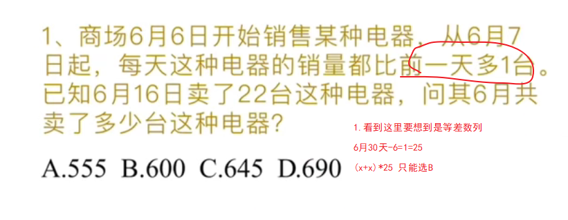

# Table of Contents

* [等差数列](#等差数列)
* [最小公倍数](#最小公倍数)
* [奇数偶数](#奇数偶数)
* [特殊因子](#特殊因子)

# 等差数列

+ 是数列为奇数项时：Sn=中间一项×项数，
+ 数列为偶数项时：Sn=[中间两项 ]  { 首项+末项}和×项数的一半。

# 最小公倍数

4、5、6最小公倍数  

# 奇数偶数

+ 一个数可以被2整数，就是偶数，否则就是奇数
+ 运算规律：
  + 奇数偶数性质相同加减为偶数，不同加减为奇。
  + 有偶相乘为偶数，否则为奇数
  + 和差同性

例如：3x+2y=10 10是偶数，2y是偶数，那么3x肯定是偶数

# 特殊因子

+  如果数a和数b都能被数c整除，那么它们的和或差也能被数c整除 
+  *能被9整除的数的特征是若一个整数的数字和能被9整除，则这个整数能被9整除*   
+  *能被9整除的数的特征是若一个整数的数字和能被3整除，则这个整数能被3整除*   
+  ,如果一个数能被3整除,*那么它的个位数的数字之和也一定能被3整除* 

如：7x+8y=77  77和7x能被7整除，那么8y可能也能被7整除 

x=3 y=7

