* [综述](#综述)
* [做差-考点最多](#做差-考点最多)

# 综述

数字推理，并不是纯纯的计算，也是有其他规律可寻的。只要能做出的规律都是好规律

**利用数字特性**

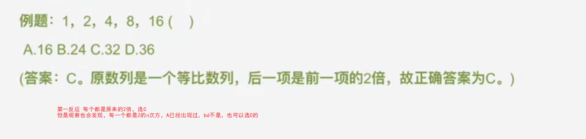

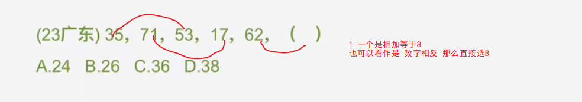

# 做差-考点最多

+ 题目特征

  + 整个数列的递增不明显 幅度小（ 2-3倍）

  + 根据等差性质快速判断

    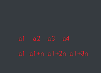

    大约实在3到5倍之间 a3-a2=n  a4-a1 =3n

+ 关注
  + 质数列 1 3 5 7 11 13 17 19 
  + 平方差

+ 解决方法

  + 如果满足三倍关系，直接利用计算
  + 否则
    + 优先考虑做差
    + 考虑二次做差
  + 如果()在中间，可以利用【隔项差】来实现

题目

1. 1，-2，-3，-2，1      可以看到a3-a2=n  a4-a1 =3n 

    思路1：-3 -1 1 3 5  推出为6

    思路2： -2 - -3=1  那么-3-? 应该等于6

2.  -7，-5，-1，5，（  ），23

    可以看到 4 12 满足3倍

   思路1： 直接用  x-5=24/3 x=13

   思路2：利用隔项差  6 10 x+1  18 -> x+1=14 ->x=13

   思路3： 2 4 6 8  直接13

3. 2，6，11，18，29

   5 16 不太满足3倍关系，但符合单调递增

    4 5 7 11 考虑二次做差

    1 2 4 8  -> 4 5 7 11 19 -> 29+19=48
   
4. 2，5，10，21，（  ），77

    5  10 满足关系

    10-2=8

    21-5=16

    x-10=?

    77-21=56

5.  1，8，21，40，（），96  

   13 39      (40-21)*3+8=65

# 多项数列-超过7

超过7个的

1. 隔项
2. 分组
3. 递推

## 隔项

1. 23，24，22，25，21，26，（  ），（  ）

   23 22 21 20

2. 数列：3，2，0，3，7，2，-4，3，（  ）

   3 0  7 -4 ？

   -3 -7 -11 -15    

   -4-x=-15  x=11

3. 0，2，7，4，26，6，63，8，（  ）

   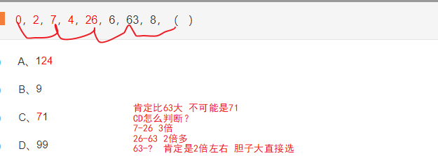

   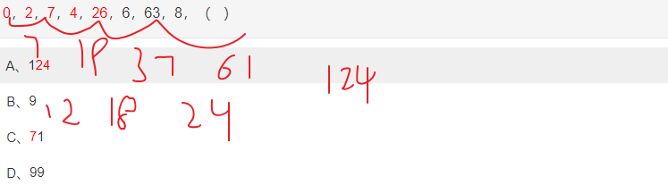

4. 2，3，4，9，16，45，（  ），315

   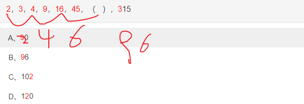

5. 38，24，62，12，74，28，（  ）

   第一项+第二项=第三项，第三项+第四项=第五项，即奇数项等于它的前两项之和；
   空缺项为第7项，所以空缺项=第5项+第6项=74+28=102。

6. 2，3，7，10，19，26，45，60，（  ）

   由于题干数列较长，可将数列划分为奇数项和偶数项；
   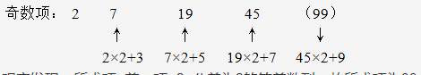
   观察发现：所求项=前一项×2+公差为2的等差数列，故所求项为99。

7. 31，29，28，26，25，23，（ ）

   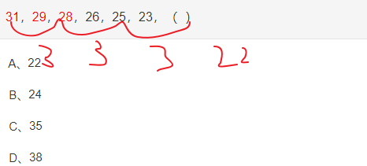

## 分组

+ 可以22分组
+ 可以前后分组

1. 5，24，6，20，4，（），40，3

   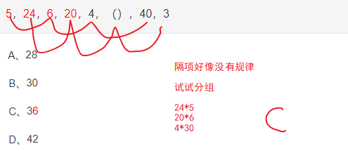

2. 1，9，7，4，8，5，（  ），11

   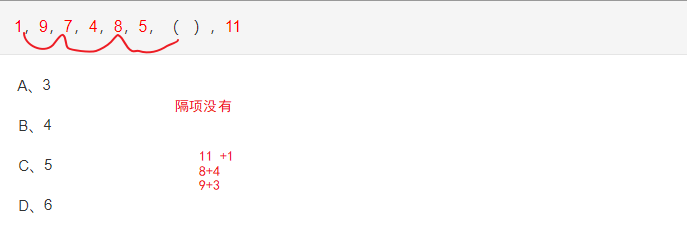

3. 8，3，17，5，24，9，26，18，30，（  ）

   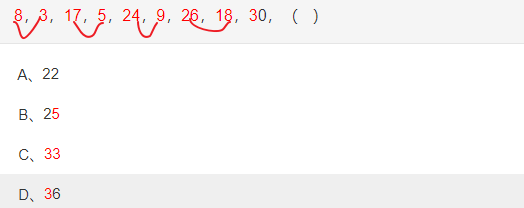

4. 

##  递推

待补充

# 分数

1. 要么约分，要么反约分

   1. 看题目项差距

      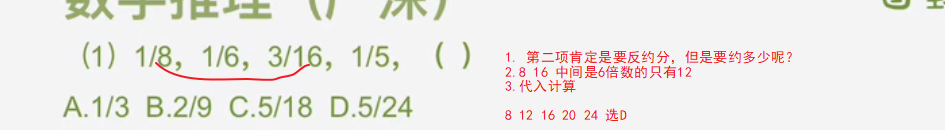

      

   2. 观察选项，带入

2. 前后有乘积关系