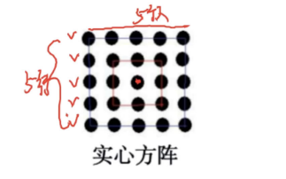

# Table of Contents

* [基础知识](#基础知识)
* [已知最外层人数](#已知最外层人数)
* [已知任意一层求其他](#已知任意一层求其他)
* [方阵个数递减型](#方阵个数递减型)

# 基础知识

a 是最外层每边人数

+ 方正总人数=a*a
+ 方正最外层总人数=4a-4  【需要减去顶点重复的】
+ 最外层和内层相差= 每边相差2*4=8
+ 方阵减少一行一列，剩下和原来的还是平方数，直接秒杀平方数

# 已知最外层人数

1. 军训汇报表演时，若某方阵最外层有72人，则此方阵共有多少人?

   A.256
   B. 324
   C.360
   D.361

   4a-4=72 a=19 19*19 尾数1 选d

   ------

2. 某学校排成一个方阵，最外层的人数是40人，这个方阵共有多少学生?A.1600
   B.200
   C.121
   D.100  秒C

   -----

3. 某校数学系的学生运动会时组成一个男女分层间隔排列的正方形实心方针，结果剩下4个男生7个女生，最外层是男生且人数为44人，则数学系男生比女生多()人。

   A.21
   B.24
   C.25
   D.27

最外层是男生且人数为44,最外层人数就是12 

那么就是 12 10 8 6 4 2 会有3个间隔，3*8+4-7=21人

---

4. 国庆期间，某广场上要摆放一个花坛，计划用花盆大小完全相同的月季和雏菊组成实心方阵，最外层是月季，从外向内每层按月季、雏菊相间摆放。如果最外层一圈的正方形有月季44盆，那么完成后共需雏菊()盆。
   A. 48
   B.60
   C.72
   D.84

  44 36 28 20 12  4 

-----

5. 【2019浙江】
   某高校军训阅兵要求每个学院组成一支队伍，每只队伍由两名排头兵和一个方阵组成，其中某学院有10名学生因身体不适退出了阅兵式，剩下的学生刚好能按要求组成队伍已知该学院方阵最外层共有92名学生，问该学院共有多少名学生?

   A.539
   B.541
   C.578
   D.588

4a-4=92 a=24 *24=576+12

如何快速求解24的平方 ？

【个位的平方做个位 】6

【个位的2倍*十位 】 8 * 2 +1=7
       【个位的平方做个位】 4+1=5

-----

#  已知任意一层求其他

1. 将某年级若干名学生排成一个方阵学习太极拳，已知方阵由外到内第三层有76人。该方阵共有学生
   A. 484
   B.529
   C.576
   D.625

76+8+8 =92 4a-4=92 a=24

----

# 方阵个数递减型

1. 用64盆花围成每边两层的空心方阵，若在外再增加一层成为三层空心方阵，需增加多少盆花?
   A. 44
   B.48
   C.52
   D.60

   28 36  44 

----

2. 【2019广东】
   某大学进行军训会操表演时，按正方形方阵排列，现去除该方阵最外围的学生，共减少100人，则现在该方阵共有()人。
   A.676
   B.625
   C.576
   D.529

   

   实在不会做蒙平方数 +100 是平方数

   -----

3. 汽车修理厂整齐停放着一些待修理车辆，恰好组成一个实心方阵，现开出一行和一列的车辆共计十五辆，则还剩()辆车等待修理。A.42
   B.49
   C. 56
   D.54

现开出一行和一列的 剩下的还是方阵直接秒杀平方数

---

4. 【2018广东】
   某教室的桌子为正方形排列，如果减少一行一列则会减少19张桌子，则教室原来有()张桌子。
   A.121
   B.81
   C.100
   D.144

100-19=81 

-----

5. 【2018广东】
   小明用石子摆了一个实心方阵，若再给方阵加上一行一列要多用17颗石子，则新添加后的方阵总共有()颗石子。
   A. 49
   B.64
   C.81
   D.100

81-17=64 

---

# 已知最外局每边人数，求其他

某学校学生排成一个方阵，最外层每边人数为40人，由外向里数第二层的人数是:A. 164
B.156
C.160
D.148

这种就更简单了，基本不会考吧