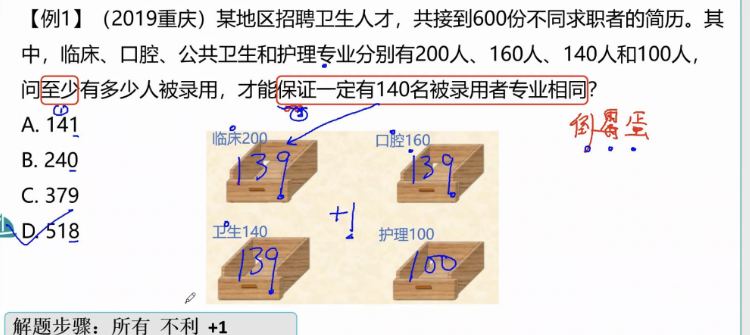
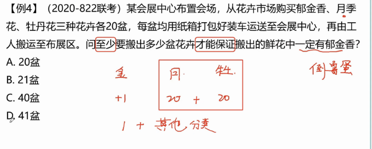
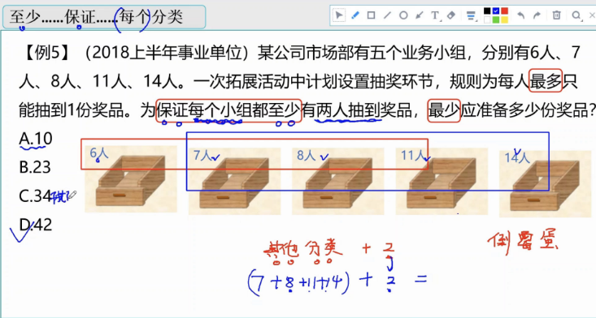

# Table of Contents

* [和定最值-数列构造](#和定最值-数列构造)
  * [总结](#总结)
* [最值-最不利极限提概述](#最值-最不利极限提概述)
* [至少保证某个分裂](#至少保证某个分裂)

# 和定最值-数列构造

和定最值，顾名思义在和为定值的情况下求某一元素的极限情况

	这种题目要本着要想其中一个数尽可能大/小，则其余的数尽可能的小/大，并且有个固定的解题方法，分为三步，
	
	+ 第一步排序定位，
	+ 第二步反向构造数列，
	+ 第三步加和求解
+ 注意
  + 解方程解出来的结果如果不是整数应该如何取舍，此时的取舍并非四舍五入**，而是问至多则向下取整，问至少则向上取整**
  + 看题目要求的数量是是否有 **各不相同**
  
  

## 总结

# 最值-最不利极限提概述

原理： 抽屉原理

常见问法：至少有多少小球才能保证每盒子中有5个

解题思路：当前抽屉列出最不利情况+1

常见错误：忘记小抽屉

>  小抽屉+正常抽屉*  不利情况  +1

我们来看下列题

1. 【2012国考66题】有300名求职者参加高端人才专场招聘会，其中软件设计类、市场营销类、财务管理类和人力资源类分别有100、80、70、50人。至少有多少人找到工作，才能保证一定有70名找到工作的人专业相同?
   （A）71
   （B）119
   （C）258
   （D）277

   **「保证一定有70名找到工作的人专业相同」意味着在这之前，所有专业都有69人找到工作了（不足69人则占满位置即可），此时再加1人即可。**

   50+69*3+1 尾数法 c

2. 在2011年世界产权组织公布的公司全球专利申请排名中，中国中兴公司提交了2826项专利申请，日本松下公司申请了2463项，中国华为公司申请了1831项，分别排名前3位，从这三个公司申请的专利中至少拿出多少项专利，才能保证拿出的专利一定有2110项是同一公司申请的专利？

   1831+2109*3=

3. 某单位五个处室分别有职工5、8、18、21和22人，现有一项工作要从该单位随机抽调若干人，问至少要抽调多少人，才能保证抽调的人中一定有两个处室的人数和超过15人？（ ）
   A、34B、35C、36D、37

   **注意这里问的是2个抽屉！！**

   15/2=7....

   5+8+3*7+1=15

# 至少保证某个分裂

先保证最多的分类分完，再看倒霉蛋的

一定有郁金香，我们先把其他的全都都算上，最后在加一个郁金香，不久一定有郁金香了

