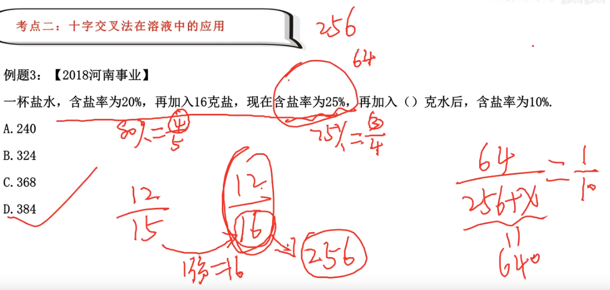
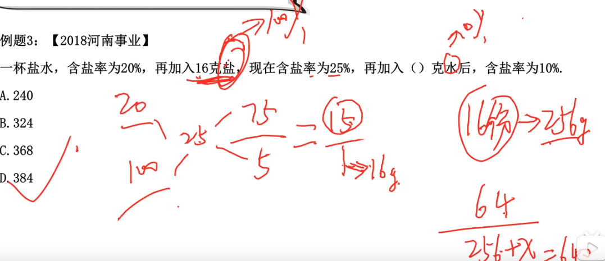

# Table of Contents

* [基本公式](#基本公式)
* [定值思维在溶液问题中的巧妙应用](#定值思维在溶液问题中的巧妙应用)
* [十字交叉法在溶液中的应用](#十字交叉法在溶液中的应用)
* [溶液中的公式比例法应用](#溶液中的公式比例法应用)

# 基本公式

+ 溶液=溶质＋溶剂

+ 浓度=溶质/溶液

+ 加入盐浓度是 100%

+ 加入水浓度时 0% 

  

# 定值思维在溶液问题中的巧妙应用

例题 1：【2019 河南事业】
1520 千克的盐水中，含盐率为 25%，要使这些盐水变为含盐率为 50%的盐水．需要蒸发掉多
少千克水？
A.700
B.720
C.760
D.800

25/100  50/100 这个过程中盐是没有变得

50/200  50/100 说明水减少了100份，原来200份对应1520 ，那么100份就是760

-----

例题 2：【2019 上海事业】
一只富含水份的水果 10 千克，其重量的 98%是水份，把它放在阳光下晒，其中一
些水份蒸发了，结果只有 95%是水份了，现在该水果重（ ）千克。
A.8.5
B.6
C.5
D.4

这里面不变得是
2/100  5/100
10/500  10/200 说明减少了300份，原来500份是10，所以200份是4

-----

例题 3：【2019 湖北事业】
某锻造厂要生产一定比例的镁铝合金，第一次加入一定量的金属镁，此时铝的比
重为 x，第二次加入同样多的金属镁后，铝的比重降为 6%，第三次再加入同样多
的金属镁后，金属铝的比重降为 4.8%。由此可知，x 为：
A.8%
B.7.2%
C.6.6%
D.9.1%

这里铝是不变得
6/100  4.8/100
24/400 24/500  这里就没思路了。。

说明每次添加100份，第一次就是300份，铝是没变得，就是24份，直接选A

-----

例题 4：【2018 全国事业联考】
一容器装有浓度为 27%盐水 90 升，第一次倒出若干升之后，加入纯净水重新配制
盐水 90 升；第二次倒出同样多的盐水之后，再加入纯净水重新配制盐水 90 升；
第三次倒出同样多的盐水之后，再加入纯净水重新配制盐水 90 升。如果这时盐水
浓度为 8%，则每次倒出盐水多少升？
A.20
B.80/3
C.30
D.50

这里要明确一个问题，当前浓度是27%,导出一半后，浓度还是27%。

**本质还是抓住溶质不变**

设第一次剩下盐水为x ,则 27% * x =A 为剩余得溶质
加入纯净水重新配制   A/90 **【注意这里是盐水，含盐所以要除**】
第二次倒出同样多的盐水之后   A/90 * x
同理可得下面得公式

27 *(x/90)^3=8

x= 60  但是注意这是剩下得水，所以答案选C

-----

例题 5：【2019 天津事业】
从一瓶浓度为 20%的消毒液中倒出 2/5 后，加满清水，再倒出 2/5，又加满清水，此时消毒
液的浓度为：（ ）
A.7.2%
B.3.2%
C.5.0%
D.4.8%

20* 3/5 * 3/5 = 7.2

**这里为什么不除呢？因为加得是水**

-----

例题 6：【2017 山西事业】
一瓶浓度为 80%的酒精溶液倒出 1/4 后用水加满，再倒出 1/3 后仍用水加满，再倒出 1/5 后
还用水加满，这时瓶中酒精溶液浓度为（）。
A.30%
B.35%
C.32%
D.50%

同上面选3

----

例题 7：【2017 天津事业】
一容量为 10 升的烧杯内装有 3 升浓度为 60%的酒精，倒出 1/3 后，加入 2 升水，
混合后再倒出一半，最后用水加满，问这时容器内溶液的浓度是多少？
A.6%
B.10%
C.15%
D.20%

3 * 0.6 * (2/3) *（1/2） 再除以100

-----

例题 8：【2020 贵州事业】
已知某溶液的浓度是 40%。现取该溶液 500mL，装进容积为 1000mL 的容器后，向
容器中加满蒸馏水后，倒掉 1/2；再向容器中加满蒸馏水，再倒掉 1/2；最后再向
容器中加满蒸馏水后，再倒掉 1/2 请问，容器中剩余的溶液的浓度是：
A.15%
B.10%
C.5%
D.2.5%

40 * 0.5*0.5 *0.5=5

-----

例题 9：【2021 天津事业】
从装满 100 克浓度为 80%的盐水杯中倒出 40 克盐水，再用清水加满；再倒出 40 克盐水，再
用清水加满；如此反复三次后，杯中盐水浓度是多少？
A.5.12%
B.12.8%
C.17.28%
D.28.8%

80 * (3/5)^3 =9的倍数

-----

#  十字交叉法在溶液中的应用

例题 1：【2020 辽宁事业】
一容器内盛有浓度为 40%的溶液，若再往里加入 1000 克的水和 400 克溶质，则溶液浓度变
为 30%，则原来溶液中溶质（）克？
A.20
B.30
C.80
D.100

400/1400 =2/7
十字交叉   溶液之比： 1：7  7份1400 1份200 200*40%=80

-----

例题 2：【2021 深圳事业】
在新冠疫情防控工作中，浓度 75%的酒精消毒液可有效灭活病毒而被广泛应用，现有浓度 95%，
65%，60%三种酒精溶液共 19 升，其中浓度 65%的溶液比浓度 60%的溶液多 4 升，三种溶液全
部混合后，恰好得到浓度 75%的消毒液，则原有浓度 95%的溶液（）升。
A.6
B.7
C.8
D.9

a比b多C,C是奇数，a就是奇数，C是偶数，a就是偶数
  x +x +C=2x+C
排除 AC

 65%的溶液比浓度 60%的溶液多 4 升  65%，60% 混合会偏向 64%
95% 64% 混合后为75 偏向64%，说明 65+60> 90
直接选B

-----

例题 3：【2018 河南事业】
一杯盐水，含盐率为 20%，再加入 16 克盐，现在含盐率为 25%，再加入（）克水后，含盐率
为 10%.
A.240
B.324
C.368
D.384

这里水是不是不变的？

第一种

第二种

加入盐浓度是 100%
加入水浓度时 0% 

-----

例题 4：【2022 福建事业】
假设容器 A 和 B 分别盛有同一种物质的溶液 100 克和 300 克，且容器 A 中的溶液的浓度是 B
的 3 倍。容器 B 的溶液全部倒入容器 A 混合液后，浓度是 15%，则原容器 B 中溶液的浓度是
（ ）。
A.25%
B.20%
C.15%
D.10%

直接秒D 

-----

例题 5：【2020 四川事业】
使用浓度为 60%的硫酸溶液 50 克和浓度为 90%的硫酸溶液若干克，配制浓度为 66%
的硫酸溶液 100 克，需要加水的质量是：
A.10 克
B.12 克
C.15 克
D.18 克

30+？=66 ？=36

100-50-40=10克水

-----

例题 6：【2018 武汉事业】
现有 0.9%的生理盐水和 20%的盐溶液若干，不能调制出下列哪一种浓度
的盐溶液？
A.1.13%
B.4.95%
C.11.25%
D.20.50%

秒D

----

例题 7：【2017 福建事业】
甲、乙为浓度不同的糖水，若将 20 克甲糖水与 10 克乙糖水混合可得到浓度为 12%的糖水，
若将 12 克甲糖水与 60 克乙糖水混合可得到浓度为 15%的糖水，则甲、乙糖水的浓度分别为
多少？（）
A.8%，12%
B.10%，16%
C.12%，16%
D.16%，14%

甲<12 乙大16 选B

-----

# 溶液中的公式比例法应用

例题 1：【2021 福建事业】
把 100 克浓度为 20%和 200 克浓度为 30%的盐水溶液混合后再添加 20 克水，这时的盐水浓度
是多少？
A.33%
B.30%
C.28%
D.25%

20+60 / (100+200+20) =25%

----

例题 2：【2019 四川事业】
现有一杯 500 克浓度为 25%的盐水，若要将其浓度调为 30%，则还需要加入盐约（）
克。
A.35.7
B.32.8
C.30.4
D.27.6

0.25* 500 / 500+x =0.3 x  
x=A

----

例题 3：【2017 山西事业】
甲、乙两个烧杯中盛有盐酸，甲杯中的盐酸浓度是乙杯中的 1/4，但甲杯中盐酸的质量却为
乙杯中的 3 倍，则将两个杯中的盐酸混合后，得到的盐酸浓度为乙杯浓度的多少倍?
A. 4/7
B. 3/8
C. 7/16
D. 7/4

但甲杯中盐酸的质量 : 这里为溶液

-----

例题 4：【2019 天津事业】
桌上放着 10%的甲溶液 400 毫升和 15%的乙溶液 200 毫升，往甲乙两种溶液中分别倒入等量
的水后两种溶液的浓度相同，那么，倒入甲溶液中水的量相当于原来甲乙两种溶液总量的多
少（ ）
A.1/2
B.2/3
C.1 倍
D.2 倍

列公式 直接选B
