# Table of Contents

* [基本公式](#基本公式)
* [火车过桥](#火车过桥)
* [平均速度](#平均速度)
* [等距离平均公式](#等距离平均公式)

# 基本公式

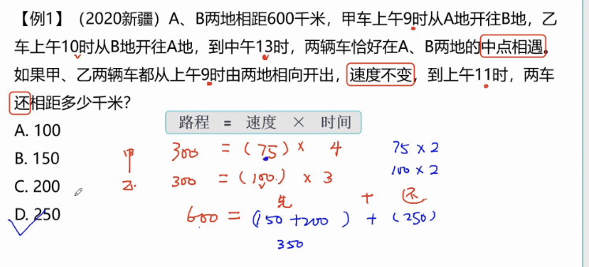

---

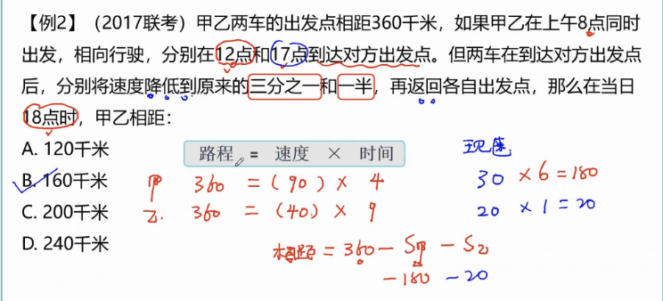

# 火车过桥

+ 火车完全通过桥：S=S桥+S车
+ 火车完全在桥上：S=S桥-S车

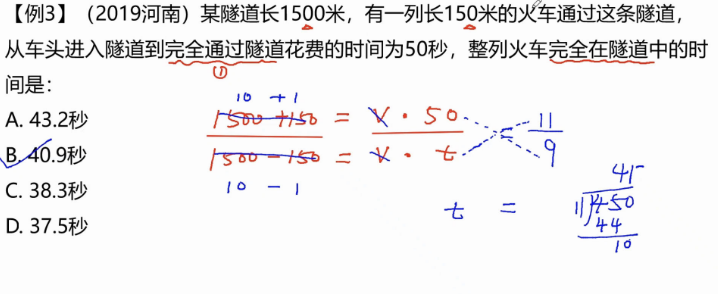

----

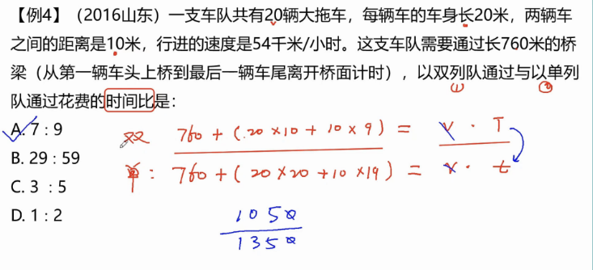

# 平均速度

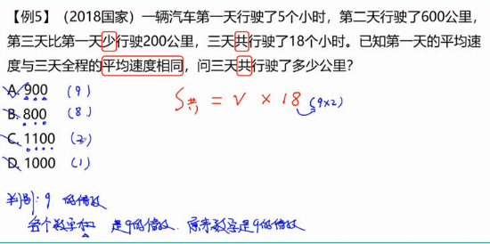

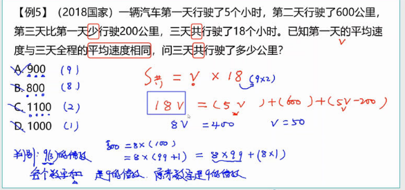

----

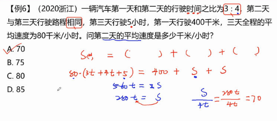

# 等距离平均公式

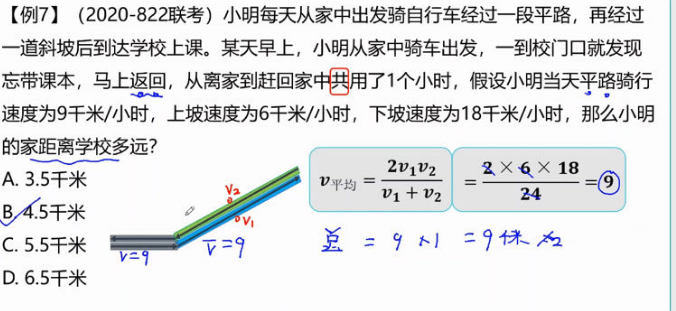

----

推导过程：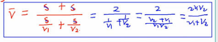

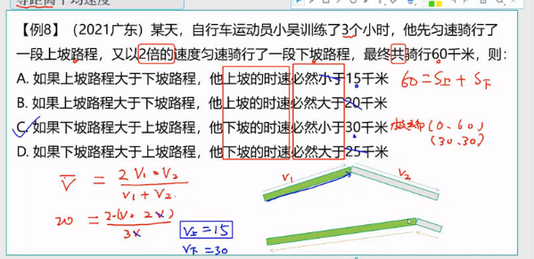

# 流水行船

S顺=V顺 X t

S逆=V逆 X t

V顺=V船+V水

V逆=V船-V水

可得  

V顺+V逆=2V船

V顺-V逆=2V水

----

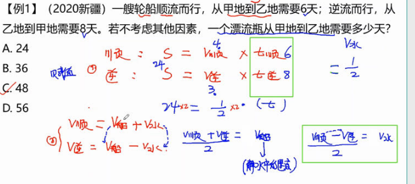

这题有意思，要先求出水得速度。V顺-V逆

---

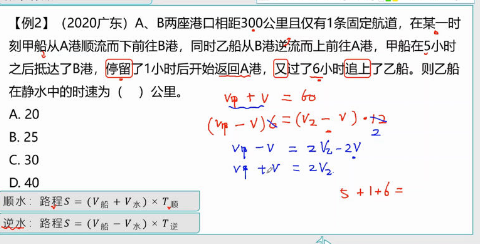