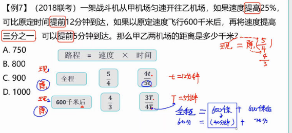

# Table of Contents

* [基本公式](#基本公式)
* [火车过桥](#火车过桥)
* [平均速度](#平均速度)
* [等距离平均公式](#等距离平均公式)
* [流水行船](#流水行船)
* [等比例问题](#等比例问题)
* [单岸](#单岸)

# 基本公式

---

# 火车过桥

+ 火车完全通过桥：S=S桥+S车
+ 火车完全在桥上：S=S桥-S车

----

# 平均速度

----

# 等距离平均公式

----

推导过程：

# 流水行船

S顺=V顺 X t

S逆=V逆 X t

V顺=V船+V水

V逆=V船-V水

可得  

V顺+V逆=2V船

V顺-V逆=2V水

----

这题有意思，要先求出水得速度。V顺-V逆

---

# 等比例问题

同样的路程，速度之比是2：3 那么时间之比就是3：2，那么多出来得一份时间就是12：30-11:00=1.5

那么3分就是4.5  12.5-4.5=8

---

这题有点坑，比例一般是等距离，这里相遇后甲20秒走完乙30秒走的路

时间=2：3 v=3：2  一份多做了200米，3分就是600米

---

---

---

上难度

第一个比例 4：5 时间 5：4 一份是12 总的就是60

第二个比例 3：4 时间 4：3 一份是5 后半程就是20 

60-20=600千米 60分钟=900千米

---

5:6 6:5 一份就是15 全90 同理 4：5 5：4  75

15 30  90*2=180

# 单岸

