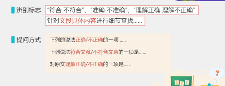
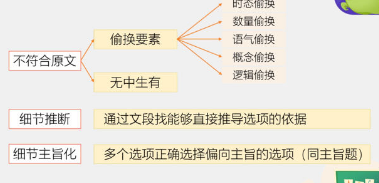
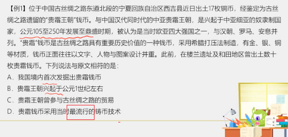
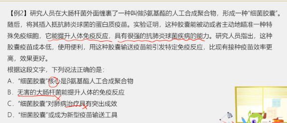

# Table of Contents

* [提问方式](#提问方式)
* [解题思路](#解题思路)
* [例题](#例题)

细节理解题主要是找细节

# 提问方式

+ 切记看清提问
+ 四个选项全部看完
+ 匹配与原文得意思

# 解题思路

1. 注意审题，辨别正误
2. 选项入手，一一对应
3. 排除干扰

选项特点

1. 同义替换
2. 原文理解和概括

# 例题

----

