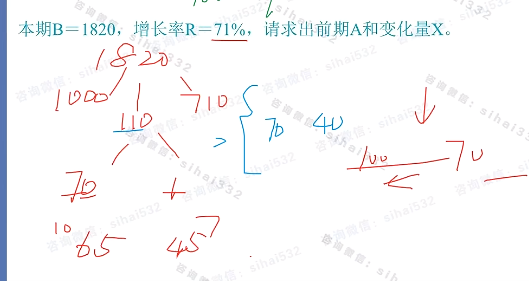

# Table of Contents

    * [原理](#原理)
    * [适用](#适用)

### 原理

举个例子:因工作出色,某部门的处长和科员一共获得了12350元奖金,根据两人的贡献,按照100:7.5的比例进行分配,在没有计算器、笔纸的条件下,我们怎样才能将奖金分的精确呢？

我们可以按照如下做法分配奖金:首先分给处长10000元,根据比例科员会分得750元,此时还剩余1600元;我们再分给处长1500元,按照比例科员会分得112.5元(估算过程为1000元的7.5%为75元,500元的7.5%为75/2=37.5元),此时会多分配12.5元;需要处长和科员按照比例返回12.5元,12.5元和总奖金相比过小,对实际分配结果影响有限,我们粗略计算即可,即处长返还12元,科员返还0.5元。

综上可知:处长共得到10000+1500-12=11488元,科员共得到750+112.5-0.5=862元。精确计算的结果是处长应分得11488.37元,科员应分得861.63元。这与我们上述估算的结果非常接近,误差在资料分析计算中完全可以忽略不计。

在资料分析模块,这样的问题不应该陌生:本期B=12350,增长率R=7.5%,让我们求前期A或变化量X。这个问题和上述例子本质是一样的,此时的本期B即为总奖金,前期A为处长,变化量X为科员,增长率R为分配比例100:7.5,上述的分配方法即是分配法在资料分析当中的应用。

### 适用

1.能初步判断出前期靠近一个整数（5000、10000 等）时，可使用分配法；当求前期或变化量只是计算过程的中间步骤时，可使用分配法。

2.当无法应用份数法（增长率R不能化成熟悉的分数），或选项离得近，份数法误差大时，可利用分配法求增量。

3.在增长率很小（一般认为小于 10%）或增长率不在任何分数附近时，求前期或变化量可使用分配法。

**注意事项：分配法不适用于增长率为负的情况。** ！！！！

*【例1】*

*例2】2015年，江西规模以上工业增加值7268.9亿元，比上年增长9.2%。2014年江西规模以上工业增加值为（）。*

*A．6656.5亿元 B.6945.3亿元 C.7268.9亿元 D.7937.6亿元*

**解析：**将2015年增加值看做7269，增长率为9.2%。设去年为整数7000（还剩下269），增加值为7000×9.2%=644，644-269=375，多出了375，再按照9份和1份进行拆分，约为350和25。那么去年=7000-350，大概是6650，选A。 

