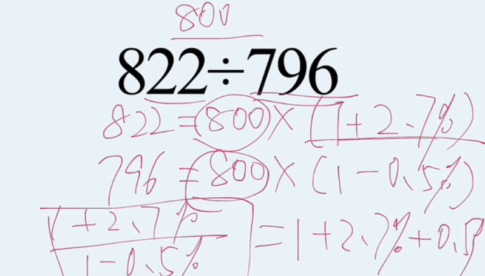

# Table of Contents

  * [加法常用技巧](#加法常用技巧)
    * [尾数法](#尾数法)
    * [高位叠加](#高位叠加)
    * [削峰填谷](#削峰填谷)
  * [减法常用技巧](#减法常用技巧)
    * [整数基准值法](#整数基准值法)
    * [“21”“12”分段法](#2112分段法)
  * [乘法常用技巧](#乘法常用技巧)
    * [**百化分**](#百化分)
    * [**乘法拆分**](#乘法拆分)
  * [除法常用技巧](#除法常用技巧)
    * [拆分法-求比例问题](#拆分法-求比例问题)
    * [估算法-近似数](#估算法-近似数)

## 加法常用技巧

### 尾数法

尾数法：通过计算式子的末几位数从而确定选项的速算方法叫尾数法

*【2019上海】2015年全市全年新增汽车驾驶人30.58万人，新增汽车驾驶人人数比2014年高出1.47万人。2014—2015年，N市总计新增汽车驾驶人约（ ）万人。*

*A. 58.22 B. 59.69 C. 61.16 D. 62.63*

**解析**：根据题干已知条件可得出2014年新增汽车驾驶人数量为30.58-1.47，因此2014-2015年，总计新增是30.58+30.58-1.47。**式子列出后，观察选项的尾数各不相同，可以采用尾数法，计算最末一位即可，8+8-7=9**，故答案选B。

*【例2】经初步核算，2009年上半年我国国内生产总值同比增长7.1%，比一季度加快1.0个百分点。其中第一产业增加值为12025亿元，增长3.8%;第二产业增加值为70070亿元，增长6.6%;第三产业增加值为57767亿元，增长8.3%。问2009年上半年，我国国内生产总值为多少亿元?*

*A.139862 B.147953 C.148632 D.151429*

**解析**：题干中的时间为2009年上半年，所求为现期国内生产总值之和，即一二三产业增加值之和为12025+70070+57767，**式子列出后，观察选项最末两位数字互不相同，可采用尾数法，仅计算最末两位即可，为25+70+67计算结果为62**，则直接选择A选项

### 高位叠加

高位叠加：从高位加起，抓住问题主要矛盾

如4156＋6913＋5523，结果16592，使用高位叠加法，先算高位，千位4＋6＋5为15，则最高位为万位1，百位1＋9＋5为15，十位5＋1＋2为8，个位6＋3＋3为12，那写下来应为

### 削峰填谷

削峰填谷：几个数字相近，可以先找出基准值，再根据 **偏离总和**，求总和或平均值

如求5641、5642、5643、5641、5643、5638、5639的平均数中，括号内所有加数**都接近于5640**，我们可以选择5640作为基准数，然后再后面依次补上超出或不足的部分。

其实这样一看就很简单了，直接就是（3+1+3）÷7+5640=5641。极大减少了计算量。

## 减法常用技巧

### 整数基准值法

**.整数基准值法:**被减数一减数=(被减数一基准值)十(基准值一减数);例如“632 一589”，我们可以加入600作为基准值，则632一589= ( 632-600) +( 600- 589 )。 **一般来说是数字比较相近的用**

例如：80021-79978

=（80021-80000）+（80000-79978）

=21+22

=43

###  “21”“12”分段法

**“21”“12”分段法:**将三位数的减法分成“21”或“12”两段，尽可能保证不用借位，减少思考和出错。

如: 632-427。

后两位相减为正数，则可以用“12”两段，百位: 6-4=2，后两位: 32-27=05，则答案为205，不用借位。

## 乘法常用技巧

### **百化分**

**.百化分:即将百分数转化为分数，若乘法中有某个乘数可以近似的转化为某个常见分数，我们可以将多位数乘法转化为简单除法计算。**

需记忆的常用小数如下:

50%=1/2

33.3%=1/3

25%=1/4

20%=1/5

16.7%=1/6

14.3%=1/7

12.5%=1/8

11.1%=1/9

如: 228*167 167≈1/6 (只考虑有效数字)

即228*167=228/6=38 (只考虑有效数字)

*【例2】2015年1-7月，我国机电产品出口额44359.4元，同比增长1.2%，占出口总额的57.2%。问：2015年1-7月，我国出口总额为（ ）。*

*A.63534.0元 B.77551.4元 C.82907.1元 D.95772.7元*

**解析**：出口总额为44359.4÷57.2%。式子列出后，可用百化分，**57.2≈57.1约等于4/7**。则44358÷4×7，观察选项，此时只计算前两位44÷4×7=77已经可以得出正确答案了。选B。

### **乘法拆分**

若乘法中有某个乘数为百分数且能拆成两个简单数值( 50%、10%、5%等),我们可以将该百分数拆成两部分再相乘。 **常用的小数拆分如下**:

45%= 50%-5%;

55%= 50%+5%;

15%= 10%+5%;

60%= 50%+10%;

95%=1-5%，

90%= 1-10%，

所有50%、100%附近数等。

如: 319*78%可以转化为319*( 100%-20%-2%) =319-63.8-6.38。

*【例】:某地区2014年的地区生产总值为1500亿元，第一产业生产值占地区生产总值的17.8%,问该地区2014年的第一产业生产总值是多少?*

**解析**:先把式子列出来：1500×17.8%，此时可用拆分法。观察得17.8%=20%-2%-0.2%，则1500×(20%-2%-0.2%)，这样整个式子就非常好算了，300-30-3=267。

【例】94.5*44.2%= 94.5 * (4/9-0.2%)

【例】620*45%= 620 * (50%-6%)=310-31=279

【例】1694*97%= 1694-17 * 3=1643

## 除法常用技巧

### 拆分法-求比例问题

列除法竖式做除法是同学们最熟悉的一种除法解法，也被我们称之为直除法;直除法简单直观，是绝大多数同学在考场上最信赖的解法，但直除法包含一个难点:当被除数和除数均较大时，商到底应上哪个数字，有时需要长时间的思考。

拆分法并不是一种估算方法，和直除法一样，拆分法也是精确求解。拆分法是把误差逐渐减少趋向于零的过程，我们可以根据选项设置决定何时停止计算。拆分的本质是对直除进行优化，规避掉了直除法中存在的难点。在熟练掌握拆分法之后，所有的除法均可用拆分法解决。

顾名思义，**拆分法的本质是将被除数由大到小拆成几部分分别计算，通过逐步分解，从而得出结果。这与哲学中的抓住主要矛盾、抓住矛盾的主要方面原理一致，抓住被除数的绝大部分，即使小部分存在误差，对最终结果影响也有限。**

**拆分法使用规则:**

**规则一:如果分数大小接近1(分子分母相差不大),可用100%减去;**

> 398/462=1-64/462=1-(46+14)/462=1-10%-3%=87%

**规则二：如果分子在分母的50%附近，先拆出50%;**

> 428/976=(488-60)/976=(488-60)/976=50%-6.2%=43.8%

**规则三:如果分子很小，可根据实际情况拆出10%或5%或1%;**

**规则四:在不满足上述情况时，可根据首位比值，拆出其他特殊分数(例如1/4,1/3,2/3,3/4,4/5等），此规则运用次数极少，了解即可。**

[注]在做多位数除法时，分子只保留前三位即可，分母可根据情况保留三四五位，即三位/三位、三位/四位、三位/五位均可。

[注]为方便计算，使用拆分法时可将分母写成偶数形式(因经常出现除以2的情况，偶数显然较奇数计算简单)。同理，在拆出1/4时，尽可能将分母写成4的倍数;拆出1/3时，尽可能将分母写成3的倍数。

如: 332/688

先拆出50%;344-12/688=50%-2%=48%

再比如：1226÷4884

拆分为（1221+5）÷4884

=1221÷4884+5÷4884

=25%+可以忽略不计的数

此时就可以根据选项选出最接近于25%的那个选项。

### 估算法-近似数

拆分是可以解决大部分相乘比较远的数字，但是比较相近的数字是不太好算的，我们可用估算法来进行估算

使用有风险，拆分法还是靠谱点
