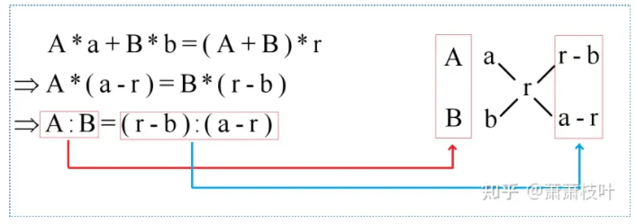
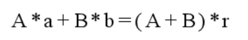
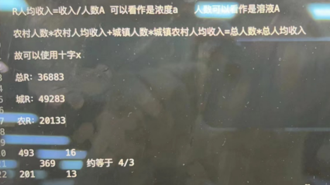

# Table of Contents

* [十字交叉法的原理](#十字交叉法的原理)
* [二、十字交叉法的其他应用场景](#二十字交叉法的其他应用场景)

https://zhuanlan.zhihu.com/p/358836495

# 十字交叉法的原理

“十字交叉法”实际上是方程的简化形式，凡是符合图1中左边方程的形式，都可以简化成右边的“十字交叉”。

【例题1】现在有浓度为a的盐水A克，和浓度为b的盐水溶液B克，混合后可以得到浓度为r的溶液A+B克。各个量之间的关系如下：

在图1中，通过左边方程式的一步步转化，大家可以从左边最底下的式子看出，左边方程式和右边十字交叉的等价关系。

所以在题目中我们可以使用十字交叉法来解决溶液问题，而不需要根据下面的等式列方程，然后解方程，这样花费的时间较多。

**注意，一定是写成这样的公式，才能用十字交叉法**

让我们在真题中看看十字交叉法是如何具体操作的！

【例题2】要将浓度分别为20％和5％的A、B两种食盐水混合配成浓度为15％的食盐水900克。问5％的食盐水需要多少克：（2010年贵州省公务员录用考试《行测》题第9题）

# 二、十字交叉法的其他应用场景

前面提到“凡是符合图1中左边方程的形式，都可以简化成右边的‘十字交叉’”，因此下列的几种问题也可以使用十字交叉法。

①平均数，平均数十字交叉后得到总数之比

②增长率，增长率十字交叉后得到基期量之比

我们可以看到 C=A+B

R=(现期-基期)/基期

③利润率，利润率十字交叉后得到总成本之比
