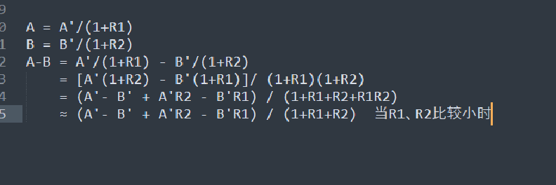

# Table of Contents

  * [使用前提条件](#使用前提条件)

我们都知道A=B/(1+R) 如果求2个基期差，分别求出2个基期，计算量是非常大的

可以用现期差来做。

1. 先用现期差来判断正负

2. 并且基期差大概率是不等于现期差的

3. 如果需要求详细数值，可以在原来的基础上进行增减 我们来看一个列子

   > 2022年9月份加工原油5681万吨，同比增长1.9%,2022年1-0月份加工原油49726万吨，同比下降5.1%，求2021年1-8月份加工原油量
   >
   > A:42943
   >
   > B:44045
   >
   > C46823
   >
   > D:48556
   >
   > 思路分析：
   >
   > 1. 首先截取有效数字，直接砍掉后二位变为56 497  不要问我为什么砍2位，砍三位精度不够了。
   >
   > 2. 首先看现期差：497-56=441 排除B
   >
   > 3. 再看加工原油49726万吨，同比下降5.1% ，那么基期是不是增加了497的百分之5 大概是25
   >
   > 4. 再看5681万吨，同比增长1.9%，直接0.5*2 1
   > 5. 441+25-1 直接选C

## 使用前提条件

