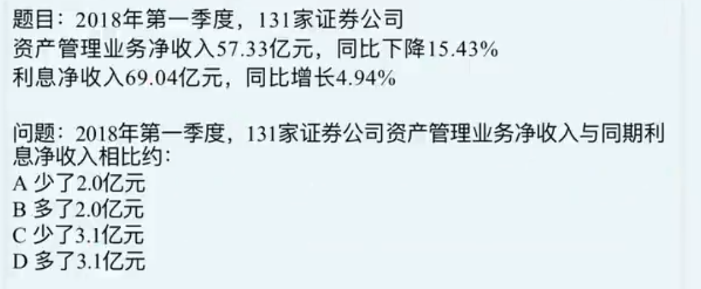

# Table of Contents

正常来说：基期差=1基期-2基期 

如果分别用现期求基期，再去减很麻烦

我们在继续推导下公式

现期差值=1现期-2现期

基期差值=1基期-2基期

基期差值=（1现期-1变化量）-（2现期-2变化量）

=（1现期-2现期）-1变化量+2变化量

**=现期差-变化量1+变化量2**

57.33-69.04= -11.29

15.43% 介于 1/6 到 1/7之间 （这是一个很好的思路）

57.33/5.5=10

69.04 4.94% =3.45 

-11.29+10+3.45 

直接秒B走人
