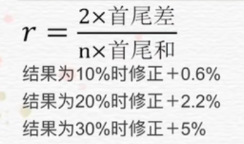

# Table of Contents

学过课程的都知道，有一个基础公式【基期×（1+r）^n =现期】

但是开平方算的很慢，推荐新方法

来源： [资料分析——年均增长率（五种解法）_哔哩哔哩_bilibili](https://www.bilibili.com/video/BV1dh4y167Er/?spm_id_from=333.788&vd_source=44d93b70850a7f4ce188ceb0f0305535)

其他方法都有限制条件，这个是通用的。

1. 2010年农村居民得到的转移性收入人均453元，比2005年增加305元，问十一五期间，年均增长率

   A 10% B 15% C 20% D 25%

2/5 * 305/600 约分大概为20% 再加上2.2 
