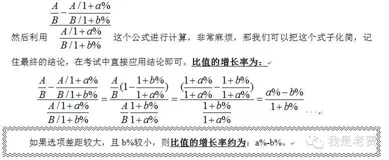

# Table of Contents

  * [比重差和比值增长率的区别](#比重差和比值增长率的区别)

## 比重差和比值增长率的区别

我们看下定义就明白了

+ 比重差=前期B/前期A**-**基期A/基期B=A/B * (a%-b%)/(1+a%)

+ 比值增长率=(前期A/前期B**-**基期A/基期B)/(基期A/基期B)

  

注意：

1. 比重差是一个差值 是由单位的
2. 比值增长率是一个变化率 增长了%5

我们看下具体题目

---

1. 2019 年中国创新指数为 228.3，2010 年为 133.0。2019 年中国创新指数
   比 2010 年约【增长百分之多少？】
   列式：
   2019 年中国创新指数比 2010 年约增长=228.3 133.
   133.0

-----

2. ．2012 年，某省加大扶持贫困残疾人力度，财政投入扶贫资金 3816.3 万元，
   比上年大幅增长 18%享受优惠政策的贫困残疾人 117727 人，比上年增加 3%。
   该省每年投入的残疾人财政扶贫资金如果可以均分到每位享受优惠政策的贫困
   残疾人身上，则 2012 年享受优惠政策的贫困残疾人的人均扶贫金额要比 2011
   年增长约多少万元？
   列式：
   2012 年享受优惠政策的贫困残疾人的人均扶贫金额要比 2011 年【增长】
   =
   38163000
   117727
   ×
   18% 3%
   1+18%

---

