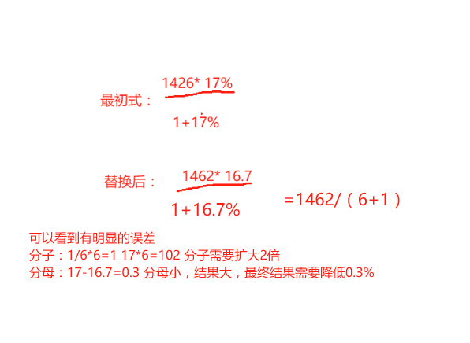

# Table of Contents

* [原理](#原理)
* [记忆](#记忆)
* [例题分析](#例题分析)
* [百化分的误差修正 -重点](#百化分的误差修正--重点)

大家知道，资料分析里很多数据都跟百分数有关，但是百分数如果不加改造，计算量是非常大的。那么有没有一种简易的方法能够显著降低百分数的计算量呢？

当然有，那就是“百化分”，完整说就是“将百分数转化成分数”。这样一说，大家是不是感觉又回到了初中数学，没错，这本来就是初中数学，只是大家长时间不接触，已经遗忘了而已。

# 原理

即把百分数转化为对应的分数，比如10%=1/10，25%=1/4等。

如果我们用A表示现期量，a%表示增长率，假设a%对应的分数为1/N，a%和N之间有如下关系：a%×N=1。

根据增长量的公式，可以得出增长量=A×a%/(1+a%)。

我们把其中的a%用1/N替换，则**增长量=A×(1/N)/(1+1/N)=A/(1+N)**。通过百化分的转化之后，计算量明显减少，并且不容易出错。

例如：A×12.5%/（1+12.5%），用1/8代替12.5%，则可以化简为A/9。

注意！ 这里也是花生十三讲的【415】份数发的原理。

> 1. 增长量=A×(1/N)/(1+1/N)=A/(1+N)  这是基本公式，也是后面我们修正百化分的
> 2. 如果是负数，那么就是A/(N-1)

# 记忆

需记忆的常用小数如下:

50%=1/2

33.3%=1/3

25%=1/4

20%=1/5

16.7%=1/6

14.3%=1/7

12.5%=1/8

11.1%=1/9

以及5.3%=1/19.只需要记住1/2到1/9以及 1/19即可。

这里还有一个技巧

# 例题分析

【2018国考127】2016年广东省公园绿地面积达89591公顷，占全国公园绿地面积的比重约为14%。则 2016年，全国公园绿地面积约为多少万公顷？

A.64 B.20 C.640 D.200

**解析**：算式为89591/14%，我们发现14%非常接近1/7，在选项差距比较大的情况下，可以结合估算法，将**89591估算为9万，14%估算为1/7**，这样就直接把算式简化为了9×7=63万，最接近的选项为A。

【2009秋季联考】2006年全国共有生产力促进中心1331家，比上年增加61家。生产力促进中心在全国分布广泛，但地区分布不均，四川、山西、黑龙江、广西、福建等地较多，分别为136，99，96，94，83家。生产力促进中心数量最多的三个省份的中心数量占全国总数的比重是：

A.19.7% B.22.7% C.23.0% D.24.9%

**解析**：观察选项，发现BC之间差距很小，差了0.3个百分点，相当于差了1%左右，所以根据误差控制的1/3原则，我们计算过程中，误差需要控制在3‰以内，这需要非常高的计算精度，所以我们先把算式精确地列出来：（136+99+96）/1331=331/1331，很明显≈**1/3÷4/3**=25%，选D。如果很不巧，答案接近BC中的一个，因为BC差距很小，这时候，我们就需要精确的计算了。

【2012北京-132】俄罗斯是世界最大的管道天然气出口国，占管道天然气总出口量的27.8%，2009年出口量为1764.8亿立方米，较2008年增长14.3%，2009年俄罗斯管道天然气出口较上年增长了多少亿立方米?( )

A.110 B. 221 C. 332 D. 443

**解析**：列出算式为1764.8×14.3%/（1+14.3%），**因为14.3%高度接近1/7**，所以我们直接用百化分的n+1方法，1765/8=221，选B。

【例4】2010年，某省广电实际总收入为145.83亿元，同比增长32.07%。其中，广告收入为67.08亿元，同比增长25.88%;有线网络收入为45.38亿元，同比增长26.35%;其他收入为33.37亿元，同比增长57.3%。2009年，该省的有线网络收入约为多少亿元?

A. 21 B. 36 C. 57 D. 110

**解析**：先将算式列出为45.38/（1+26.35%），观察选项之间差距较大，可用估算法，**将26.35%转化为分数，最接近于1/4，将分母转化为整数45**，于是就简化为45×4/5=36，选B。

【例5】2010年1～3月，法国货物贸易进出口总额为2734.4亿美元，同比增长13.4%。其中，出口1264.7亿美元，同比增长14.5%;进口1469.7亿美元，同比增长12.4%;逆差205.0亿美元，同比增长1.0%。2010年1～3月，法国货物贸易进出口总额比上年同期增长了约多少?()

A.323亿美元 B.356亿美元 C.389亿美元 D.410亿美元

**解析**：首先列出式子2734.4/(1+13.4%)，进出口总额的增长率为13.4%，没有比较明确对应的百分数，已知**14.3%=1/7，12.5%=1/8，13.4%在14.3%和12.5%之间，可以估算为1/7.5**。因此进出口总额的增长量为2734.4/(1+7.5)=2734.4/8.5=321.69，与A选项最接近，选A

# 百化分的误差修正 -重点

百化分很好用，但是，不巧的是，很多a%并不完美地等 价于1/n，

**比如16.7%换成17%，怎么办呢？我们依然可以用1/6代替17%，但是这个替代过程使得计算结果缩小了，17%×6=102%，1/6×6=100%，所以这个替换使得计算结果缩小了大概2%，所以我们只需要在计算结果上再加3%即可。如果还要在精细，那么我们分母还是需要在原来基础上减去0.3%，也就是最终2%-0.3%=2.5%**

我们来看看具体是怎么推导的。

【2015深圳-86】人均可支配收入为14265元，比上年增长17.0%，则人均可支配收入比上年增加了（ ）元。

A.2072.7 B. 2065.7 C. 2425.1 D. 2467.9

14265/7=2037 分子扩大2%为2077 分母在减小为0.3% A最接近

计算器结果：2072

