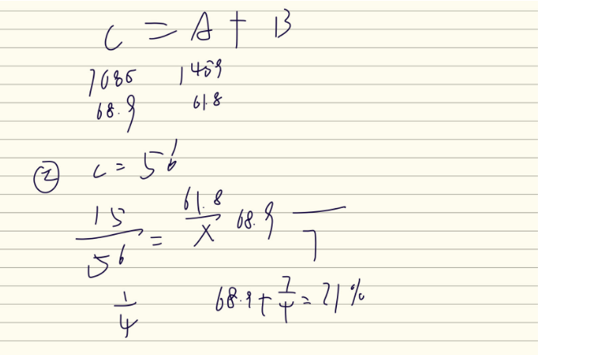

# Table of Contents

* [间隔增长率](#间隔增长率)
  * [快速计算](#快速计算)
  * [2年平均增长](#2年平均增长)
* [增长量](#增长量)
* [混合增长率](#混合增长率)
  * [知道CA，求B](#知道ca求b)

# 间隔增长率

## 快速计算

2022 年,全国软件和信息技术服务业规模以上企业累计完成软件业务收入约比2020 年增长了:

求得是隔年增长率

## 2年平均增长

2021 年 1~2 月，全国网上零售额 17587 亿元，同比增长 32.5%两年平均增长13.3%。

# 增长量

# 混合增长率

## 知道CA，求B

精算

