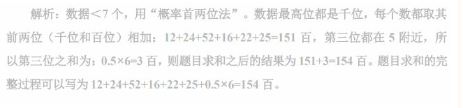

# Table of Contents

* [间隔增长率](#间隔增长率)
  * [快速计算](#快速计算)
  * [2年平均增长](#2年平均增长)
* [增长量](#增长量)
* [混合增长率](#混合增长率)
  * [知道CA，求B](#知道ca求b)
  * [混合后得出基期，但是求得是现期](#混合后得出基期但是求得是现期)
* [未来增长率](#未来增长率)
* [增长率大小比较](#增长率大小比较)
* [乘积增长率](#乘积增长率)
* [平均数](#平均数)
* [变化幅度最小](#变化幅度最小)
* [2个部分比是另外2个部分比的几倍](#2个部分比是另外2个部分比的几倍)
* [年均增长率](#年均增长率)
  * [到底算几年？](#到底算几年)
* [平均数增长率](#平均数增长率)


# 间隔增长率

## 快速计算

技巧：

1. 去掉一个%在计算
2. 都要带着正负号

2020年凡凡的年收入同比增长30%，增幅同比回落10个百分点。求2020年吴某凡的年收入比2018年增长了百分之几。

1. 先画图 

2. 利用公式求 R= R1+R2+R1×R2

3. 去掉一个百分号 40+30+ 【40×30%】=70+12=82

    这里得12等于【40×30%=1200%】再去掉百分号得出得。

    也就是先去掉一个百分号，算出结果后，再去掉一个百分号。

[参考链接](https://mp.weixin.qq.com/s/1MAKcudygEQyOELVhqkReQ)

## 2年平均增长

2021 年 1~2 月，全国网上零售额 17587 亿元，同比增长 32.5%两年平均增长13.3%。


# 增长量


# 混合增长率

## 知道CA，求B

先看答案接近不，接近第二种，否则第一种，第一种更快。


精算


## 混合后得出基期，但是求得是现期


可以看到是求混合增长率，但是注意题目问的是2020年不是2019年得。
总额=进口+出口
14-8/(8+3.2)=11.2/6 接近2 但是注意这里是基期，还有乘增长率

1.9 *(1+a)/(1+B)

# 未来增长率

1. 全市有幼儿园 1836 所，增加 65 所；在园幼儿 54.50 万人，增长 4.0%。若全市每所幼儿园平均在园幼儿数保持 2019 年同比增量不变，则到（ ），幼儿园平均在园幼儿数可超过 300 名。

   这题问法会有点不一样，问的是平均量的未来增长率，【所以我们先要求出平均量的增长率】

   ```
   1. 65÷（1836-65）≈3.7%
   2.在根据比重差得到今年的平均增量 0.86人
   3.求出还差多少为(54.5/1836)≈296.8，则年数=（300-296.6）÷0.86=3+
   
   ```

   

# 增长率大小比较

方法： **直接找老大验证排除**

【真题1】2017年1～2月，53家重点监测的造船企业（以下简称重点企业）造船完工912万载重吨，同比增长133%；承接新船订单197万载重吨，同比增长119%。2月末，手持船舶订单8874万载重吨，同比下降23.1%。

2017年1～2月，重点企业完工出口船886万载重吨，同比增长138%；承接出口船订单171万载重吨，同比增长109%。2月末，手持出口船订单8129万载重吨，同比下降26.6%。

1.2017年1～2月，重点企业下列指标中同比增速最快的是（  ）

A.造船完工量

B.承接新船订单量

C.出口船完工量

D.承接出口船订单量

这道题就是典型的增长率的读比较问题。问 2017 12月，重点企业指标中同比增速最快的量，直接在材料中找老大，即增长率最快的是138%，对应的是完工的出口船量，即出口船完工量。
故本题答案为 C。


# 乘积增长率

乘积就是两个数想成，一般形式为A=B×C，已知BC增长率求A的增长率。和间隔增长率公式一样。

适用范围：①实际乘积关系，例如总额=单价×数量 

②部分=整体×占比【占比增长率是当前出去上一年的】

1. 

 2019年，我国海洋生产总值89415亿元，比上年增长6.2% ; 2019年,我国海洋第三产业占海洋生产总值的比重由59.1%.上升到60%，求2019年我国海洋第三产业增加值年增长率为（）?

海洋第三产业增加值=海洋生产总值x占比，

海洋生产总值增长率=6.2%，【占比增长率=0.9%/59.1%=1.5%】这里这里，占比增长率是(当前-上年)/上一年

则海洋第三产业增加值增长率=6.2%+1.5%+6.2%x1.5%≈7.8%

2. 

这题就是典型的乘积增长率：

固定通信=电信X占比

15年=-2*(29.6-27.8)/27.8

[参考](https://www.douyin.com/video/7302631037840919849)

# 平均数

我们知道**平均数=若干个数的和/数的个数**，要求若干个数的和或平均数，用“概率首位法”即可快速秒杀。

**（1）数据＜7个或数据前两位一样，用“概率首两位法”；**

**（2）数据≥7个且数据杂乱，用“概率首位法”**

1. **求7654+8532+9877+4321+5204+463+3527的和**。

   

2. **求1254+2436+5273+1618+2257+2562的和**



不过还是推荐高位相加，比较准确点，如果题目相差很远可以用这种方法，如果很近，还是要精算。


# 变化幅度最小

变化幅度不看正负号，只看数字大小

增长率看大小


就这一句话坑点很多

+ 2021年下半年
+ 同比变化幅度最小 是11月
+ 化学纤维是第一幅图 不是第二幅图
+ 现期差30多 并且小数位不一样，直接选D


# 2个部分比是另外2个部分比的几倍

我国博物馆占文物机构总数的 43.5%……博物馆接待观众 71774 万人次，占文物机构接待观众总人次的 85.2%， 2014 年，平均每家博物馆接待观众人次数约是其他文物机构的多少倍（ ）。

----


观众 71774 万人次，占文物机构接待观众总人次的 85.2%”可知其他文物机构数
量占比为 1 − 43.5%＝56.5%，其他文物机构接待观众总人次占比为 1 − 85.2%＝
14.8%。（注：当总数相同的情况下可用占比进行直接的除法，进行倍数运算），列
式（85.2%÷43.5%）÷（14.8%÷56.5%）≈7.5


# 年均增长率

## 到底算几年？


2011-2020 中间是隔了10年


# 平均数增长率


公式: （a-b）/(1+b)

a=26/534= -5%

b=420/3376= -12% 代入公式 

7%/88% 直接选D
