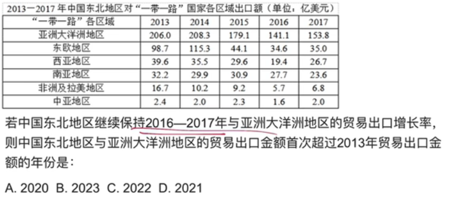
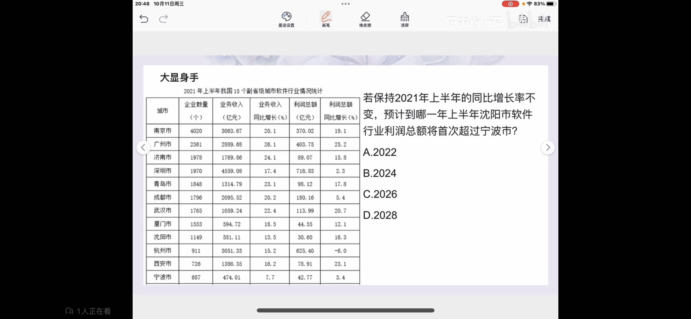
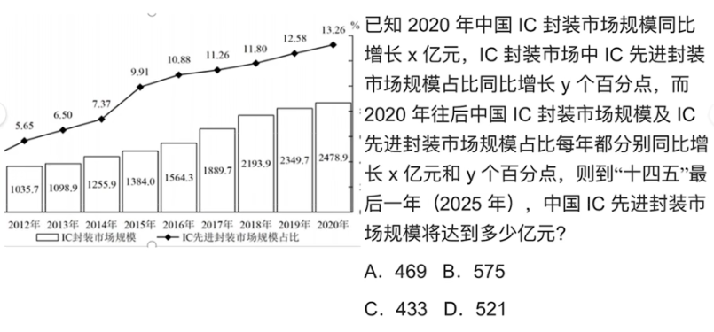

# Table of Contents

* [例题](#例题)


2019年，你收获了100kg苹果，

2020年，你收获了110kg苹果。

按照2020年增长速度，2021你会收获多少kg苹果。


方法一：

单独求出2020到2019的增长率 （110-100）/(100),再代入计算，太麻烦了。


方法二：

因为增速相同，可得到

2019*a=2020

2020*a=2021

即：（2020*2020）/(2019)=2021 可得 （110 *  110）/(100)=121


方法三：

其实是方法二得快捷运算版本，可直接估算。

我们看2020年增长了10，那么2021年肯定大于10，那就是110+10+?,这个?怎么算？

如果选项相差很大，直接这么做，否则可以算出x是多少。

以下是推导公式

第一年为a1 第二年为a2，增量是x 根据方法二可得

```java
第三年=(a2^2)/a1
    =((al+x)^2)/a1
    =(a1^2+x^2+2a1x)/a1
    =a1+2x+(x^2/a1)
    =a1+x+x+(x^2/a1)
```

这里得a1+x+x是不是上面得110+10 ，?=(x^2/a1)=100/100=1

总结：今年+今年增长量+(今年增长量^2)/去年


# 例题



  2016到2017 

153.8-141.1=12.7 = 13

13是未来每年最低得增长量

206-154=52 

52/13=4 也就是选D




这题有点难做，待定




注意题目问的是IC先进封装市场，但是图表给的是整个IC封装市场和先进封装市场得比重
说白了，题目就是没给你直接得量，你要求一下。

2019=2349*12.58%=300左右

2020=2478*13.46=330左右

x=30

5年后得x+2020=150+330=480 最低480 选D
