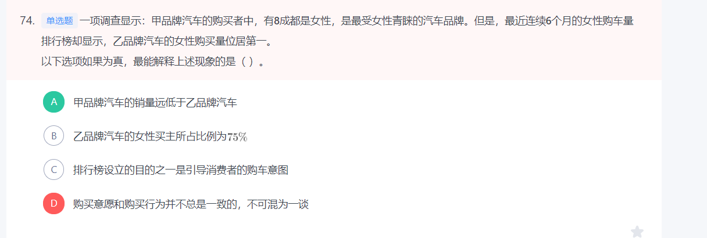

# Table of Contents

* [常识](#常识)
* [言语](#言语)
* [数量](#数量)
* [图推](#图推)
* [资料](#资料)
* [判断](#判断)

# 常识

1. 党的二十大报告指出，改革开放和社会主义现代化建设深入推进，书写了【**经济快速发展和社会长期稳定**】两大奇迹新篇章，我国发展具备了更为坚实的物质基础、更为完善的制度保证，实现中华民族伟大复兴进入了不可逆转的历史进程。
2. 2023年1月28日，广东省委、省政府召开“新春第一会”——全省高质量发展大会。**会议指出，要勃发开局之气象、展示开局之作为，扎实抓好“双区”和横琴、前海、南沙三大平台建设、坚持制造业当家、“百县千镇万村高质量发展工程”、绿美广东生态建设、构建全过程创新生态链、推动产业有序转移等重大部署落实。**
3. “风雨浸衣骨更硬，野菜充饥志越坚；官兵一致同甘苦，革命理想高于天。”该文句最有可能描述的事件是【**红军长征**】
4. 毛泽东同志说：“我们共产党人从来不隐瞒自己的政治主张。我们的将来纲领或最高纲领，是要将中国推进到社会主义社会和共产主义社会去的，这是确定的和毫无疑义的。”这段话出自【《**论联合政府**》】
5. 党的十八大以来，我们深化对民主政治发展规律的认识，提出【**全过程人民民主**】的重大理念，其不仅有完整的制度程序，而且有完整的参与实践。
6. 推进农业绿色发展，有助于加快农业现代化，全面推进乡村振兴。关于“推进农业绿色发展”，下列说法准确的是【**发展节水农业和旱作农业**】
7. 根据《党政领导干部选拔任用工作条例》，党政领导干部应当逐级提拔。特别优秀或者工作特殊需要的干部，符合有关条件或情形的可以破格提拔**。以下不属于可以破格提拔的条件或情形的是【经济发达、高新技术产业发展地区急需引进的】**
8. 

9. **统一战线，武装斗争，党的建设**，是中国共产党在中国革命中战胜敌人的三个法宝，三个主要的法宝。”
10. 嘉兴南湖革命纪念馆的题诗“革命声传画舫中，诞生共党庆工农”纪念的历史事件是：【**中共一大的召开】**
11. 习近平总书记在深圳经济特区建立40周年庆祝大会上的讲话中指出，广东、深圳经济发展水平较高，面临的资源要素约束更紧，受到来自国际的技术、人才等领域竞争压力更大，落实新发展理念、推动【**高质量发展**】是根本出路。
12. 1923年6月12-20日，中国共产党在广州召开第三次全国代表大会。大会通过了《关于国民运动及国民党问题的决议案》，决定共产党员以个人资格加入国民党，实行党内合作，以建立各革命阶级的统一战线。1937年，在共产党的催促下，**9月22日，国民党中央通讯社发表了《中共中央为公布国共合作宣言》**。23日，蒋介石发表谈话，实际上承认了共产党的合法地位。至此，抗日民族统一战线正式形成，第二次国共合作开始
13. 2021年2月25日召开的全国脱贫攻坚总结表彰大会宣告
    1. 完成了消除绝对贫困的艰巨任务。
    2. 2012年年底，拉开了新时代脱贫攻坚的序幕。
14. 中华人民共和国全国人民代表大会是最高国家权力机关。全国人民代表大会行使的职权不包括：【**编制和执行国民经济和社会发展计划和国家预算**】
15. 民法典与人们生活息息相关，被誉为“社会生活的百科全书”。以下内容中，民法典未涉及的是：【**监管保险业务**】

# 言语

# 数量

+ 等距离平均公式V=(2v1v2)/(v1+v2)
+ **长方形体积=长*宽 * 高**

5-2=3=8-5；6-3=3=9-6；11-4=7=18-11。即每列相邻两个数字之间差值相等

---

1. 某印刷厂原计划用全自动装订机花费4小时装订一批文件，但在还剩300份文件时装订机出现故障，无法装订。印刷厂立即安排了部分员工进行人工装订，由于人工装订的总效率仅为机器的20%，最终比原计划推迟1小时完成装订。则这批文件共有（ ）份

解答：已知人工装订的效率是自动装订机效率的，则相同数量材料人工装订所需时间是全自动装订机的5倍。设装订300份材料全自动装订机所需时间为x，人工装订所需时间为5x，人工完成后多出一个小时做完，故多用时间为5x-x=1小时，x=0.25小时。

所以4个小时就是 4*1200=4800

---

2. 某地举办了“铁人三项”体育活动，先进行蛙跳，后游泳，最后竞走到达终点。一位选手在上午7点出发，9点到达了终点，全程未休息，其蛙跳、游泳和竞走的速度分别为每小时2千米、3千米和6千米。如果蛙跳和竞走的路程相同，则所有项目的总路程是（ ）。

根据“第一项和第三项路程一样”，由等距离平均速度公式

等距离平均公式V=(2v1v2)/(v1+v2)

都是3 所以为6

---

----

3. 

   ----

   4. 

# 图推

+ 折叠图翻转都是等距离

1. 

-----

2. 

----

3. 

判断

1. 

# 资料

+ 基期比重
+ 数多4倍以上 就是4+1
+ 

# 判断

该项说明购买意愿和购买行为存在差别，但是，在题干出现的矛盾中涉及的都是已经发生的购买行为，而不涉及购买意愿，不能解释题干矛盾，排除。

---

